# Social Enterprise Platform

A full-featured social networking platform built with Spring Boot, React, PostgreSQL, OpenSearch, and AOEE (a custom Rust-based social graph cache).


## Features

### Social Feed
- Personalized home feed with 80% organic + 20% recommended content
- Create posts with text, images, videos, and file attachments
- Six reaction types (Like, Love, Haha, Wow, Sad, Angry) with hover picker
- Nested comments (one level of replies)
- Link previews with OpenGraph metadata
- Cursor-based infinite scroll


### User Profiles
- Follow/unfollow other users
- View follower and following lists
- User bio, avatar, and activity history

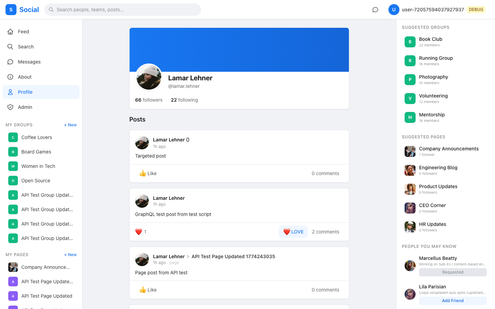

### Friend Requests
- Send, accept, and reject friend requests from suggested people
- Accepting creates mutual follow relationships
- Status persists across page refreshes

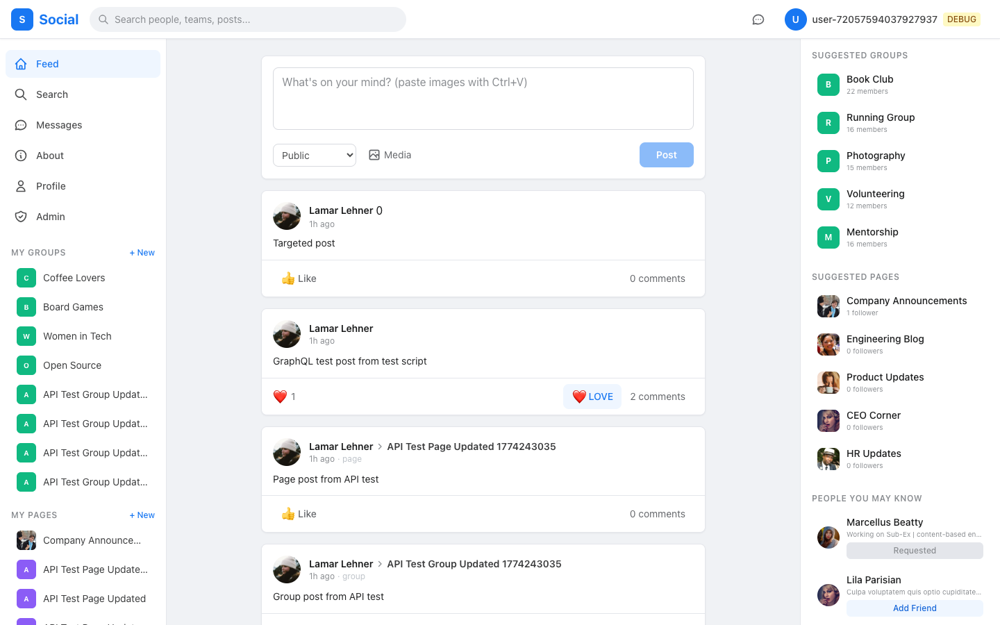

### Groups
- Create and join public or restricted groups
- Role-based membership (Owner, Admin, Member)
- Group feed with pinned posts
- Pending member approval for restricted groups

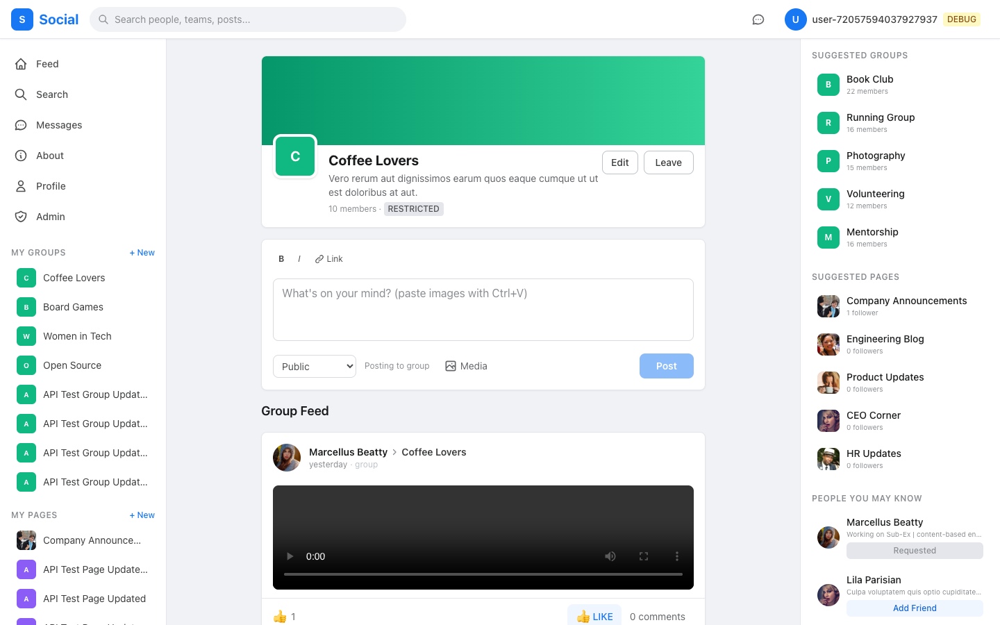

### Pages
- Create pages for organizations, brands, or topics
- Follow/unfollow pages
- Page feed with pinned posts

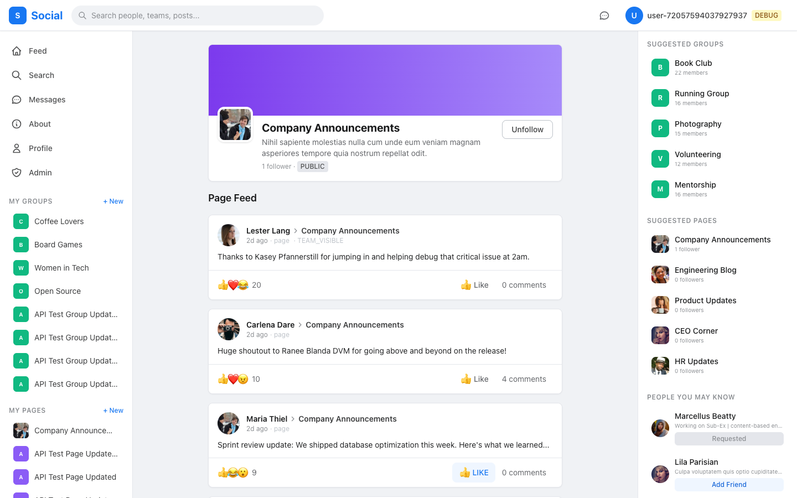

### Direct Messages
- Real-time messaging between users
- Conversation list with unread counts
- File attachments in messages

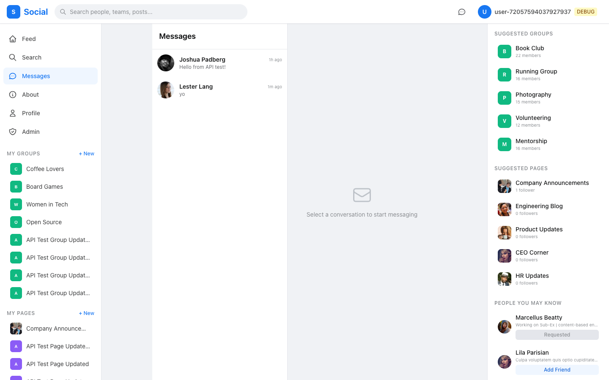

### Search
- Full-text search across users, groups, and pages
- Powered by OpenSearch with PostgreSQL fallback
- "People You May Know" suggestions

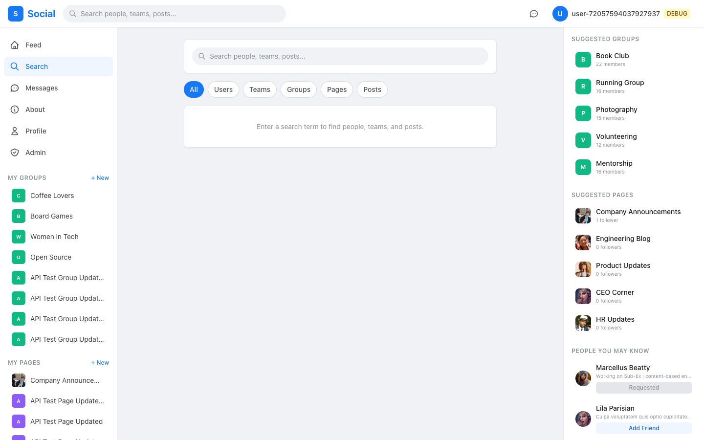

### Admin Dashboard
- Real-time platform metrics (DAU, WAU, MAU)
- Engagement analytics per group, page, or user
- User management with admin privilege toggles
- Content moderation (delete posts/comments)
- System health monitoring

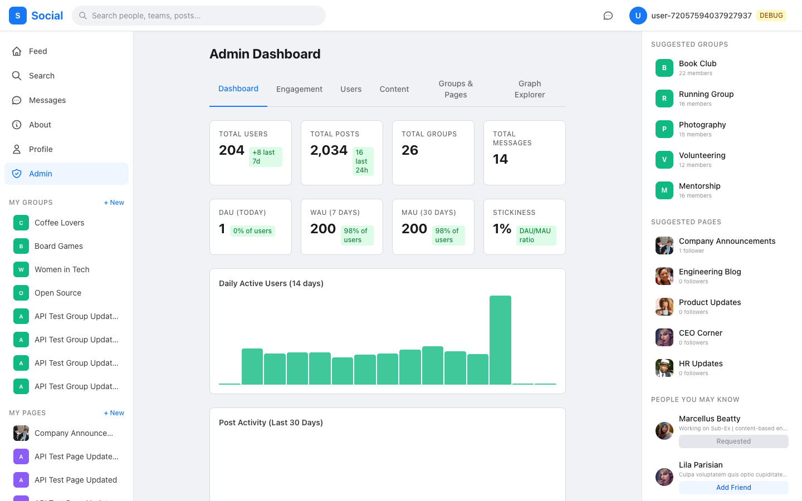
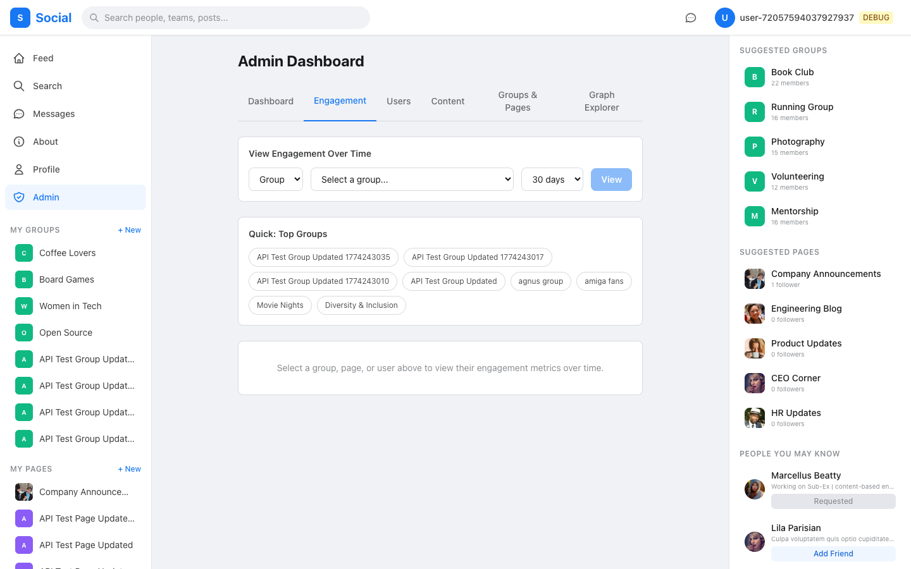
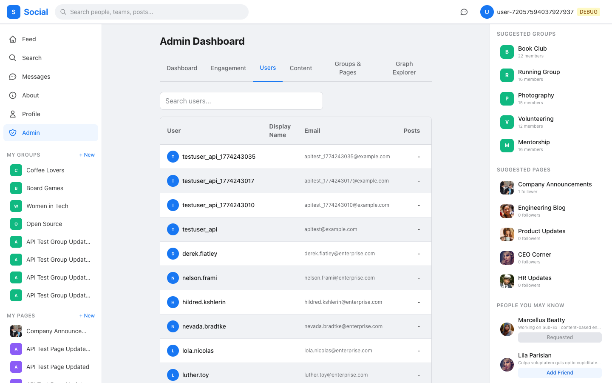

### Graph Explorer (AOEE Integration)
- Interactive force-directed network visualization
- Multi-hop graph traversal with configurable depth
- Friend-of-friend discovery with connection scoring
- Mutual friends finder between any two users
- Node profile with edge counts across all relationship types
- Fullscreen mode for large graph exploration
- One-click backfill from PostgreSQL into AOEE graph cache

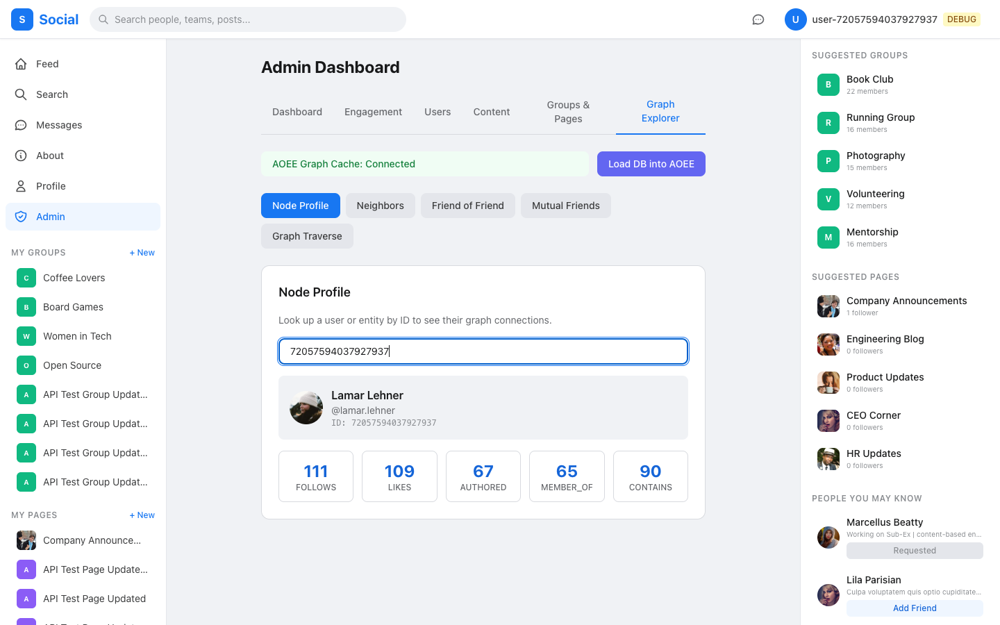
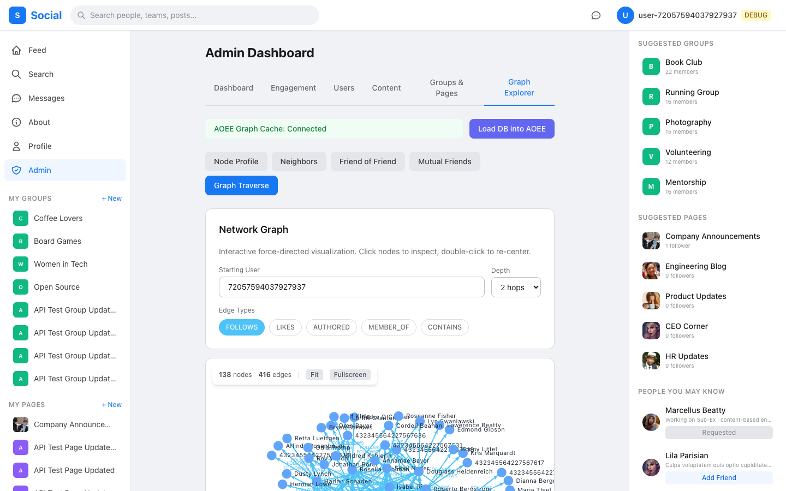
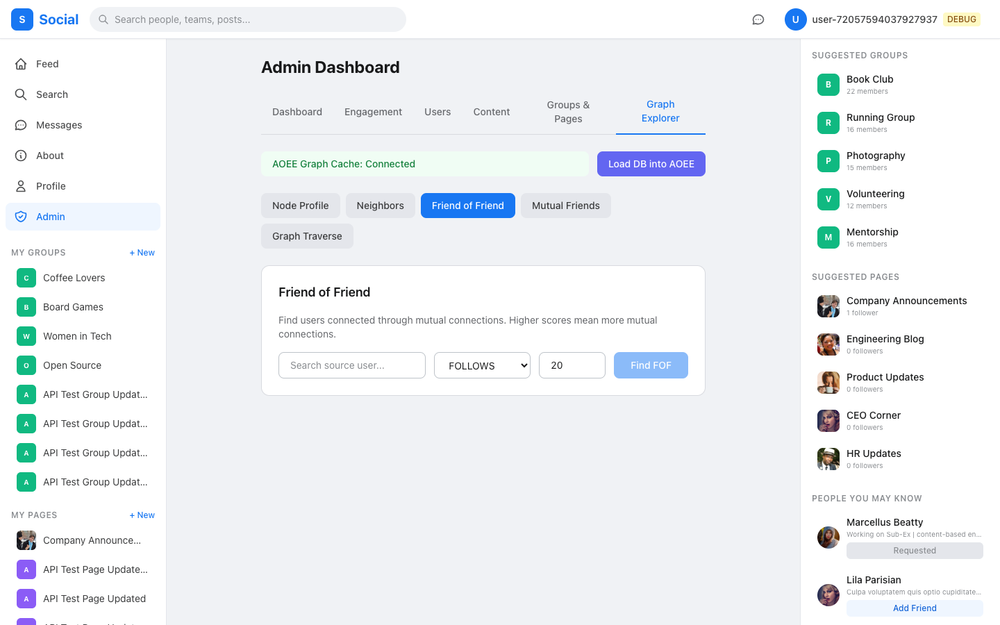

---

## Architecture

```
Browser (React SPA)
   |
   +-- REST /api/* -------> Spring Boot (:8080) ----> PostgreSQL (:5432)
   +-- GraphQL /graphql --/        |
   |                               +-- OpenSearch (:9200)
   |                               +-- AOEE Proxy (:8082) --> AOEE gRPC (:50051)
   +-- /uploads/* ---------> Static file serving
```

| Layer | Technology |
|-------|-----------|
| Frontend | React 18, TypeScript, Vite, Tailwind CSS, TanStack React Query, Zustand |
| Backend | Spring Boot 3.4.3, Java 21, Spring Data JPA, GraphQL |
| Database | PostgreSQL 16 (Flyway migrations, partitioned tables) |
| Search | OpenSearch 2.12 (with DB LIKE fallback) |
| Graph Cache | [AOEE](https://github.com/geekychris/AOEE_Attribute_object_enterprise_edition) — Rust gRPC server with Spring Boot REST proxy |
| Auth | JWT (HMAC-SHA256, 24h expiry) + debug header mode |

### AOEE — Social Graph Cache

AOEE (Attribute Object Enterprise Edition) is a high-performance, TAO-inspired in-memory relationship cache. It provides sub-millisecond graph queries for:

- **FOLLOWS** — who a user follows
- **LIKES** — what a user has liked
- **AUTHORED** — posts by a user
- **MEMBER_OF** — group memberships
- **CONTAINS** — posts in a group

The social platform syncs domain events (follows, reactions, posts, memberships) to AOEE asynchronously and uses it for friend-of-friend recommendations, reactor ranking, and the admin graph explorer.

AOEE is **not checked into this repo** — it's fetched from GitHub at build time by `setup-aoee.sh`.

---

## Quick Start

### Prerequisites

- Java 21+
- Node.js 18+
- Docker & Docker Compose
- Maven 3.9+

### Start Everything

```bash
# Clone the repo
git clone git@github.com:geekychris/enterprise_social_platform.git
cd enterprise_social_platform

# Start infrastructure + app + frontend
./start.sh

# Optional: generate test data
./start.sh --generate

# Optional: start with AOEE graph cache
./start.sh --with-aoee
```

This will:
1. Fetch AOEE from GitHub (if not present)
2. Start PostgreSQL and OpenSearch via Docker
3. Build and start the Spring Boot backend on `:8080`
4. Start the Vite dev server on `:3999`

### Access Points

| Service | URL |
|---------|-----|
| Frontend | http://localhost:3999 |
| Backend API | http://localhost:8080 |
| GraphiQL | http://localhost:8080/graphiql |
| OpenSearch | http://localhost:9200 |

### Debug Login

On the login page, enable "Debug Mode" and enter any user ID to log in without a password. The first user in the test dataset is `72057594037927937`.

### Stop

```bash
./start.sh --stop
```

---

## Build

```bash
# Full build (AOEE + backend + frontend)
./build.sh

# Skip AOEE fetch
./build.sh --skip-aoee

# Backend only
./build.sh --skip-frontend --skip-aoee
```

---

## API

The platform exposes 70+ REST endpoints and a GraphQL API. See the full reference:

- **[API Reference](docs/API_REFERENCE.md)** — every endpoint with request/response examples
- **[Architecture Guide](docs/ARCHITECTURE.md)** — system design, event model, feed algorithm
- **[Data Model](docs/DATA_MODEL.md)** — database schema, programming patterns, configuration

### Test Scripts

```bash
# Run all 106 REST API tests
./scripts/test-rest-api.sh

# Run all 27 GraphQL tests
./scripts/test-graphql-api.sh
```

---

## Project Structure

```
enterprise_social_platform/
├── social-platform/
│   ├── social-core/          # Shared DTOs, models, GlobalId system
│   ├── social-app/           # Spring Boot backend (REST + GraphQL)
│   ├── social-frontend/      # React SPA (Vite + Tailwind)
│   └── social-datagen/       # Test data generator
├── aoee/                     # Fetched from git (not checked in)
├── docs/                     # Architecture, API, data model docs
├── scripts/                  # API test scripts
├── docker-compose.yml        # PostgreSQL, OpenSearch, AOEE services
├── build.sh                  # Full build pipeline
├── setup-aoee.sh             # AOEE git clone/build
└── start.sh                  # Service orchestration
```

---

## License

This project is for demonstration and educational purposes.
