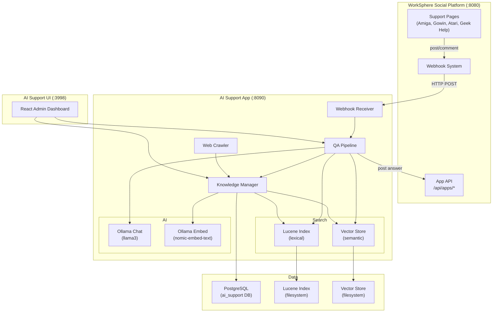
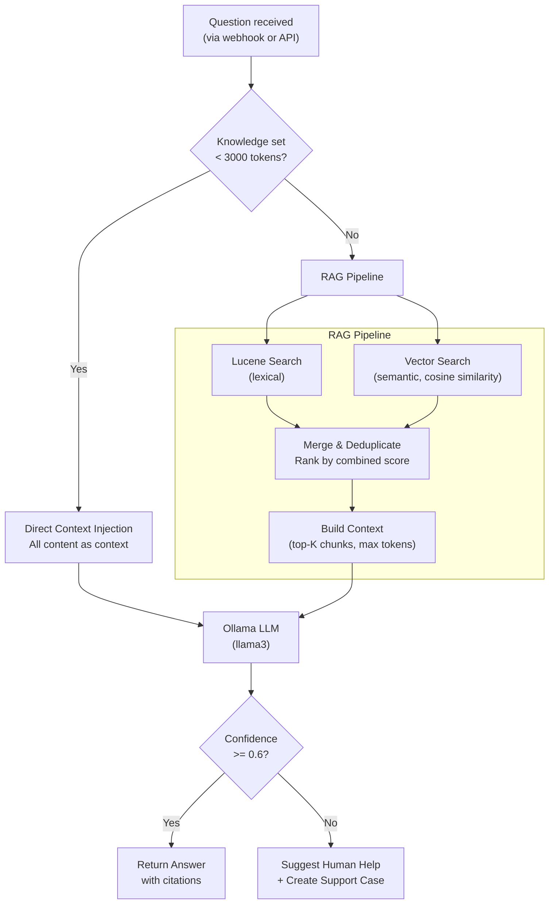
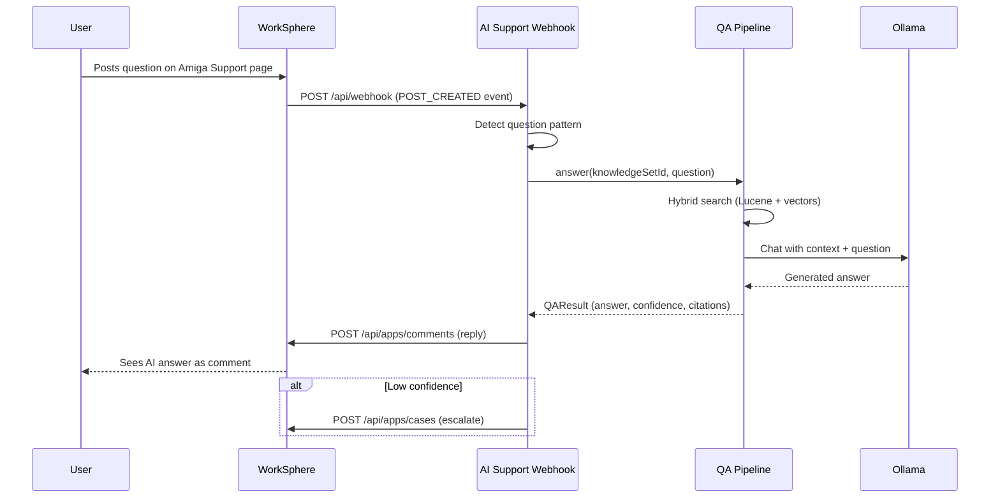
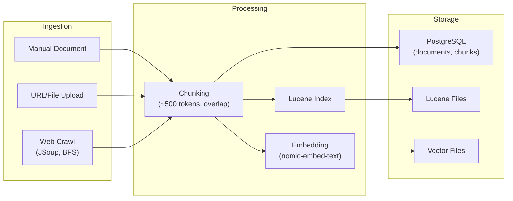
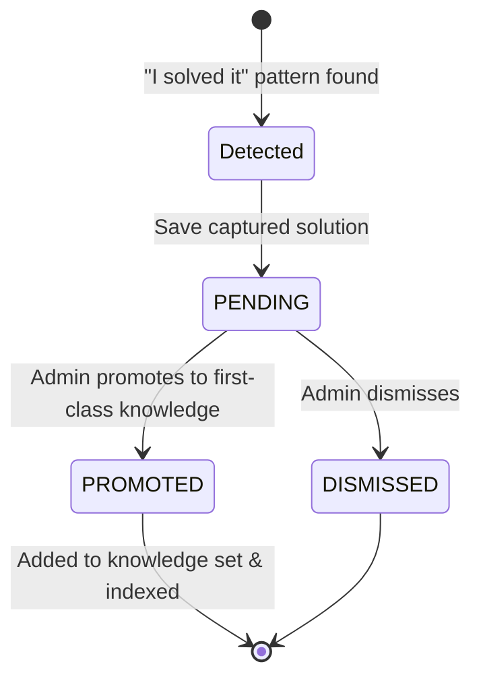

# AI Support -- Intelligent Knowledge-Based Support System

## Overview

A standalone Spring Boot + React application that provides AI-powered support for WorkSphere social platform pages. Uses Ollama for LLM chat and embeddings, Lucene for lexical search, and an in-memory vector store for semantic search.

When a user posts a question on a WorkSphere support page (Amiga, Gowin, Atari, Geek Help), the system receives a webhook event, searches its knowledge base using a hybrid retrieval strategy, generates an answer via a local LLM, and posts the response back as a comment. If confidence is low, it escalates to a human by creating a support case.

## Architecture



The system is split into three deployable units:

- **AI Support App** (`:8090`) -- Spring Boot backend handling webhooks, knowledge management, search, and QA orchestration.
- **AI Support UI** (`:3998`) -- React admin dashboard for managing knowledge sets, reviewing solutions, and testing queries.
- **WorkSphere Social** (`:8080`) -- The upstream social platform that sends webhook events and receives AI-generated replies via its App API.

All AI inference runs locally through Ollama, keeping data on-premises and avoiding external API dependencies.

## Question Answering Pipeline

The QA pipeline uses an adaptive strategy based on knowledge set size. Small knowledge sets bypass RAG entirely and inject all content as direct context, while larger sets use hybrid retrieval.



Key details:

- **Lexical search** uses Apache Lucene for keyword matching, handling exact terms, model numbers, and acronyms well.
- **Semantic search** uses cosine similarity over 768-dimensional embeddings from `nomic-embed-text`, capturing meaning even when wording differs.
- **Hybrid merge** combines both result sets, deduplicates by chunk ID, and ranks by a weighted combined score.
- **Confidence threshold** of 0.6 determines whether the answer is posted directly or escalated to a human.

## Webhook Integration

The webhook system connects AI Support to the WorkSphere social platform, enabling automatic responses to user questions.



The webhook receiver maps WorkSphere pages to knowledge sets by page ID. When a `POST_CREATED` event arrives, the system checks whether the post text looks like a question (using pattern detection), then triggers the QA pipeline. The reply is posted back through the WorkSphere App API as a comment on the original post.

## Knowledge Management

Knowledge is organized into **knowledge sets**, each containing **documents** that are split into **chunks** for indexing and retrieval.



Three ingestion paths are supported:

- **Manual documents** -- text content added directly through the API or admin UI.
- **URL/file upload** -- content fetched from a URL or uploaded as a file.
- **Web crawl** -- breadth-first crawl using JSoup, following links up to a configurable depth. Useful for ingesting entire wiki sections or documentation sites.

During processing, documents are split into chunks of approximately 500 tokens with overlap to preserve context across boundaries. Each chunk is embedded via Ollama's `nomic-embed-text` model (768 dimensions) and indexed in both the Lucene lexical index and the in-memory vector store. Both indexes are backed by filesystem persistence.

## Community Solution Capture

The system monitors community discussions for self-reported solutions. When a user posts something matching a "solved it" pattern, the solution is captured and queued for admin review.



Promoted solutions become first-class documents in their knowledge set, automatically chunked, embedded, and indexed so future questions can benefit from community-discovered answers.

## Cross-Knowledge-Set Routing

When a question is asked on "Geek Help" (the general-purpose support page), the system searches **all** knowledge sets and suggests the best match. This enables a single entry point for users who are unsure which specific support page to use. The routing endpoint returns the best-matching knowledge set along with the answer, so the UI can suggest the user visit the more specific page for follow-up.

## Tech Stack

| Component | Technology |
|-----------|-----------|
| Backend | Spring Boot 3.4.3, Java 21 |
| Frontend | React 18, TypeScript, Vite, Tailwind CSS |
| Database | PostgreSQL (ai_support DB) |
| LLM | Ollama (llama3) |
| Embeddings | Ollama (nomic-embed-text, 768d) |
| Lexical Search | Apache Lucene 9.10 |
| Vector Search | Custom cosine similarity (in-memory, file-backed) |
| Web Crawling | JSoup 1.17 |
| HTTP Client | OkHttp 4.12 |

## API Endpoints

### Knowledge Management (`/api/knowledge`)

| Method | Path | Description |
|--------|------|-------------|
| GET | /sets | List all knowledge sets |
| POST | /sets | Create knowledge set |
| GET | /sets/{id} | Get knowledge set with stats |
| GET | /sets/{id}/documents | List documents |
| POST | /sets/{id}/documents | Add and index document |
| DELETE | /documents/{id} | Delete document |
| POST | /sets/{id}/crawl | Start web crawl |
| POST | /sets/{id}/index-all | Re-index all unindexed docs |

### Search (`/api/search`)

| Method | Path | Description |
|--------|------|-------------|
| GET | /lexical/{ksId}?q=&topK= | Lucene search |
| GET | /semantic/{ksId}?q=&topK= | Vector similarity search |
| GET | /hybrid/{ksId}?q=&topK= | Combined search |
| GET | /route?q=&topK= | Cross-KS routing |

### Question Answering (`/api/qa`)

| Method | Path | Description |
|--------|------|-------------|
| POST | /ask | Answer a question |
| POST | /route | Route question to best KS |
| POST | /feedback | Record answer feedback |

### Solutions (`/api/solutions`)

| Method | Path | Description |
|--------|------|-------------|
| GET | / | List solutions by status |
| POST | /{id}/promote | Promote to knowledge |
| POST | /{id}/dismiss | Dismiss solution |
| GET | /stats | Solution counts by status |

### Webhook (`/api/webhook`)

| Method | Path | Description |
|--------|------|-------------|
| POST | / | Receive WorkSphere events |

## Quick Start

```bash
# Prerequisites: PostgreSQL, Ollama with llama3 + nomic-embed-text

# 1. Create database
createdb ai_support

# 2. Build and start
cd ai-support/ai-support-app
mvn package -DskipTests
java -jar target/ai-support-app-1.0.0-SNAPSHOT.jar

# 3. Populate knowledge
node scripts/populate-knowledge.mjs

# 4. Start UI
cd ai-support/ai-support-ui
npm install && npx vite

# 5. Run tests
bash scripts/test-qa-scenarios.sh

# 6. Register with WorkSphere (optional)
bash scripts/register-app.sh
```

## Demo Knowledge Sets

| Knowledge Set | Topic | Documents | Chunks |
|---------------|-------|-----------|--------|
| Amiga Computer Support | Commodore Amiga models, hardware, software, emulation | 8 | ~18 |
| Gowin FPGA Support | Gowin FPGAs, Tang Nano boards, HDL design | 6 | ~15 |
| Atari 8-bit Support | Atari 400/800/XL/XE, storage, BASIC, repairs | 6 | ~18 |
| Geek Help | General retro computing and FPGA overview | 3 | ~8 |

## Ports

| Service | Port |
|---------|------|
| AI Support Backend | 8090 |
| AI Support UI | 3998 |
| Ollama | 11434 |
| PostgreSQL | 5432 |
| WorkSphere Social | 8080/8088 |
