# AI Support -- Intelligent Knowledge-Based Support System

## 1. Overview

AI Support is a standalone application that provides automated, AI-powered question answering for WorkSphere social platform pages. When a user posts a question on a support page, the system receives a webhook event, searches its knowledge base using a hybrid retrieval strategy, generates an answer via a local LLM through a ReAct-style agentic reasoning loop, and posts the response back as a comment. If confidence is low, it escalates to a human by creating a support case.

The system is split into three deployable units:

| Unit | Port | Technology | Description |
|------|------|-----------|-------------|
| **AI Support App** | `:8090` | Spring Boot 3.4.3, Java 21 | Backend handling webhooks, knowledge management, search, and QA orchestration |
| **AI Support UI** | `:3998` | React 18, TypeScript, Vite, Tailwind CSS | Admin dashboard for managing knowledge sets, reviewing solutions, and testing queries |
| **WorkSphere Social** | `:8080` | Spring Boot (upstream) | The social platform that sends webhook events and receives AI-generated replies via its App API |

All AI inference runs locally through Ollama, keeping data on-premises and avoiding external API dependencies.

**Key technologies:**

| Component | Technology | Version |
|-----------|-----------|---------|
| LLM (Chat) | Ollama llama3 | Local |
| Embeddings | Ollama nomic-embed-text (768 dimensions) | Local |
| Lexical Search | Apache Lucene | 9.10 |
| Vector Search | Custom cosine similarity (in-memory, file-backed) | -- |
| Database | PostgreSQL | ai_support DB |
| Web Crawling | JSoup | 1.17 |
| HTTP Client | OkHttp | 4.12 |
| Schema Migrations | Flyway | -- |

---

## 2. System Architecture

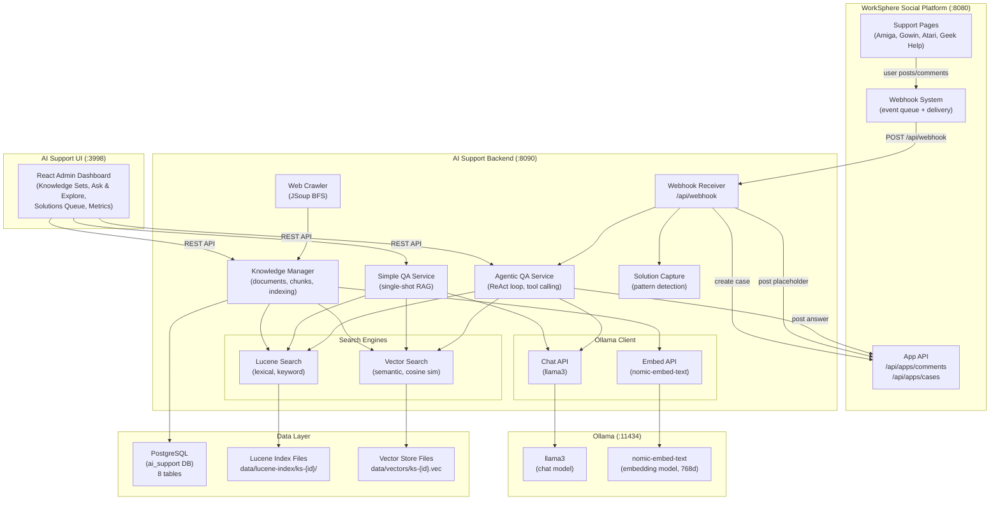

### Component Responsibilities

- **Webhook Receiver** (`WebhookController`): Accepts POST_CREATED and COMMENT_CREATED events from WorkSphere. Returns HTTP 200 immediately and processes asynchronously via `CompletableFuture.runAsync()`. Maps the incoming `installation.targetId` to a knowledge set via `socialPageId`, detects whether the content is a question, then dispatches to the agentic QA pipeline.

- **Agentic QA Service** (`AgenticQAService`): The primary question-answering path. Implements a ReAct-style tool-calling loop where the LLM iteratively searches, retrieves documents, and reasons before producing a final answer.

- **Simple QA Service** (`QAService`): A fallback single-shot RAG pipeline. Performs hybrid search, builds context from top-K chunks, and makes a single LLM call. Used for direct API queries via `/api/qa/ask`.

- **Knowledge Manager** (`KnowledgeService`): Manages knowledge sets, documents, chunking, and dual indexing (Lucene + vector). Handles SHA-256 deduplication on document ingestion.

- **Web Crawler** (`WebCrawlerService`): BFS crawler using JSoup that ingests entire documentation sites into knowledge sets.

- **Solution Capture** (`CapturedSolutionHandler`): Monitors community posts for resolution patterns and captures solutions for admin review or auto-promotion.

---

## 3. Agentic QA Pipeline

This is the core of the system. The `AgenticQAService` implements a ReAct-style (Reason + Act) loop where the LLM can iteratively call tools to search for information, retrieve documents, and refine its understanding before producing a final answer.

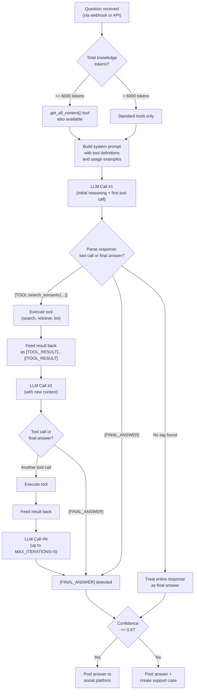

### Available Tools

The LLM is provided with these tools in the system prompt, each invoked via a specific text pattern `[TOOL:tool_name(args)]`:

| Tool | Signature | Description |
|------|-----------|-------------|
| `search_semantic` | `search_semantic(query)` | Embeds the query via nomic-embed-text and finds the top-5 most similar chunks using cosine similarity. Best for conceptual/meaning-based queries. **The system prompt instructs the LLM to use this first.** |
| `search_lexical` | `search_lexical(keywords)` | Apache Lucene keyword search across title and content fields. Good for exact terms, model numbers, and acronyms. Returns top-5 chunks with BM25 scores. |
| `get_document` | `get_document(id)` | Retrieves full document content by numeric ID. Truncated to 4000 chars if the document is very large. Useful for deep reading after search identifies a relevant document. |
| `list_documents` | `list_documents()` | Lists all available documents in the knowledge set with IDs, titles, character counts, and source types. Helpful for the LLM to understand what is available. |
| `get_all_content` | `get_all_content()` | Dumps the entire knowledge base content. **Only offered when total tokens <= 6000**, since larger knowledge sets would overflow the context window. Truncated to 8000 chars as a safety limit. |

### Key Design Decisions

- **Max 5 iterations** (`MAX_ITERATIONS = 5`): Prevents runaway loops where the LLM keeps calling tools indefinitely. If no `[FINAL_ANSWER]` tag is found after 5 iterations, a fallback message is returned.

- **System prompt includes worked examples**: The prompt contains a full example interaction showing the exact tool call format, a follow-up document retrieval, and a properly formatted final answer with sources. This few-shot approach significantly improves format compliance.

- **Direct context injection for small knowledge sets**: When the knowledge set has fewer than 3000 tokens (in the simple QA path) or 6000 tokens (agentic path), the system makes `get_all_content()` available, allowing the LLM to read everything at once rather than searching.

- **Tool call parsing via regex**: The pattern `\[TOOL:(\w+)\(([^)]*)\)\]` extracts tool name and arguments. The text before the tool call is captured as the LLM's "thought" for trace purposes.

- **Every step is traced**: Each iteration records: thought text, tool name, tool arguments, tool result (truncated to 300 chars for storage), and execution duration in milliseconds. These are stored as JSON in the `context_chunks` field of the `qa_traces` table.

### Confidence Estimation (Agentic)

The agentic pipeline uses a heuristic-based confidence score:

| Condition | Confidence |
|-----------|-----------|
| Answer contains "I wasn't able", "couldn't find", "don't have", or "no information" | 0.2 |
| No tool calls returned results | 0.4 |
| 1 tool call with results | 0.7 |
| N tool calls with results (N >= 2) | min(0.5 + N * 0.15, 0.95) |

If confidence is below the threshold (0.6), the answer is appended with a human-help offer and a support case is created via the App API.

---

## 4. Simple RAG Pipeline (Fallback)

The `QAService` provides a non-agentic path for simple, fast responses. This is used when calling `/api/qa/ask` directly (not through webhooks, which use the agentic path).

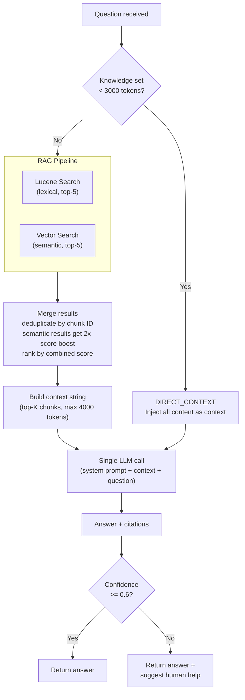

### Hybrid Search Merge Strategy

1. **Semantic results** are scored with a 2x multiplier (`score * 2`) to prioritize meaning-based matches.
2. **Lexical results** contribute their raw BM25 score.
3. When a chunk appears in both result sets, their scores are summed.
4. Results are sorted by combined score and the top-K (default: 5) are selected.
5. Context is built by concatenating chunk text up to the `max-context-tokens` limit (default: 4000).

### Confidence Estimation (Simple RAG)

The simple pipeline uses a word-overlap heuristic:

1. If the answer contains hedging phrases ("I don't have", "not sure", "cannot find", etc.), confidence = 0.2.
2. Otherwise, it computes the ratio of significant words (length > 4) in the answer that also appear in the context.
3. Final confidence = min(0.5 + overlapRatio, 0.95), rounded to two decimal places.

---

## 5. End-to-End Question Flow

This sequence diagram shows every step from a user posting a question to seeing the AI answer appear as a comment.

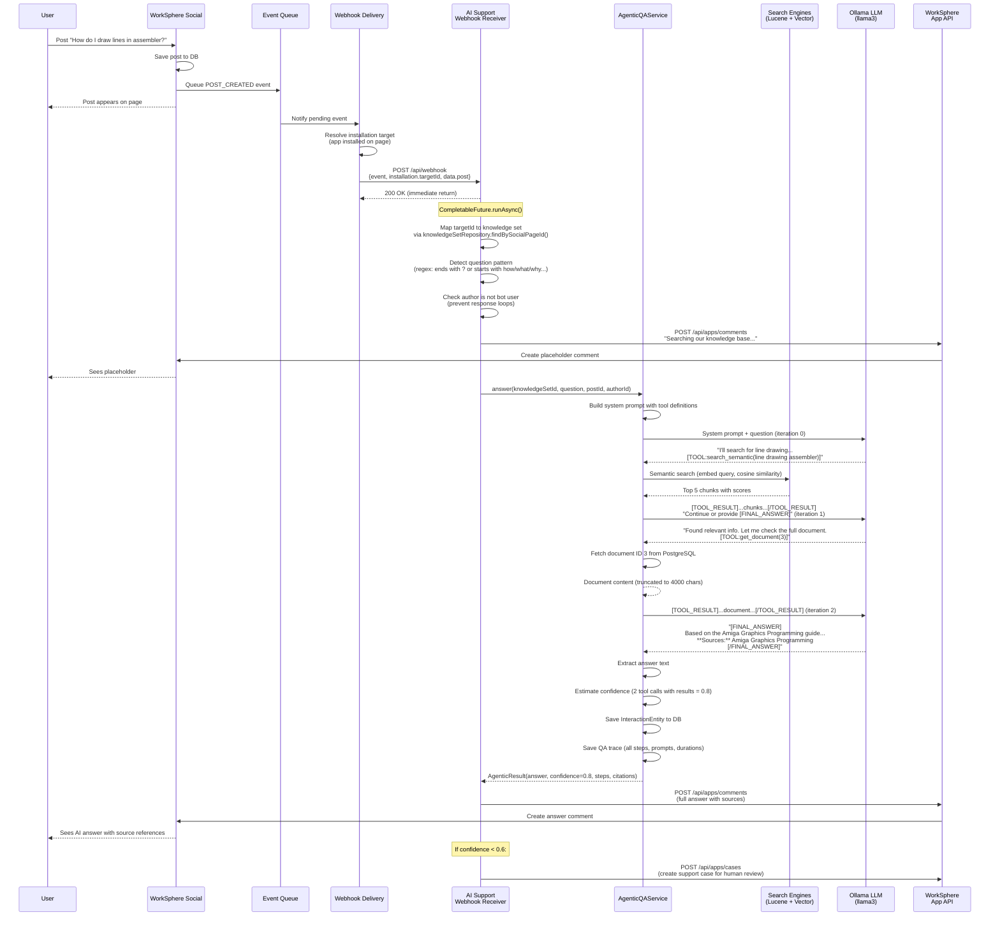

### Webhook Event Format

The webhook payload from WorkSphere follows this structure:

```json
{
  "event": "POST_CREATED",
  "timestamp": "2026-04-03T10:30:00Z",
  "installation": {
    "targetId": 72057594037927941,
    "type": "PAGE"
  },
  "data": {
    "post": {
      "id": 72057594038000001,
      "content": "How do I draw lines in assembler?",
      "author": {
        "id": 72057594037927940,
        "displayName": "RetroFan42"
      }
    }
  }
}
```

### Question Detection Pattern

The webhook receiver uses a regex to detect questions:

```
\?$|^(how|what|why|when|where|which|can|does|is|are|will|should|could|would|hi i|hello|hey)
```

This matches posts that end with `?` or start with common question words and greetings (case-insensitive, multiline). Posts that do not match the question pattern are checked for resolution patterns instead (see Section 8).

---

## 6. Knowledge Ingestion Pipeline

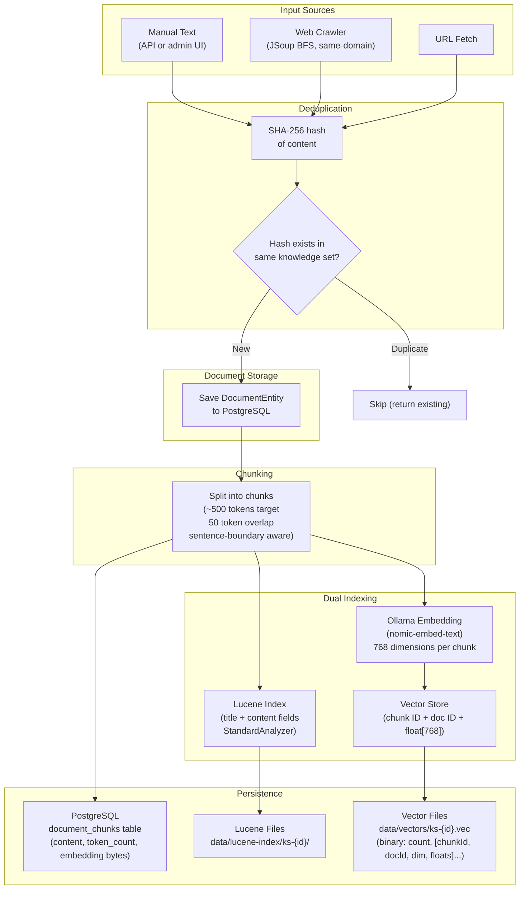

### Chunking Strategy

The `KnowledgeService.chunkText()` method splits documents with these parameters:

| Parameter | Value | Description |
|-----------|-------|-------------|
| Target chunk size | ~500 tokens | Estimated at 4 characters per token, so ~2000 characters per chunk |
| Overlap | 50 tokens | ~200 characters of overlap between consecutive chunks to preserve cross-boundary context |
| Boundary detection | Sentence-aware | Prefers breaking at `. ` (period-space) or `\n` (newline) boundaries when they fall in the second half of the chunk |

**Algorithm:**

1. If the full text is shorter than one chunk, return it as a single chunk.
2. Otherwise, advance through the text in windows of `charsPerChunk` (2000 chars).
3. Before cutting, look for the last sentence boundary (`. `) or newline within the window.
4. If a boundary exists in the second half of the window, break there instead.
5. The next chunk starts `overlapChars` (200) characters before the break point.

### Deduplication

Every document's content is hashed with SHA-256 before storage. If a document with the same hash already exists in the same knowledge set, the existing document is returned without creating a duplicate. This prevents the crawler from re-ingesting pages it has already visited.

### Embedding Storage

Embeddings are stored in two places:

1. **PostgreSQL**: The `document_chunks.embedding` column stores the raw bytes (`float[]` serialized to `byte[]` via `ByteBuffer`). This serves as the source of truth.
2. **Vector store files**: Binary files at `data/vectors/ks-{id}.vec` store all embeddings for fast in-memory loading at startup. Format: `int(count)`, then for each entry: `long(chunkId)`, `long(documentId)`, `int(dimensions)`, `float[dimensions]`.

---

## 7. Web Crawler

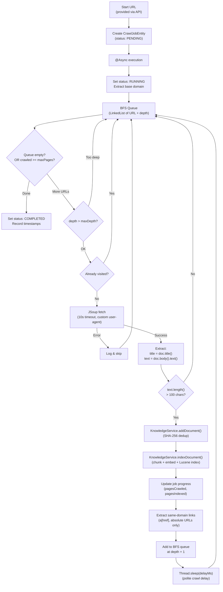

### Crawler Configuration

| Property | Default | Description |
|----------|---------|-------------|
| `aisupport.crawler.max-depth` | 3 | Maximum link-following depth from the start URL |
| `aisupport.crawler.max-pages` | 100 | Maximum number of pages to crawl per job |
| `aisupport.crawler.delay-ms` | 1000 | Delay between page fetches (polite crawling) |
| `aisupport.crawler.user-agent` | `WorkSphere-AI-Support-Crawler/1.0` | User-Agent header sent with requests |

### Crawl Constraints

- **Same-domain restriction**: Only follows links whose host matches the start URL's host. Prevents accidentally crawling the entire internet.
- **Fragment exclusion**: URLs containing `#` are skipped (same-page anchors).
- **Protocol restriction**: Only `http://` and `https://` URLs are followed.
- **Content minimum**: Pages with fewer than 100 characters of body text are skipped.
- **Async execution**: Crawls run in a Spring `@Async` thread pool, so the API returns the job ID immediately.
- **Progress tracking**: The `crawl_jobs` table is updated after each page with current `pagesCrawled` and `pagesIndexed` counts.

---

## 8. Community Solution Capture

The system monitors all posts and comments for self-reported solutions. When community members solve their own problems and share the fix, the `CapturedSolutionHandler` detects this and captures the knowledge.

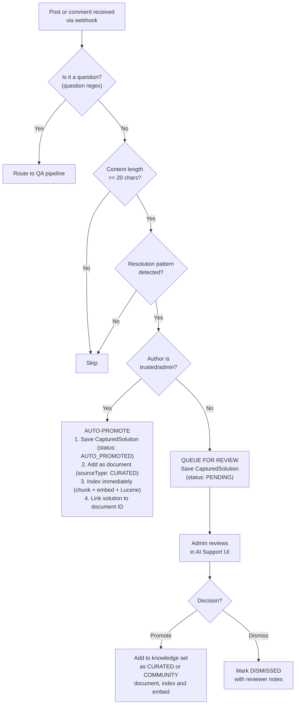

### Resolution Patterns

The following regex patterns (case-insensitive) trigger solution detection:

| Pattern | Example Match |
|---------|--------------|
| `i solved` | "I solved it by updating the firmware" |
| `i fixed` | "I fixed the issue" |
| `solution was` | "The solution was to replace the capacitor" |
| `the fix is` | "The fix is to use a pull-up resistor" |
| `figured it out` | "Finally figured it out!" |
| `resolved by` | "Resolved by changing the jumper setting" |
| `worked for me` | "This worked for me" |
| `this worked` | "This worked!" |
| `the answer is` | "The answer is to use DMA channel 3" |
| `i found that` | "I found that the issue was with the PSU" |
| `turns out` | "Turns out the ROM was corrupted" |
| `problem was` | "The problem was a cold solder joint" |
| `issue was` | "The issue was insufficient voltage" |
| `root cause` | "Root cause: timing violation in the FPGA" |
| `workaround is` | "The workaround is to use a different cable" |

### Trusted Users

Solutions from users in the `TRUSTED_USER_IDS` set are auto-promoted without requiring admin review. These are pre-configured admin/support user IDs:

- `72057594037927937` (Lamar, admin)
- `72057594037927938` (Joshua, admin)
- `72057594037927939` (Cecilia, admin)

### Knowledge Tiers

| Tier | Source Type | Description |
|------|-----------|-------------|
| **CURATED** | Auto-promoted from trusted users, or admin-promoted as "first class" | Treated as authoritative, first-class knowledge. Stored alongside original documents. |
| **COMMUNITY** | Admin-promoted as community contribution | Prefixed with `[Community Solution by Username]`. Valuable but may need verification. |

---

## 9. Cross-Knowledge-Set Routing

When a question arrives on the "Geek Help" page (the general-purpose support page), or when the `/api/qa/route` endpoint is called, the system searches **all** knowledge sets to find the best match.

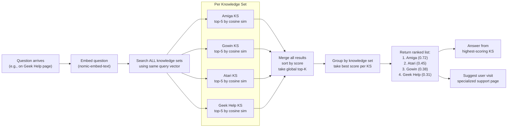

### Routing Algorithm

1. The question is embedded once via `ollamaService.embed(query)`.
2. The same embedding vector is used to search every knowledge set's vector store.
3. Results from all knowledge sets are merged and sorted by cosine similarity score.
4. The global top-K results are returned.
5. For the `/api/qa/route` endpoint, results are grouped by knowledge set ID, keeping only the best score per set.
6. The ranked list is returned with `knowledgeSetId`, `score`, `name`, `slug`, and `socialPageId`.

This enables a single entry point for users who are unsure which specific support page to use.

---

## 10. Trace System

Every QA interaction generates a detailed trace record that captures the full pipeline execution for debugging, quality monitoring, and continuous improvement.

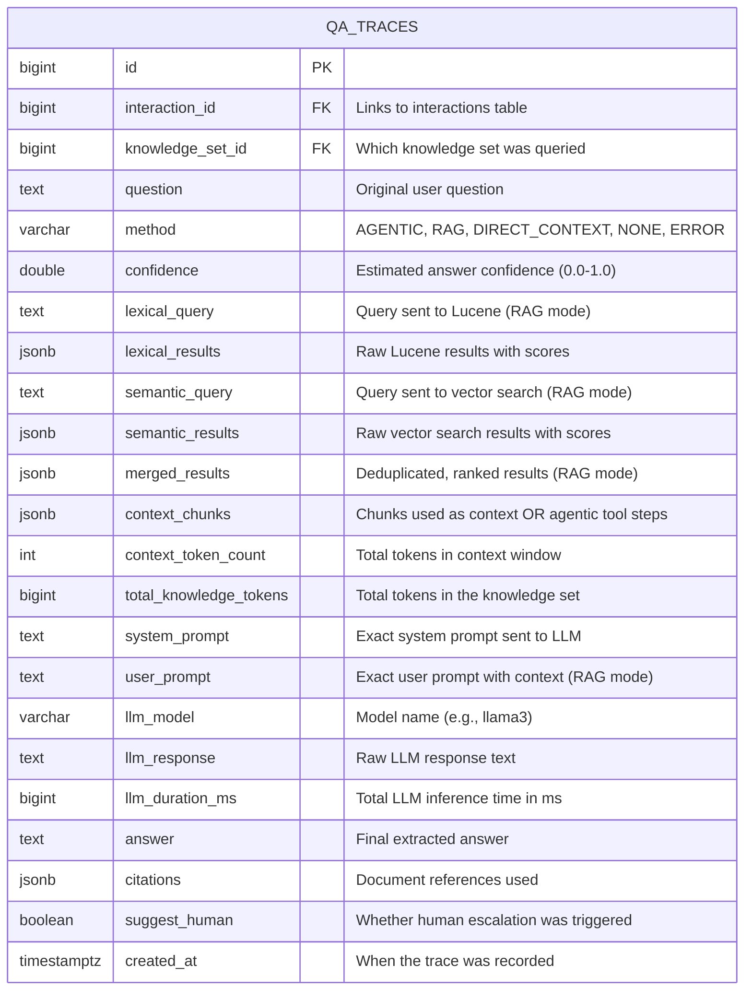

### What Is Captured

**For Simple RAG mode (`method = "RAG"`):**

- `lexical_query` / `lexical_results`: The Lucene search query and raw results (chunkId, documentId, title, score).
- `semantic_query` / `semantic_results`: The vector search query and raw results (chunkId, documentId, score).
- `merged_results`: The combined, deduplicated, score-boosted results after merging.
- `context_chunks`: Array of `{chunkId, tokens, contentPreview}` for each chunk included in the context window.
- `context_token_count`: How many tokens were packed into the context.
- `system_prompt` + `user_prompt`: The exact prompts sent to the LLM.
- `llm_response`: The raw LLM output.
- `llm_duration_ms`: Wall-clock time for the LLM call.

**For Agentic mode (`method = "AGENTIC"`):**

- `context_chunks`: Array of tool-call step objects, each containing:
  - `iteration`: Step number (0-4)
  - `thought`: The LLM's reasoning text before the tool call
  - `tool`: Tool name invoked (e.g., `search_semantic`, `get_document`)
  - `args`: Arguments passed to the tool
  - `resultPreview`: First 300 characters of the tool's output
  - `durationMs`: Tool execution time in milliseconds
- `llm_duration_ms`: Total cumulative LLM inference time across all iterations.
- `system_prompt`: The full agentic system prompt with tool definitions and examples.

### Trace Inspection

The admin UI exposes trace details through:
- `GET /api/qa/traces` -- List recent traces with summary fields (question, method, confidence, duration, created_at).
- `GET /api/qa/traces/{id}` -- Full trace detail including all JSON fields.

This allows operators to inspect exactly what data the LLM received, what tools it called, how long each step took, and what answer it produced -- essential for diagnosing quality issues and tuning prompts.

---

## 11. Database Schema

The system uses 8 tables managed by Flyway migrations:

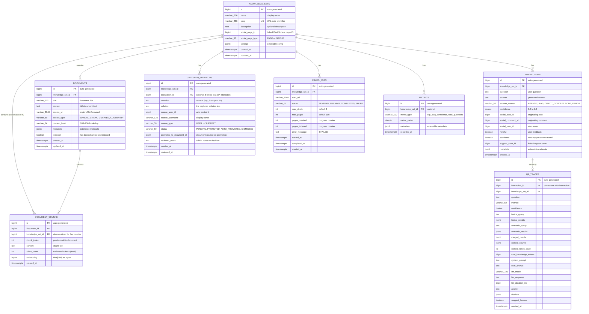

---

## 12. Social Platform Integration

The AI Support system integrates bidirectionally with WorkSphere Social:

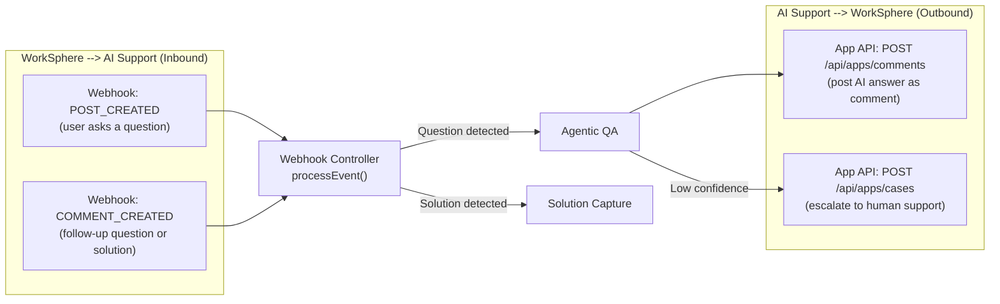

### App Registration

The AI Support app is registered with WorkSphere as a `PAGE`-type app. Registration is done via the `scripts/register-app.sh` script:

1. **Register app**: `POST /api/app-registry/apps` with name, slug, description, webhook URL, and permissions (`read:posts`, `write:comments`, `write:cases`).
2. **Create support pages**: If they do not already exist.
3. **Install app on pages**: The app is installed on each support page, which means WorkSphere will deliver webhook events for that page.
4. **Link knowledge sets**: Update each AI Support knowledge set with its corresponding `socialPageId`.

### App API Authentication

All outbound calls to WorkSphere use:

```
Authorization: Bearer {api-key}
X-App-Id: {app-id}
Content-Type: application/json
```

The `SocialAppClient` uses OkHttp with a 10-second connect timeout and 30-second read timeout.

### Bot Loop Prevention

The `SocialAppClient.isBotUser(authorId)` method checks whether the author of a post or comment is the AI Support bot itself (a hardcoded bot user ID: `72057594037999999`). This prevents the system from responding to its own messages and creating infinite response loops.

### Webhook Event Types Handled

| Event | Handler | Behavior |
|-------|---------|----------|
| `POST_CREATED` | `handlePost()` | If question: post placeholder, run agentic QA, post answer. If not: check for solution patterns. |
| `COMMENT_CREATED` | `handleComment()` | Same as POST_CREATED but also checks that the author is not the bot user. |
| All others | Logged and ignored | Graceful handling of unknown event types. |

---

## 13. Configuration Reference

All configuration is managed via `application.yml`:

```yaml
server:
  port: 8090                          # AI Support backend port

spring:
  datasource:
    url: jdbc:postgresql://localhost:5432/ai_support
    username: social
    password: social_dev_password
  jpa:
    hibernate:
      ddl-auto: validate              # Schema managed by Flyway
    show-sql: false
  flyway:
    enabled: true                     # Auto-run migrations on startup
  jackson:
    serialization:
      write-dates-as-timestamps: false # ISO-8601 date format

aisupport:
  ollama:
    base-url: http://localhost:11434  # Ollama API endpoint
    chat-model: llama3                # Model for chat/QA
    embed-model: nomic-embed-text     # Model for embeddings
    embed-dimensions: 768             # Embedding vector size
  lucene:
    index-dir: ./data/lucene-index    # Filesystem path for Lucene indexes
  vectors:
    storage-dir: ./data/vectors       # Filesystem path for vector store files
  social-app:
    base-url: http://localhost:8080   # WorkSphere Social platform URL
    api-key: ""                       # Set after app registration
    app-id: ""                        # Set after app registration
  crawler:
    max-depth: 3                      # Default max crawl depth
    max-pages: 100                    # Default max pages per crawl job
    delay-ms: 1000                    # Polite delay between fetches (ms)
    user-agent: "WorkSphere-AI-Support-Crawler/1.0"
  qa:
    max-context-tokens: 4000          # Max tokens in RAG context window
    direct-context-threshold: 3000    # Below this, inject all content directly
    top-k-results: 5                  # Number of search results to use
    confidence-threshold: 0.6         # Below this, suggest human help
```

### Environment Variable Overrides

All properties can be overridden via environment variables using Spring Boot's relaxed binding:

```bash
AISUPPORT_OLLAMA_BASE_URL=http://gpu-server:11434
AISUPPORT_OLLAMA_CHAT_MODEL=llama3:70b
AISUPPORT_SOCIAL_APP_API_KEY=your-key-here
AISUPPORT_SOCIAL_APP_APP_ID=your-app-id
SPRING_DATASOURCE_URL=jdbc:postgresql://db-host:5432/ai_support
```

---

## 14. API Reference

### Knowledge Management (`/api/knowledge`)

#### `GET /sets` -- List All Knowledge Sets

```bash
curl http://localhost:8090/api/knowledge/sets
```

```json
[
  {
    "id": 1,
    "name": "Amiga Computer Support",
    "slug": "amiga",
    "description": "Commodore Amiga hardware, software, and emulation",
    "socialPageId": 72057594037927941,
    "socialPageType": "PAGE",
    "createdAt": "2026-04-01T12:00:00Z"
  }
]
```

#### `POST /sets` -- Create Knowledge Set

```bash
curl -X POST http://localhost:8090/api/knowledge/sets \
  -H "Content-Type: application/json" \
  -d '{
    "name": "Amiga Computer Support",
    "slug": "amiga",
    "description": "Commodore Amiga hardware, software, and emulation",
    "socialPageId": "72057594037927941",
    "socialPageType": "PAGE"
  }'
```

#### `GET /sets/{id}` -- Get Knowledge Set With Stats

```bash
curl http://localhost:8090/api/knowledge/sets/1
```

```json
{
  "id": 1,
  "name": "Amiga Computer Support",
  "slug": "amiga",
  "description": "...",
  "socialPageId": 72057594037927941,
  "documentCount": 8,
  "chunkCount": 18,
  "totalTokens": 4520,
  "luceneDocCount": 18,
  "vectorCount": 18
}
```

#### `PUT /sets/{id}` -- Update Knowledge Set

```bash
curl -X PUT http://localhost:8090/api/knowledge/sets/1 \
  -H "Content-Type: application/json" \
  -d '{"name": "Amiga Support (Updated)", "socialPageId": "72057594037927941"}'
```

#### `GET /sets/{ksId}/documents` -- List Documents

```bash
curl http://localhost:8090/api/knowledge/sets/1/documents
```

```json
[
  {
    "id": 1,
    "title": "Amiga Model Guide",
    "sourceUrl": null,
    "sourceType": "MANUAL",
    "indexed": true,
    "contentLength": 3200,
    "createdAt": "2026-04-01T12:00:00Z"
  }
]
```

#### `POST /sets/{ksId}/documents` -- Add and Index Document

```bash
curl -X POST http://localhost:8090/api/knowledge/sets/1/documents \
  -H "Content-Type: application/json" \
  -d '{
    "title": "Amiga Capacitor Replacement Guide",
    "content": "The Amiga 500 and A1200 are known for leaking capacitors...",
    "sourceUrl": "https://example.com/amiga-caps",
    "sourceType": "MANUAL"
  }'
```

```json
{
  "id": 9,
  "title": "Amiga Capacitor Replacement Guide",
  "indexed": true,
  "chunksIndexed": 3
}
```

Auto-indexing happens immediately: the document is chunked, embedded, and indexed in both Lucene and the vector store before the response is returned.

#### `DELETE /documents/{id}` -- Delete Document

```bash
curl -X DELETE http://localhost:8090/api/knowledge/sets/documents/9
```

Removes the document, all its chunks, and entries from both Lucene and vector indexes.

#### `POST /sets/{ksId}/crawl` -- Start Web Crawl

```bash
curl -X POST http://localhost:8090/api/knowledge/sets/1/crawl \
  -H "Content-Type: application/json" \
  -d '{
    "url": "https://amiga.example.com/wiki",
    "maxDepth": 2,
    "maxPages": 50
  }'
```

```json
{
  "jobId": 1,
  "status": "PENDING"
}
```

The crawl runs asynchronously. Monitor progress by querying the knowledge set stats.

#### `POST /sets/{ksId}/index-all` -- Re-index Unindexed Documents

```bash
curl -X POST http://localhost:8090/api/knowledge/sets/1/index-all
```

```json
{
  "status": "indexing_started"
}
```

Runs asynchronously via `@Async`. Finds all documents in the knowledge set where `indexed = false` and processes them.

---

### Search (`/api/search`)

#### `GET /lexical/{ksId}` -- Lucene Keyword Search

```bash
curl "http://localhost:8090/api/search/lexical/1?q=capacitor+replacement&topK=3"
```

```json
[
  {
    "chunkId": 5,
    "documentId": 2,
    "title": "Amiga Hardware Repair Guide",
    "content": "The most common repair needed on vintage Amigas is capacitor replacement...",
    "score": 3.45
  }
]
```

#### `GET /semantic/{ksId}` -- Vector Similarity Search

```bash
curl "http://localhost:8090/api/search/semantic/1?q=how+to+fix+audio+problems&topK=3"
```

```json
[
  {
    "chunkId": 5,
    "documentId": 2,
    "score": 0.82
  }
]
```

Note: semantic search returns similarity scores (0.0 to 1.0), not BM25 scores.

#### `GET /hybrid/{ksId}` -- Combined Search

```bash
curl "http://localhost:8090/api/search/hybrid/1?q=amiga+display+issues&topK=3"
```

```json
{
  "lexical": [...],
  "semantic": [...],
  "knowledgeSetId": 1,
  "query": "amiga display issues"
}
```

Returns both result sets for client-side comparison.

#### `GET /route` -- Cross-Knowledge-Set Search

```bash
curl "http://localhost:8090/api/search/route?q=how+to+program+Tang+Nano&topK=5"
```

```json
[
  {
    "chunkId": 22,
    "documentId": 8,
    "score": 0.78,
    "knowledgeSetId": 2
  }
]
```

---

### Question Answering (`/api/qa`)

#### `POST /ask` -- Simple RAG Answer

```bash
curl -X POST http://localhost:8090/api/qa/ask \
  -H "Content-Type: application/json" \
  -d '{
    "knowledgeSetId": 1,
    "question": "What Amiga models are there?"
  }'
```

```json
{
  "answer": "The Commodore Amiga line includes several models...\n\n**Sources:** Amiga Model Guide",
  "confidence": 0.82,
  "method": "RAG",
  "suggestHuman": false,
  "interactionId": 15,
  "traceId": 12,
  "citations": [
    {
      "documentId": 1,
      "title": "Amiga Model Guide",
      "snippet": "The Commodore Amiga is a family of personal computers..."
    }
  ]
}
```

#### `POST /ask-agentic` -- Agentic QA Answer

```bash
curl -X POST http://localhost:8090/api/qa/ask-agentic \
  -H "Content-Type: application/json" \
  -d '{
    "knowledgeSetId": 1,
    "question": "How do I replace the capacitors on my Amiga 500?"
  }'
```

```json
{
  "answer": "## Capacitor Replacement on the Amiga 500\n\nBased on the Amiga Hardware Repair Guide...\n\n**Sources:** Amiga Hardware Repair Guide",
  "confidence": 0.80,
  "method": "AGENTIC",
  "suggestHuman": false,
  "interactionId": 16,
  "traceId": 13,
  "steps": [
    {
      "iteration": 0,
      "thought": "I'll search for capacitor replacement information.",
      "tool": "search_semantic",
      "args": "capacitor replacement Amiga 500",
      "resultPreview": "Semantic search results for 'capacitor replacement Amiga 500':\n\n--- Chunk 5 (doc: 2, similarity: 0.847) ---...",
      "durationMs": 245
    },
    {
      "iteration": 1,
      "thought": "Found relevant information. Let me get the full repair guide.",
      "tool": "get_document",
      "args": "2",
      "resultPreview": "Document 'Amiga Hardware Repair Guide' (ID: 2):\n\nThe most common repair needed...",
      "durationMs": 12
    },
    {
      "iteration": 2,
      "thought": "Final answer generated",
      "tool": "none",
      "args": "",
      "resultPreview": "",
      "durationMs": 1823
    }
  ],
  "citations": [
    {
      "documentId": 2,
      "title": "Amiga Hardware Repair Guide",
      "snippet": "The most common repair needed on vintage Amigas..."
    }
  ]
}
```

#### `POST /route` -- Route Question to Best Knowledge Set

```bash
curl -X POST http://localhost:8090/api/qa/route \
  -H "Content-Type: application/json" \
  -d '{"question": "How do I install a PiStorm in my Amiga 500?"}'
```

```json
[
  {
    "knowledgeSetId": 1,
    "score": 0.72,
    "name": "Amiga Computer Support",
    "slug": "amiga",
    "socialPageId": 72057594037927941
  },
  {
    "knowledgeSetId": 4,
    "score": 0.38,
    "name": "Geek Help",
    "slug": "geek-help",
    "socialPageId": 72057594037927944
  }
]
```

#### `GET /traces` -- List Recent Traces

```bash
curl "http://localhost:8090/api/qa/traces?knowledgeSetId=1&limit=10"
```

```json
[
  {
    "id": 13,
    "knowledge_set_id": 1,
    "question": "How do I replace the capacitors?",
    "method": "AGENTIC",
    "confidence": 0.80,
    "llm_duration_ms": 3200,
    "suggest_human": false,
    "created_at": "2026-04-03T10:30:00Z"
  }
]
```

#### `GET /traces/{id}` -- Get Full Trace

```bash
curl http://localhost:8090/api/qa/traces/13
```

Returns the complete trace record with all JSON fields expanded.

#### `POST /feedback` -- Record Answer Feedback

```bash
curl -X POST http://localhost:8090/api/qa/feedback \
  -H "Content-Type: application/json" \
  -d '{"interactionId": 15, "helpful": true}'
```

```json
{"status": "recorded"}
```

---

### Solutions (`/api/solutions`)

#### `GET /` -- List Solutions By Status

```bash
curl "http://localhost:8090/api/solutions?status=PENDING"
```

```json
[
  {
    "id": 1,
    "knowledgeSetId": 1,
    "question": "(from post 72057594038000005)",
    "solution": "I fixed the audio crackling by replacing C404 and C405...",
    "sourceUsername": "AmigaGuru",
    "sourceType": "USER",
    "status": "PENDING",
    "createdAt": "2026-04-03T09:15:00Z"
  }
]
```

#### `POST /{id}/promote` -- Promote to Knowledge

```bash
curl -X POST http://localhost:8090/api/solutions/1/promote \
  -H "Content-Type: application/json" \
  -d '{
    "tier": "FIRST_CLASS",
    "title": "Audio Fix: Replace C404 and C405",
    "notes": "Verified by admin - common A500 issue"
  }'
```

```json
{
  "status": "promoted",
  "documentId": 10
}
```

The `tier` parameter controls the document source type:
- `"FIRST_CLASS"` -- stored as `CURATED` (treated as authoritative knowledge)
- Anything else -- stored as `COMMUNITY` (prefixed with contributor attribution)

#### `POST /{id}/dismiss` -- Dismiss Solution

```bash
curl -X POST http://localhost:8090/api/solutions/1/dismiss \
  -H "Content-Type: application/json" \
  -d '{"notes": "Duplicate of existing document"}'
```

```json
{"status": "dismissed"}
```

#### `GET /stats` -- Solution Counts

```bash
curl http://localhost:8090/api/solutions/stats
```

```json
{
  "pending": 3,
  "promoted": 12,
  "dismissed": 5
}
```

---

### Webhook (`/api/webhook`)

#### `POST /` -- Receive WorkSphere Events

```bash
curl -X POST http://localhost:8090/api/webhook \
  -H "X-WorkSphere-Event: POST_CREATED" \
  -H "X-WorkSphere-Event-Id: evt-123" \
  -H "Content-Type: application/json" \
  -d '{
    "event": "POST_CREATED",
    "timestamp": "2026-04-03T10:30:00Z",
    "installation": {
      "targetId": 72057594037927941,
      "type": "PAGE"
    },
    "data": {
      "post": {
        "id": 72057594038000001,
        "content": "How do I replace bad capacitors on my Amiga?",
        "author": {
          "id": 72057594037927940,
          "displayName": "RetroFan42"
        }
      }
    }
  }'
```

```json
{"status": "received"}
```

Always returns HTTP 200 immediately. Processing happens asynchronously.

---

### Health (`/api/health`)

#### `GET /` -- System Health Check

```bash
curl http://localhost:8090/api/health
```

```json
{
  "status": "UP",
  "ollamaAvailable": true,
  "database": "UP",
  "knowledgeSets": 4
}
```

---

## 15. Admin UI Guide

The AI Support UI is a React 18 + TypeScript application served by Vite on port 3998. It provides four main areas:

### Knowledge Sets Tab

- **List view**: Shows all knowledge sets with name, document count, chunk count, and total tokens.
- **Create**: Form to create a new knowledge set with name, slug, description, and optional social page linkage.
- **Detail view** (click a knowledge set):
  - **Documents list**: All documents with title, source type, indexed status, and content length. Delete button per document.
  - **Add document**: Form with title, content (textarea), optional source URL, and source type selector.
  - **Web crawl**: Form with start URL, max depth, and max pages. Starts an async crawl job.
  - **Re-index**: Button to trigger re-indexing of all unindexed documents.
  - **Stats**: Document count, chunk count, total tokens, Lucene doc count, vector count.

### Ask & Explore Tab

- **Knowledge set selector**: Dropdown to choose which knowledge set to query.
- **Question input**: Text area for entering a question.
- **Mode toggle**: Switch between "Simple RAG" (`/api/qa/ask`) and "Agentic" (`/api/qa/ask-agentic`).
- **Answer display**: Rendered markdown answer with confidence score, method badge, and citation list.
- **Agentic step inspector**: When using agentic mode, shows each tool-calling step with iteration number, thought text, tool name, arguments, result preview, and duration.
- **Trace link**: Click to view the full QA trace for the interaction.
- **Example questions**: Pre-populated example questions per knowledge set for quick testing.

### Solutions Queue Tab

- **Status filter**: Toggle between PENDING, PROMOTED, and DISMISSED views.
- **Solution cards**: Each card shows the captured solution text, source username, source type (USER or SUPPORT), knowledge set, and timestamp.
- **Promote action**: Opens a dialog to set the title, tier (FIRST_CLASS or COMMUNITY), and reviewer notes. Creates a document and indexes it.
- **Dismiss action**: Opens a dialog for reviewer notes. Marks the solution as dismissed.
- **Stats bar**: Shows counts of pending, promoted, and dismissed solutions.

### Metrics Tab

- **Per-knowledge-set stats**: Document count, chunk count, total tokens, interaction count.
- **Recent interactions**: List of recent QA interactions with question, confidence, method, and escalation status.
- **Recent traces**: Summary table of recent QA traces with timing information.

---

## 16. Deployment

### Prerequisites

- **Java 21** (for the Spring Boot backend)
- **Node.js 18+** (for the React admin UI)
- **PostgreSQL** (any recent version)
- **Ollama** with `llama3` and `nomic-embed-text` models pulled

### Quick Start

```bash
# 1. Install Ollama models
ollama pull llama3
ollama pull nomic-embed-text

# 2. Create database
createdb ai_support

# 3. Build and start backend
cd ai-support/ai-support-app
mvn package -DskipTests
java -jar target/ai-support-app-1.0.0-SNAPSHOT.jar

# 4. Populate demo knowledge
cd ai-support
node scripts/populate-knowledge.mjs

# 5. Start admin UI
cd ai-support/ai-support-ui
npm install
npx vite

# 6. (Optional) Register with WorkSphere
bash scripts/register-app.sh

# 7. Run tests
bash scripts/test-qa-scenarios.sh
```

### Docker Compose

A minimal `docker-compose.yml` setup requires four services:

```yaml
services:
  postgres:
    image: postgres:16
    environment:
      POSTGRES_DB: ai_support
      POSTGRES_USER: social
      POSTGRES_PASSWORD: social_dev_password
    ports: ["5432:5432"]

  ollama:
    image: ollama/ollama
    ports: ["11434:11434"]
    volumes: ["ollama-data:/root/.ollama"]

  ai-support-app:
    build: ./ai-support-app
    ports: ["8090:8090"]
    environment:
      SPRING_DATASOURCE_URL: jdbc:postgresql://postgres:5432/ai_support
      AISUPPORT_OLLAMA_BASE_URL: http://ollama:11434
    depends_on: [postgres, ollama]

  ai-support-ui:
    build: ./ai-support-ui
    ports: ["3998:3998"]
    depends_on: [ai-support-app]
```

After starting, pull the Ollama models:

```bash
docker exec ollama ollama pull llama3
docker exec ollama ollama pull nomic-embed-text
```

### Kubernetes

For Kubernetes deployment, the key considerations are:

- **Ollama**: Deploy as a StatefulSet with GPU node affinity if available. Use a PersistentVolumeClaim for model storage.
- **AI Support App**: Deploy as a Deployment with environment variable overrides for database and Ollama URLs. Mount PersistentVolumeClaims for `data/lucene-index/` and `data/vectors/`.
- **PostgreSQL**: Use a managed database service or a StatefulSet with PVC.
- **AI Support UI**: Deploy as a simple Deployment behind an Ingress. Configure the API base URL via environment variable.

### Port Reference

| Service | Port | Protocol |
|---------|------|----------|
| AI Support Backend | 8090 | HTTP |
| AI Support UI | 3998 | HTTP |
| Ollama | 11434 | HTTP |
| PostgreSQL | 5432 | TCP |
| WorkSphere Social | 8080 / 8088 | HTTP |

---

## 17. Testing

### QA Test Suite

The `scripts/test-qa-scenarios.sh` script provides an end-to-end test suite that validates the entire system:

```bash
# Run against default localhost:8090
bash scripts/test-qa-scenarios.sh

# Run against a custom host
bash scripts/test-qa-scenarios.sh http://ai-support-host:8090
```

### Test Categories

| Category | Tests | What It Validates |
|----------|-------|-------------------|
| **API Health** | 3 | App is running, Ollama is available, knowledge sets exist (>= 4) |
| **Amiga Knowledge (KS 1)** | 5 | Questions about models, capacitor repair, WinUAE, RAM upgrades, Deluxe Paint |
| **Gowin FPGA Knowledge (KS 2)** | 3 | Questions about Gowin FPGAs, Tang Nano 9K programming, CST constraint files |
| **Atari 8-bit Knowledge (KS 3)** | 3 | Questions about Atari models, FujiNet, modern TV connections |
| **Cross-KS Routing** | 3 | Routing Amiga/FPGA/Atari questions to the correct knowledge set |
| **Search APIs** | 3 | Lexical search, semantic search, and hybrid search return results |
| **Solutions Queue** | 1 | Solutions stats endpoint responds |

### How Tests Work

Each QA test:

1. Sends a question to `POST /api/qa/ask` for a specific knowledge set.
2. Checks that the confidence score meets a minimum threshold (typically 0.5 or 0.6).
3. Checks that the answer contains expected keywords (case-insensitive).
4. Reports PASS or FAIL with the actual confidence score.

Routing tests:

1. Send a question to `POST /api/qa/route`.
2. Check that the top-ranked knowledge set matches the expected topic.

### Test Output

```
=== API Health ===
  [1] AI Support app is running ... PASS
  [2] Ollama is available ... PASS
  [3] Knowledge sets exist ... (4 sets) PASS

=== Amiga Knowledge (KS 1) ===
  [4] What models of Amiga exist? ... (conf=0.82) PASS
  [5] How to fix capacitors? ... (conf=0.78) PASS
  ...

=======================================
  TEST SUMMARY
=======================================
  Total:  21
  Passed: 21
  Failed: 0

  All tests passed!
```

### Manual Testing via Admin UI

For interactive testing, use the **Ask & Explore** tab in the admin UI:

1. Select a knowledge set from the dropdown.
2. Type a question in the text area.
3. Toggle between Simple RAG and Agentic modes.
4. Click "Ask" to submit.
5. Inspect the answer, confidence, citations, and (for agentic mode) the step-by-step tool-calling trace.
6. Click the trace link to see the full QA trace with all raw data.

---

## Demo Knowledge Sets

| Knowledge Set | Topic | Documents | Chunks |
|---------------|-------|-----------|--------|
| Amiga Computer Support | Commodore Amiga models, hardware, software, emulation | 8 | ~18 |
| Gowin FPGA Support | Gowin FPGAs, Tang Nano boards, HDL design | 6 | ~15 |
| Atari 8-bit Support | Atari 400/800/XL/XE, storage, BASIC, repairs | 6 | ~18 |
| Geek Help | General retro computing and FPGA overview | 3 | ~8 |

---

## Project Structure

```
ai-support/
  ai-support-app/                     # Spring Boot backend
    src/main/java/com/aisupport/
      AiSupportApplication.java       # Entry point
      config/
        OllamaConfig.java             # Ollama connection settings
        WebConfig.java                # CORS configuration
      controller/
        QAController.java             # /api/qa endpoints
        KnowledgeController.java      # /api/knowledge endpoints
        SearchController.java         # /api/search endpoints
        CapturedSolutionController.java # /api/solutions endpoints
        HealthController.java         # /api/health endpoint
      qa/
        AgenticQAService.java         # ReAct-style tool-calling QA
        QAService.java                # Simple RAG QA
        QATraceService.java           # Trace persistence
      search/
        LuceneSearchService.java      # Apache Lucene integration
        VectorSearchService.java      # In-memory vector store
      service/
        KnowledgeService.java         # Documents, chunks, indexing
        OllamaService.java            # Ollama chat and embedding client
        SocialAppClient.java          # WorkSphere App API client
      crawler/
        WebCrawlerService.java        # JSoup BFS crawler
      webhook/
        WebhookController.java        # /api/webhook endpoint
        CapturedSolutionHandler.java  # Solution pattern detection
      persistence/
        entity/                       # JPA entities (8 tables)
        repository/                   # Spring Data repositories
    src/main/resources/
      application.yml                 # Configuration
      db/migration/                   # Flyway SQL migrations

  ai-support-ui/                      # React admin dashboard
    src/
      api/                            # API client functions
      components/                     # Reusable React components
      pages/                          # Page-level components
      App.tsx                         # Main app with routing
      main.tsx                        # Entry point

  scripts/
    populate-knowledge.mjs            # Seed demo knowledge sets
    test-qa-scenarios.sh              # End-to-end QA test suite
    register-app.sh                   # Register with WorkSphere
    setup-pages-and-link.py           # Create pages and link KS
    add-programming-docs.py           # Add programming documentation
```
