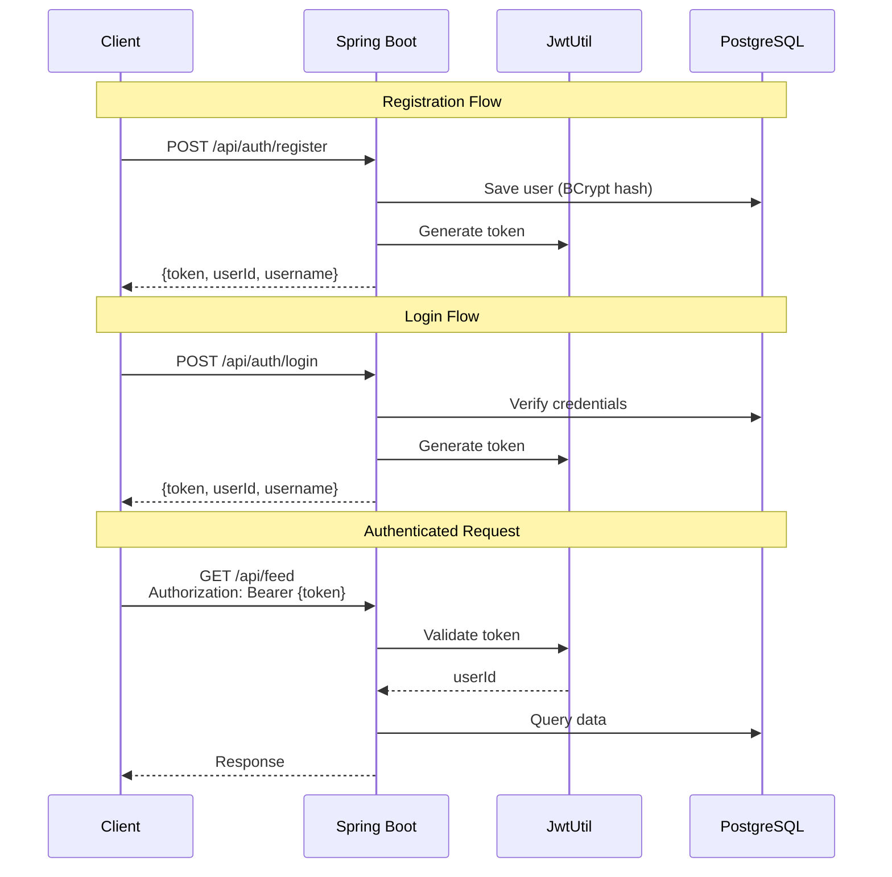
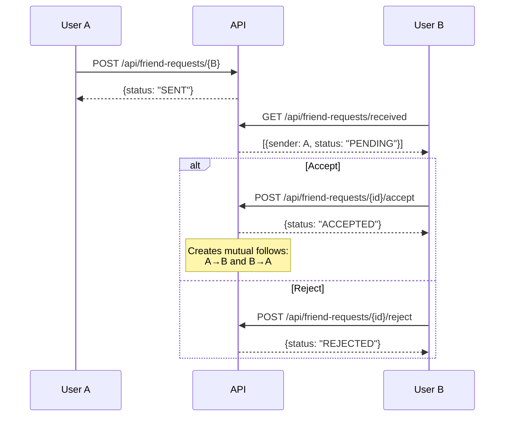
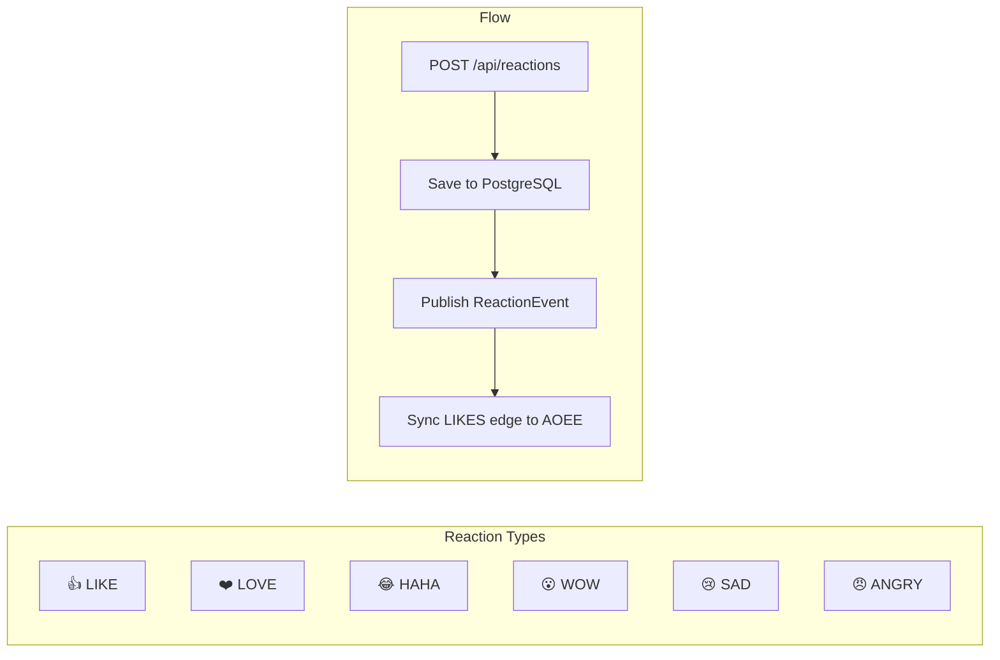
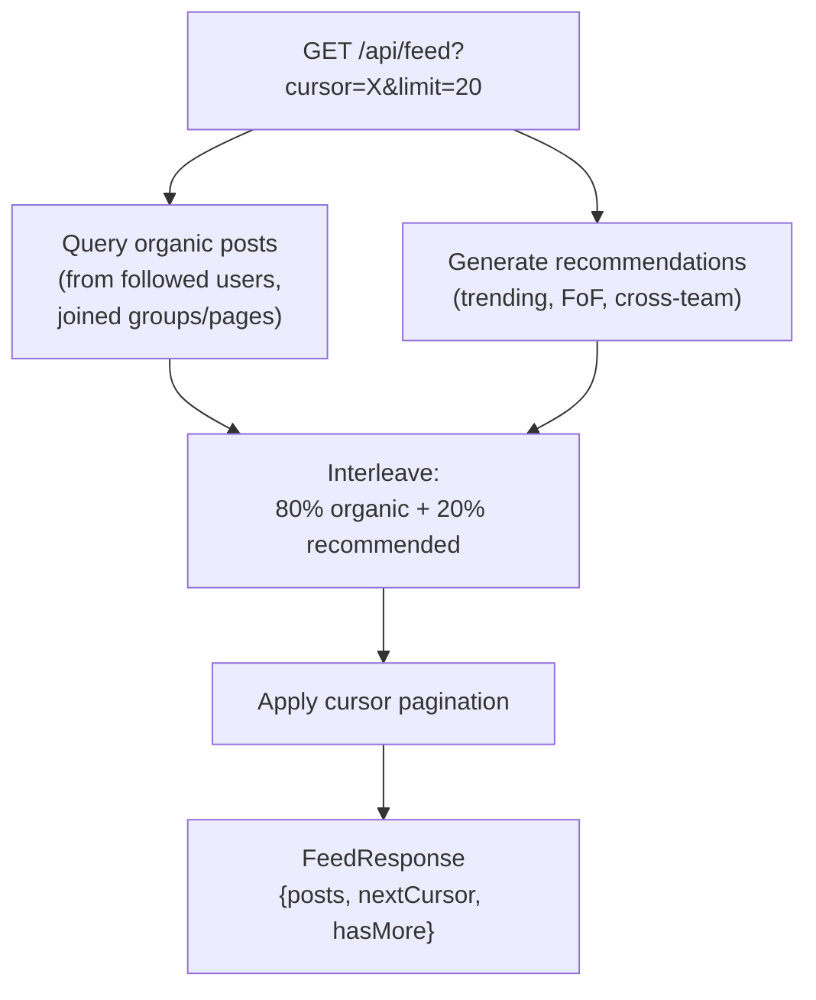
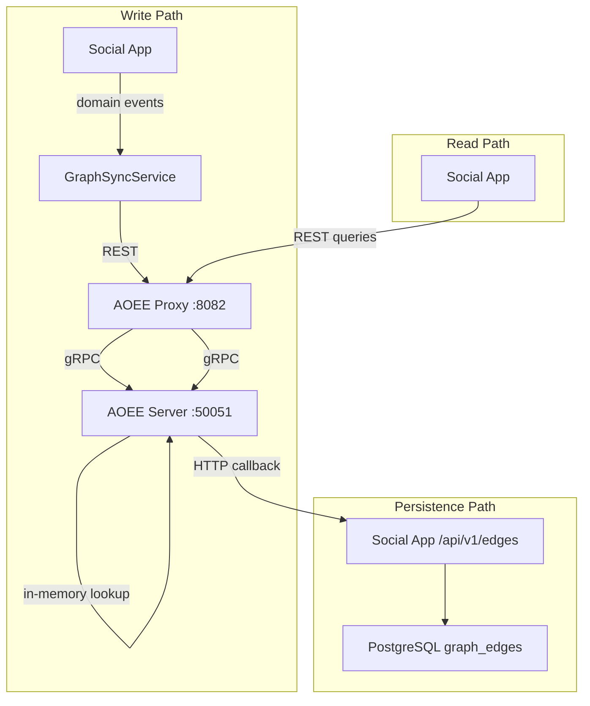
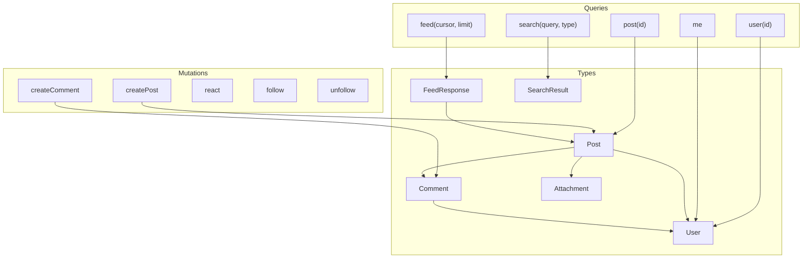

# Social Enterprise Platform -- API Reference

## Table of Contents

- [Authentication](#authentication)
- [REST API](#rest-api)
  - [Auth](#auth-apiauth)
  - [Users](#users-apiusers)
  - [Follow](#follow-apifollow)
  - [Friend Requests](#friend-requests-apifriend-requests)
  - [Posts](#posts-apiposts)
  - [Comments](#comments-apicomments)
  - [Reactions](#reactions-apireactions)
  - [Feed](#feed-apifeed)
  - [Groups](#groups-apigroups)
  - [Pages](#pages-apipages)
  - [Teams](#teams-apiteams)
  - [Messages](#messages-apimessages)
  - [Attachments](#attachments-apiattachments)
  - [Search](#search-apisearch)
  - [Link Preview](#link-preview-apilink-preview)
  - [Admin](#admin-apiadmin)
  - [AOEE Persistence](#aoee-persistence-apiv1)
- [GraphQL API](#graphql-api)
- [Response Types (DTOs)](#response-types-dtos)
- [Error Responses](#error-responses)
- [Notes](#notes)

---

## Authentication

All `/api/**` endpoints require authentication **except**:
- `/api/auth/**` -- registration and login
- `/api/v1/**` -- AOEE persistence layer (no auth required)



### Headers

| Header | Environment | Description |
|--------|-------------|-------------|
| `Authorization: Bearer <jwt_token>` | Production | JWT issued by `/api/auth/login` or `/api/auth/register` |
| `X-Debug-User-Id: <user_id>` | Development | Bypass auth when debug mode is enabled |

---

## REST API

---

### Auth (`/api/auth`)

#### POST `/api/auth/register`

Register a new user account.

- **Auth required:** No

**Request body:**
```json
{
  "username": "john",
  "displayName": "John Doe",
  "email": "john@example.com",
  "password": "secret",
  "bio": "Hello world"
}
```

**Response `200 OK`:**
```json
{
  "token": "eyJhbGciOiJIUzI1NiJ9.eyJzdWIiOiI3MjA1NzU5...",
  "userId": "72057594037927937",
  "username": "john",
  "admin": false
}
```

**Notable behavior:**
- Returns a JWT token immediately (user is logged in after registration).
- `userId` is a 64-bit integer serialized as a JSON number (see [Notes](#notes) on ID handling).

---

#### POST `/api/auth/login`

Authenticate with username and password.

- **Auth required:** No

**Request body:**
```json
{
  "username": "john",
  "password": "secret"
}
```

**Response `200 OK`:**
```json
{
  "token": "eyJhbGciOiJIUzI1NiJ9.eyJzdWIiOiI3MjA1NzU5...",
  "userId": "72057594037927937",
  "username": "john",
  "admin": false
}
```

---

### Users (`/api/users`)

#### GET `/api/users/{id}`

Retrieve a user profile by ID.

- **Auth required:** Yes

**Path parameters:**
| Parameter | Type | Description |
|-----------|------|-------------|
| `id` | long | User ID |

**Response `200 OK`:**
```json
{
  "id": "72057594037927937",
  "username": "john",
  "displayName": "John Doe",
  "email": "john@example.com",
  "avatarUrl": "/uploads/abc123.jpg",
  "bio": "Hello world",
  "visibility": "PUBLIC",
  "followerCount": 42,
  "followingCount": 15,
  "admin": false
}
```

**Response `404 Not Found`:** User does not exist.

---

#### GET `/api/users/search?q={query}`

Search users by username or display name.

- **Auth required:** Yes

**Query parameters:**
| Parameter | Type | Required | Description |
|-----------|------|----------|-------------|
| `q` | string | Yes | Search query |

**Response `200 OK`:**
```json
[
  {
    "id": "72057594037927937",
    "username": "john",
    "displayName": "John Doe",
    "avatarUrl": "/uploads/abc123.jpg"
  }
]
```

---

#### GET `/api/users/{id}/followers`

List all users who follow the specified user.

- **Auth required:** Yes

**Response `200 OK`:**
```json
[
  {
    "id": "72057594037927938",
    "username": "jane",
    "displayName": "Jane Smith",
    "avatarUrl": "/uploads/def456.jpg"
  }
]
```

---

#### GET `/api/users/{id}/following`

List all users the specified user follows.

- **Auth required:** Yes

**Response `200 OK`:** Same shape as `/followers` above -- array of `UserSummaryDto`.

---

### Follow (`/api/follow`)

#### POST `/api/follow/{targetId}`

Follow another user.

- **Auth required:** Yes

**Path parameters:**
| Parameter | Type | Description |
|-----------|------|-------------|
| `targetId` | long | ID of the user to follow |

**Response `200 OK`:** Empty body.

**Notable behavior:**
- Idempotent -- calling again when already following returns `200` without error.
- Publishes a `FollowEvent` for feed assembly and AOEE graph sync.

---

#### DELETE `/api/follow/{targetId}`

Unfollow a user.

- **Auth required:** Yes

**Response `204 No Content`:** Empty body.

**Notable behavior:**
- Idempotent -- calling when not following returns `204` without error.
- Publishes a `FollowEvent` (unfollow) for graph sync.

---

### Friend Requests (`/api/friend-requests`)



#### POST `/api/friend-requests/{targetId}`

Send a friend request to another user.

- **Auth required:** Yes

**Path parameters:**
| Parameter | Type | Description |
|-----------|------|-------------|
| `targetId` | long | ID of the target user |

**Response `200 OK`:**
```json
{
  "status": "SENT",
  "id": "72057594037927940"
}
```

**Other responses:**
```json
{ "status": "ALREADY_EXISTS" }
```
```json
{ "status": "ALREADY_FRIENDS" }
```

**Response `400 Bad Request`:**
```json
{ "error": "Cannot send friend request to yourself" }
```

---

#### GET `/api/friend-requests/received`

List pending friend requests received by the authenticated user.

- **Auth required:** Yes

**Response `200 OK`:**
```json
[
  {
    "id": "72057594037927940",
    "senderId": "72057594037927938",
    "senderUsername": "jane",
    "senderDisplayName": "Jane Smith",
    "senderAvatarUrl": "/uploads/def456.jpg",
    "receiverId": "72057594037927937",
    "receiverUsername": "john",
    "receiverDisplayName": "John Doe",
    "receiverAvatarUrl": "/uploads/abc123.jpg",
    "status": "PENDING",
    "createdAt": "2026-03-20T14:30:00Z"
  }
]
```

---

#### GET `/api/friend-requests/sent`

List pending friend requests sent by the authenticated user.

- **Auth required:** Yes

**Response `200 OK`:** Same shape as `/received` -- array of `FriendRequestDto`.

---

#### POST `/api/friend-requests/{requestId}/accept`

Accept a pending friend request. Creates mutual follow relationships between both users.

- **Auth required:** Yes

**Path parameters:**
| Parameter | Type | Description |
|-----------|------|-------------|
| `requestId` | long | Friend request ID |

**Response `200 OK`:**
```json
{ "status": "ACCEPTED" }
```

**Response `403 Forbidden`:**
```json
{ "error": "Not your request" }
```

**Response `400 Bad Request`:**
```json
{ "error": "Request is not pending" }
```

**Notable behavior:**
- Creates bidirectional follow relationships (both users follow each other).
- Each follow publishes a `FollowEvent`.

---

#### POST `/api/friend-requests/{requestId}/reject`

Reject a pending friend request.

- **Auth required:** Yes

**Response `200 OK`:**
```json
{ "status": "REJECTED" }
```

**Error responses:** Same as `/accept`.

---

#### GET `/api/friend-requests/status/{targetUserId}`

Check the friendship/request status between the authenticated user and another user.

- **Auth required:** Yes

**Response `200 OK`:**
```json
{ "status": "FRIENDS" }
```

Possible `status` values:
| Status | Description |
|--------|-------------|
| `FRIENDS` | Mutual follow exists |
| `REQUEST_SENT` | Authenticated user sent a pending request (includes `requestId`) |
| `REQUEST_RECEIVED` | Target user sent a pending request (includes `requestId`) |
| `NONE` | No relationship |

**Example with requestId:**
```json
{ "status": "REQUEST_SENT", "requestId": "72057594037927940" }
```

---

### Posts (`/api/posts`)

#### POST `/api/posts`

Create a new post.

- **Auth required:** Yes

**Request body:**
```json
{
  "content": "Hello everyone! This is my first post.",
  "targetType": "USER_FEED",
  "targetId": null,
  "visibility": "PUBLIC",
  "attachmentIds": [288230376151711745]
}
```

| Field | Type | Required | Description |
|-------|------|----------|-------------|
| `content` | string | Yes | Post text content |
| `targetType` | string | No | One of: `USER_FEED`, `GROUP_FEED`, `PAGE_FEED` |
| `targetId` | long | No | Group or page ID when targeting a group/page feed |
| `visibility` | string | No | `PUBLIC`, `PRIVATE`, `TEAM_VISIBLE`, `RESTRICTED` |
| `attachmentIds` | long[] | No | IDs of previously uploaded attachments |

**Response `200 OK`:**
```json
{
  "id": "144115188075855873",
  "author": {
    "id": "72057594037927937",
    "username": "john",
    "displayName": "John Doe",
    "avatarUrl": "/uploads/abc123.jpg"
  },
  "content": "Hello everyone! This is my first post.",
  "targetType": "USER_FEED",
  "targetId": 0,
  "visibility": "PUBLIC",
  "attachments": [],
  "reactionCounts": {},
  "currentUserReaction": null,
  "commentCount": 0,
  "createdAt": "2026-03-20T14:30:00Z",
  "recommended": false,
  "recommendationScore": null
}
```

---

#### GET `/api/posts/{id}`

Retrieve a post by ID.

- **Auth required:** Yes (auth principal is used to resolve `currentUserReaction`)

**Response `200 OK`:** Full `PostDto` (see above).

**Response `404 Not Found`:** Post does not exist.

---

#### GET `/api/posts/{id}/comments`

List all top-level comments on a post, with nested replies.

- **Auth required:** Yes

**Response `200 OK`:**
```json
[
  {
    "id": "216172782113783809",
    "author": {
      "id": "72057594037927938",
      "username": "jane",
      "displayName": "Jane Smith",
      "avatarUrl": "/uploads/def456.jpg"
    },
    "content": "Great post!",
    "depth": 0,
    "postId": "144115188075855873",
    "parentCommentId": null,
    "attachments": [],
    "reactionCounts": { "LIKE": 3 },
    "currentUserReaction": "LIKE",
    "replies": [
      {
        "id": "216172782113783810",
        "author": {
          "id": "72057594037927937",
          "username": "john",
          "displayName": "John Doe",
          "avatarUrl": "/uploads/abc123.jpg"
        },
        "content": "Thanks!",
        "depth": 1,
        "postId": "144115188075855873",
        "parentCommentId": "216172782113783809",
        "attachments": [],
        "reactionCounts": {},
        "currentUserReaction": null,
        "replies": [],
        "createdAt": "2026-03-20T14:35:00Z"
      }
    ],
    "createdAt": "2026-03-20T14:32:00Z"
  }
]
```

---

#### PUT `/api/posts/{id}`

Update a post's content. Only the author can edit.

- **Auth required:** Yes (must be the post author)

**Request body:**
```json
{
  "content": "Updated post content."
}
```

**Response `200 OK`:** Updated `PostDto`.

**Response `403 Forbidden`:** Authenticated user is not the post author.

---

#### DELETE `/api/posts/{id}`

Delete a post.

- **Auth required:** Yes

**Response `204 No Content`:** Empty body.

---

### Comments (`/api/comments`)

#### POST `/api/comments`

Create a comment on a post, optionally as a reply to another comment.

- **Auth required:** Yes

**Request body:**
```json
{
  "postId": 144115188075855873,
  "parentCommentId": null,
  "content": "Nice post!"
}
```

| Field | Type | Required | Description |
|-------|------|----------|-------------|
| `postId` | long | Yes | ID of the post to comment on |
| `parentCommentId` | long | No | ID of the parent comment (for threaded replies) |
| `content` | string | Yes | Comment text |

**Response `200 OK`:**
```json
{
  "id": "216172782113783811",
  "author": {
    "id": "72057594037927937",
    "username": "john",
    "displayName": "John Doe",
    "avatarUrl": "/uploads/abc123.jpg"
  },
  "content": "Nice post!",
  "depth": 0,
  "postId": "144115188075855873",
  "parentCommentId": null,
  "attachments": [],
  "reactionCounts": {},
  "currentUserReaction": null,
  "replies": [],
  "createdAt": "2026-03-20T15:00:00Z"
}
```

---

#### GET `/api/comments/{id}`

Retrieve a single comment by ID.

- **Auth required:** Yes

**Response `200 OK`:** Full `CommentDto`.

**Response `404 Not Found`:** Comment does not exist.

---

#### PUT `/api/comments/{id}`

Update a comment's content. Only the author can edit.

- **Auth required:** Yes (must be the comment author)

**Request body:**
```json
{
  "content": "Updated comment text."
}
```

**Response `200 OK`:** Updated `CommentDto`.

**Response `403 Forbidden`:** Authenticated user is not the comment author.

---

#### DELETE `/api/comments/{id}`

Delete a comment.

- **Auth required:** Yes

**Response `204 No Content`:** Empty body.

---

### Reactions (`/api/reactions`)



#### POST `/api/reactions`

React to a post or comment. Replaces any existing reaction by the same user on the same target.

- **Auth required:** Yes

**Request body:**
```json
{
  "targetId": "144115188075855873",
  "reactionType": "LIKE"
}
```

| Field | Type | Required | Description |
|-------|------|----------|-------------|
| `targetId` | long or string | Yes | ID of the post or comment (accepts both formats) |
| `reactionType` | string | Yes | One of: `LIKE`, `LOVE`, `HAHA`, `WOW`, `SAD`, `ANGRY` |

**Response `200 OK`:**
```json
{
  "id": "360287970189639681",
  "targetId": "144115188075855873",
  "reactionType": "LIKE"
}
```

**Notable behavior:**
- The target type (POST, COMMENT) is auto-detected from the `GlobalId` encoding of `targetId`.
- Falls back to `POST` if the type cannot be determined.
- Also writes to the AOEE graph cache for fast lookups.

---

#### GET `/api/reactions/{targetId}/users`

List users who reacted to a target, sorted with followed users first.

- **Auth required:** Yes

**Response `200 OK`:**
```json
[
  {
    "userId": "72057594037927938",
    "username": "jane",
    "displayName": "Jane Smith",
    "avatarUrl": "/uploads/def456.jpg",
    "reactionType": "LIKE",
    "followed": true
  },
  {
    "userId": "72057594037927939",
    "username": "bob",
    "displayName": "Bob Jones",
    "avatarUrl": null,
    "reactionType": "LOVE",
    "followed": false
  }
]
```

**Notable behavior:**
- Results are sorted so that users the authenticated user follows appear first.

---

#### DELETE `/api/reactions/{targetId}`

Remove the authenticated user's reaction from a target.

- **Auth required:** Yes

**Response `204 No Content`:** Empty body.

---

#### GET `/api/reactions/aoee/{targetId}/likers`

Query the AOEE graph cache for all users who liked a target.

- **Auth required:** Yes

**Response `200 OK`:**
```json
{
  "targetId": "144115188075855873",
  "likerIds": [72057594037927937, 72057594037927938],
  "count": 2,
  "source": "aoee"
}
```

---

#### GET `/api/reactions/aoee/user/{userId}/likes`

Query the AOEE graph cache for all targets a user has liked.

- **Auth required:** Yes

**Response `200 OK`:**
```json
{
  "userId": "72057594037927937",
  "likedTargetIds": [144115188075855873, 144115188075855874],
  "count": 2,
  "source": "aoee"
}
```

---

#### GET `/api/reactions/aoee/{targetId}/check/{userId}`

Check whether a specific user has liked a specific target via the AOEE graph.

- **Auth required:** Yes

**Response `200 OK`:**
```json
{
  "targetId": "144115188075855873",
  "userId": "72057594037927937",
  "liked": true,
  "source": "aoee"
}
```

---

### Feed (`/api/feed`)



#### GET `/api/feed?cursor={id}&limit={n}`

Retrieve the authenticated user's feed (posts from followed users), with cursor-based pagination.

- **Auth required:** Yes

**Query parameters:**
| Parameter | Type | Required | Default | Description |
|-----------|------|----------|---------|-------------|
| `cursor` | string | No | null | Post ID to start after (for pagination) |
| `limit` | int | No | 20 | Number of posts per page |

**Response `200 OK`:**
```json
{
  "posts": [
    {
      "id": "144115188075855873",
      "author": {
        "id": "72057594037927938",
        "username": "jane",
        "displayName": "Jane Smith",
        "avatarUrl": "/uploads/def456.jpg"
      },
      "content": "Just published a new article!",
      "targetType": "USER_FEED",
      "targetId": 0,
      "visibility": "PUBLIC",
      "attachments": [],
      "reactionCounts": { "LIKE": 5, "LOVE": 2 },
      "currentUserReaction": null,
      "commentCount": 3,
      "createdAt": "2026-03-20T14:30:00Z",
      "recommended": false,
      "recommendationScore": null
    }
  ],
  "nextCursor": "144115188075855870",
  "hasMore": true
}
```

---

#### GET `/api/feed/recommended?limit={n}`

Retrieve recommended posts for the authenticated user (content discovery).

- **Auth required:** Yes

**Query parameters:**
| Parameter | Type | Required | Default | Description |
|-----------|------|----------|---------|-------------|
| `limit` | int | No | 10 | Max number of recommendations |

**Response `200 OK`:**
```json
[
  {
    "id": "144115188075855880",
    "author": {
      "id": "72057594037927940",
      "username": "alice",
      "displayName": "Alice W.",
      "avatarUrl": null
    },
    "content": "Trending topic discussion...",
    "targetType": "USER_FEED",
    "targetId": 0,
    "visibility": "PUBLIC",
    "attachments": [],
    "reactionCounts": { "LIKE": 42 },
    "currentUserReaction": null,
    "commentCount": 12,
    "createdAt": "2026-03-19T10:00:00Z",
    "recommended": true,
    "recommendationScore": 0.87
  }
]
```

**Notable behavior:**
- Posts the user has already seen are excluded.
- Each post has `recommended: true` and a `recommendationScore` between 0 and 1.

---

### Groups (`/api/groups`)

#### POST `/api/groups`

Create a new group. The creator becomes the OWNER.

- **Auth required:** Yes

**Request body:**
```json
{
  "name": "Engineering Team",
  "description": "Internal engineering discussions",
  "visibility": "PUBLIC",
  "avatarUrl": "/uploads/group-avatar.jpg"
}
```

| Field | Type | Required | Description |
|-------|------|----------|-------------|
| `name` | string | Yes | Group name |
| `description` | string | No | Group description |
| `visibility` | string | No | `PUBLIC` or `PRIVATE` |
| `avatarUrl` | string | No | URL to group avatar |

**Response `200 OK`:**
```json
{
  "id": "432345564227567617",
  "name": "Engineering Team",
  "slug": "engineering-team",
  "description": "Internal engineering discussions",
  "avatarUrl": "/uploads/group-avatar.jpg",
  "coverUrl": null,
  "visibility": "PUBLIC",
  "memberCount": 1,
  "pinnedPostId": null
}
```

---

#### GET `/api/groups/{id}`

Retrieve a group by ID.

- **Auth required:** Yes

**Response `200 OK`:** Full `GroupDto` (see above).

**Response `404 Not Found`:** Group does not exist.

---

#### GET `/api/groups/search?q={query}`

Search groups by name.

- **Auth required:** Yes

**Query parameters:**
| Parameter | Type | Required | Description |
|-----------|------|----------|-------------|
| `q` | string | Yes | Search query |

**Response `200 OK`:** Array of `GroupDto`.

---

#### PUT `/api/groups/{id}`

Update a group's details.

- **Auth required:** Yes (must be group owner/admin)

**Request body:**
```json
{
  "name": "Updated Name",
  "description": "Updated description",
  "avatarUrl": "/uploads/new-avatar.jpg",
  "coverUrl": "/uploads/cover.jpg"
}
```

**Response `200 OK`:** Updated `GroupDto`.

---

#### POST `/api/groups/{id}/join`

Join a group (or request to join if the group is private).

- **Auth required:** Yes

**Response `200 OK`:** Empty body.

**Notable behavior:**
- For `PUBLIC` groups, membership is immediately `APPROVED`.
- For `PRIVATE` groups, membership is `PENDING` until approved by an owner/admin.

---

#### DELETE `/api/groups/{id}/leave`

Leave a group.

- **Auth required:** Yes

**Response `204 No Content`:** Empty body.

---

#### POST `/api/groups/{id}/members/{userId}/approve`

Approve a pending membership request.

- **Auth required:** Yes (must be group owner/admin)

**Response `200 OK`:** Empty body.

---

#### POST `/api/groups/{id}/members/{userId}/reject`

Reject a pending membership request.

- **Auth required:** Yes (must be group owner/admin)

**Response `200 OK`:** Empty body.

---

#### GET `/api/groups/{id}/membership`

Get the authenticated user's membership status in a group.

- **Auth required:** Yes

**Response `200 OK`:**
```json
{
  "userId": "72057594037927937",
  "groupId": "432345564227567617",
  "role": "MEMBER",
  "status": "APPROVED",
  "userName": "john",
  "userAvatarUrl": "/uploads/abc123.jpg",
  "joinedAt": "2026-03-20T14:30:00Z"
}
```

**Response `204 No Content`:** User is not a member.

---

#### GET `/api/groups/{id}/members`

List all approved members of a group.

- **Auth required:** Yes

**Response `200 OK`:** Array of `MembershipDto`.

---

#### GET `/api/groups/{id}/pending`

List pending membership requests for a group.

- **Auth required:** Yes (should be owner/admin)

**Response `200 OK`:** Array of `MembershipDto` with `status: "PENDING"`.

---

#### POST `/api/groups/{id}/pin/{postId}`

Pin a post in the group.

- **Auth required:** Yes (must be group owner/admin)

**Response `200 OK`:** Empty body.

---

#### DELETE `/api/groups/{id}/pin`

Unpin the currently pinned post.

- **Auth required:** Yes (must be group owner/admin)

**Response `200 OK`:** Empty body.

---

#### GET `/api/groups/{id}/posts`

List all posts in a group, ordered by newest first.

- **Auth required:** Yes

**Response `200 OK`:** Array of `PostDto`.

---

#### GET `/api/groups/mine`

List all groups the authenticated user is a member of.

- **Auth required:** Yes

**Response `200 OK`:** Array of `GroupDto`.

---

### Pages (`/api/pages`)

#### POST `/api/pages`

Create a new page. The creator becomes the OWNER.

- **Auth required:** Yes

**Request body:**
```json
{
  "name": "Company Blog",
  "description": "Official company updates",
  "visibility": "PUBLIC",
  "avatarUrl": "/uploads/page-avatar.jpg"
}
```

| Field | Type | Required | Description |
|-------|------|----------|-------------|
| `name` | string | Yes | Page name |
| `description` | string | No | Page description |
| `visibility` | string | No | `PUBLIC` or `PRIVATE` |
| `avatarUrl` | string | No | URL to page avatar |

**Response `200 OK`:**
```json
{
  "id": "504403158265495553",
  "name": "Company Blog",
  "slug": "company-blog",
  "description": "Official company updates",
  "avatarUrl": "/uploads/page-avatar.jpg",
  "coverUrl": null,
  "visibility": "PUBLIC",
  "ownerType": "USER",
  "ownerId": "72057594037927937",
  "followerCount": 0,
  "pinnedPostId": null
}
```

---

#### GET `/api/pages/{id}`

Retrieve a page by ID.

- **Auth required:** Yes

**Response `200 OK`:** Full `PageDto` (see above).

**Response `404 Not Found`:** Page does not exist.

---

#### GET `/api/pages/search?q={query}`

Search pages by name.

- **Auth required:** Yes

**Response `200 OK`:** Array of `PageDto`.

---

#### PUT `/api/pages/{id}`

Update a page's details.

- **Auth required:** Yes (must be page owner)

**Request body:**
```json
{
  "name": "Updated Page Name",
  "description": "Updated description",
  "avatarUrl": "/uploads/new-avatar.jpg",
  "coverUrl": "/uploads/cover.jpg"
}
```

**Response `200 OK`:** Updated `PageDto`.

---

#### POST `/api/pages/{id}/follow`

Follow a page.

- **Auth required:** Yes

**Response `200 OK`:** Empty body.

---

#### DELETE `/api/pages/{id}/unfollow`

Unfollow a page.

- **Auth required:** Yes

**Response `204 No Content`:** Empty body.

---

#### GET `/api/pages/{id}/following`

Check whether the authenticated user is following a page.

- **Auth required:** Yes

**Response `200 OK`:**
```json
true
```

---

#### POST `/api/pages/{id}/members/{userId}/approve`

Approve a pending page membership request.

- **Auth required:** Yes (must be page owner)

**Response `200 OK`:** Empty body.

---

#### GET `/api/pages/{id}/members`

List all members/followers of a page.

- **Auth required:** Yes

**Response `200 OK`:** Array of `MembershipDto`.

---

#### POST `/api/pages/{id}/pin/{postId}`

Pin a post on the page.

- **Auth required:** Yes (must be page owner)

**Response `200 OK`:** Empty body.

---

#### DELETE `/api/pages/{id}/pin`

Unpin the currently pinned post.

- **Auth required:** Yes (must be page owner)

**Response `200 OK`:** Empty body.

---

#### GET `/api/pages/{id}/posts`

List all posts on a page, ordered by newest first.

- **Auth required:** Yes

**Response `200 OK`:** Array of `PostDto`.

---

#### GET `/api/pages/mine`

List all pages the authenticated user owns or is a member of.

- **Auth required:** Yes

**Response `200 OK`:** Array of `PageDto`.

---

### Teams (`/api/teams`)

#### GET `/api/teams/{id}`

Retrieve a team by ID.

- **Auth required:** Yes

**Response `200 OK`:**
```json
{
  "id": "576460752303423489",
  "name": "Backend Team",
  "slug": "backend-team",
  "description": "Backend engineering squad",
  "visibility": "PUBLIC",
  "memberCount": 8
}
```

**Response `404 Not Found`:** Team does not exist.

---

#### GET `/api/teams`

List all teams.

- **Auth required:** Yes

**Response `200 OK`:** Array of `TeamDto`.

---

#### POST `/api/teams`

Create a new team.

- **Auth required:** Yes

**Request body:**
```json
{
  "name": "Backend Team",
  "slug": "backend-team",
  "description": "Backend engineering squad",
  "visibility": "PUBLIC"
}
```

| Field | Type | Required | Description |
|-------|------|----------|-------------|
| `name` | string | Yes | Team name |
| `slug` | string | Yes | URL-friendly identifier |
| `description` | string | No | Team description |
| `visibility` | string | No | `PUBLIC` or `PRIVATE` (defaults to `PUBLIC`) |

**Response `200 OK`:** Full `TeamDto`.

---

### Messages (`/api/messages`)

#### POST `/api/messages`

Send a direct message to another user.

- **Auth required:** Yes

**Request body:**
```json
{
  "recipientId": "72057594037927938",
  "content": "Hey Jane, how are you?",
  "attachmentIds": [288230376151711745]
}
```

| Field | Type | Required | Description |
|-------|------|----------|-------------|
| `recipientId` | long or string | Yes | Recipient user ID |
| `content` | string | Yes | Message content |
| `attachmentIds` | long[] | No | IDs of previously uploaded attachments |

**Response `200 OK`:**
```json
{
  "id": "648518346341351425",
  "sender": {
    "id": "72057594037927937",
    "username": "john",
    "displayName": "John Doe",
    "avatarUrl": "/uploads/abc123.jpg"
  },
  "recipient": {
    "id": "72057594037927938",
    "username": "jane",
    "displayName": "Jane Smith",
    "avatarUrl": "/uploads/def456.jpg"
  },
  "content": "Hey Jane, how are you?",
  "attachments": [],
  "read": false,
  "createdAt": "2026-03-20T15:00:00Z"
}
```

---

#### GET `/api/messages/conversations`

List all conversations for the authenticated user, ordered by most recent message.

- **Auth required:** Yes

**Response `200 OK`:**
```json
[
  {
    "partner": {
      "id": "72057594037927938",
      "username": "jane",
      "displayName": "Jane Smith",
      "avatarUrl": "/uploads/def456.jpg"
    },
    "lastMessage": {
      "id": "648518346341351425",
      "sender": { "id": "72057594037927937", "username": "john", "displayName": "John Doe", "avatarUrl": null },
      "recipient": { "id": "72057594037927938", "username": "jane", "displayName": "Jane Smith", "avatarUrl": null },
      "content": "Hey Jane, how are you?",
      "attachments": [],
      "read": false,
      "createdAt": "2026-03-20T15:00:00Z"
    },
    "unreadCount": 3
  }
]
```

---

#### GET `/api/messages/conversation/{partnerId}?page=0&size=50`

Retrieve messages in a conversation with a specific user, with page-based pagination.

- **Auth required:** Yes

**Query parameters:**
| Parameter | Type | Required | Default | Description |
|-----------|------|----------|---------|-------------|
| `page` | int | No | 0 | Page number (zero-indexed) |
| `size` | int | No | 50 | Messages per page |

**Response `200 OK`:** Array of `MessageDto`, ordered by most recent first.

---

#### POST `/api/messages/conversation/{partnerId}/read`

Mark all messages from a partner as read.

- **Auth required:** Yes

**Response `200 OK`:** Empty body.

---

#### GET `/api/messages/unread-count`

Get the total number of unread messages for the authenticated user.

- **Auth required:** Yes

**Response `200 OK`:**
```json
{
  "unreadCount": 7
}
```

---

### Attachments (`/api/attachments`)

#### POST `/api/attachments/upload`

Upload a file attachment.

- **Auth required:** Yes
- **Content-Type:** `multipart/form-data`

**Form parameters:**
| Parameter | Type | Required | Description |
|-----------|------|----------|-------------|
| `file` | file | Yes | The file to upload (max 50MB) |

**Response `200 OK`:**
```json
{
  "id": "288230376151711745",
  "fileUrl": "/uploads/a1b2c3d4-photo.jpg",
  "mediaType": "image/jpeg",
  "fileSize": 245760,
  "width": 1920,
  "height": 1080
}
```

**Notable behavior:**
- Files are stored on disk in the configured upload directory.
- `width` and `height` are populated only for image files.
- Duplicate files with the same content hash are deduplicated.

---

#### GET `/api/attachments/{id}`

Retrieve attachment metadata by ID.

- **Auth required:** Yes

**Response `200 OK`:** `AttachmentDto` (see above).

**Response `404 Not Found`:** Attachment does not exist.

---

### Search (`/api/search`)

#### GET `/api/search?q={query}&type={type}`

Full-text search across users, groups, and pages using OpenSearch.

- **Auth required:** Yes

**Query parameters:**
| Parameter | Type | Required | Description |
|-----------|------|----------|-------------|
| `q` | string | Yes | Search query |
| `type` | string | No | Filter by type: `USER`, `PAGE`, `GROUP`. Omit for all types. |

**Response `200 OK`:**
```json
{
  "hits": [
    {
      "id": "72057594037927937",
      "objectType": "USER",
      "name": "John Doe",
      "description": "Hello world",
      "avatarUrl": "/uploads/abc123.jpg",
      "score": 8.5
    },
    {
      "id": "432345564227567617",
      "objectType": "GROUP",
      "name": "Engineering Team",
      "description": "Internal engineering discussions",
      "avatarUrl": "/uploads/group-avatar.jpg",
      "score": 5.2
    }
  ],
  "totalHits": 2
}
```

---

### Link Preview (`/api/link-preview`)

#### GET `/api/link-preview?url={url}`

Fetch Open Graph metadata from an external URL for rich link previews.

- **Auth required:** Yes

**Query parameters:**
| Parameter | Type | Required | Description |
|-----------|------|----------|-------------|
| `url` | string | Yes | Full URL (must start with `http://` or `https://`) |

**Response `200 OK`:**
```json
{
  "url": "https://example.com/article",
  "title": "Example Article Title",
  "description": "A brief description of the article content.",
  "image": "https://example.com/og-image.jpg",
  "siteName": "Example Site",
  "type": "article"
}
```

**Notable behavior:**
- Reads the first 50KB of the target page.
- Extracts Open Graph (`og:*`) meta tags.
- Falls back to `<title>` tag if no `og:title` is found.
- Returns an empty object `{}` on any error (network timeout, non-200 status, invalid URL).
- Connects with a 5-second timeout.
- Only `http` and `https` schemes are allowed; others return `400 Bad Request`.

---

### Admin (`/api/admin`)

All admin endpoints require the authenticated user to have `admin: true`. Returns `403 Forbidden` if the user is not an admin.

---

#### GET `/api/admin/dashboard`

Platform-wide dashboard overview with aggregate statistics.

- **Auth required:** Yes (admin)

**Response `200 OK`:**
```json
{
  "totalUsers": 1250,
  "totalPosts": 8340,
  "totalComments": 22100,
  "totalGroups": 45,
  "totalPages": 30,
  "totalMessages": 15600,
  "totalReactions": 41000,
  "totalAttachments": 2100,
  "activeUsersLast24h": 87,
  "postsLast24h": 120,
  "postsLast7d": 650,
  "postsLast30d": 2100,
  "newUsersLast7d": 35,
  "newUsersLast30d": 150
}
```

---

#### GET `/api/admin/analytics/dau-mau`

Daily, weekly, and monthly active user metrics with a 14-day DAU trend.

- **Auth required:** Yes (admin)

**Response `200 OK`:**
```json
{
  "dau": 87,
  "wau": 340,
  "mau": 890,
  "totalUsers": 1250,
  "dauTrend": [
    { "date": "2026-03-08", "active_users": 65 },
    { "date": "2026-03-09", "active_users": 72 },
    { "date": "2026-03-10", "active_users": 80 }
  ]
}
```

**Notable behavior:**
- Active users are those who posted, commented, reacted, or sent a message.
- `dauTrend` covers the last 14 days including today.

---

#### GET `/api/admin/analytics/engagement?entityType={type}&entityId={id}&days={n}`

Engagement analytics for a specific group, page, or user over time.

- **Auth required:** Yes (admin)

**Query parameters:**
| Parameter | Type | Required | Default | Description |
|-----------|------|----------|---------|-------------|
| `entityType` | string | Yes | -- | `group`, `page`, or `user` |
| `entityId` | string | Yes | -- | ID of the entity |
| `days` | int | No | 30 | Number of days to look back |

**Response `200 OK` (group example):**
```json
{
  "entityType": "group",
  "entityId": "432345564227567617",
  "days": 30,
  "activity": [
    { "date": "2026-03-01", "posts": 5, "unique_posters": 3 },
    { "date": "2026-03-02", "posts": 8, "unique_posters": 5 }
  ],
  "memberGrowth": [
    { "date": "2026-03-01", "new_members": 2 }
  ],
  "info": {
    "name": "Engineering Team",
    "members": 45,
    "total_posts": 340
  }
}
```

**Response `200 OK` (user example):**
```json
{
  "entityType": "user",
  "entityId": "72057594037927937",
  "days": 30,
  "activity": [
    { "date": "2026-03-01", "posts": 2, "comments": 5, "reactions": 12 }
  ],
  "info": {
    "username": "john",
    "display_name": "John Doe",
    "total_posts": 85,
    "total_comments": 210,
    "followers": 42
  }
}
```

---

#### GET `/api/admin/analytics/user-activity`

Platform-wide daily activity breakdown (posts, comments, reactions) for the last 30 days.

- **Auth required:** Yes (admin)

**Response `200 OK`:**
```json
[
  { "date": "2026-02-20", "posts": 45, "comments": 120, "reactions": 310 },
  { "date": "2026-02-21", "posts": 52, "comments": 135, "reactions": 280 }
]
```

---

#### GET `/api/admin/analytics/top-users?period={period}&limit={n}`

Most active users by post count in a given time period.

- **Auth required:** Yes (admin)

**Query parameters:**
| Parameter | Type | Required | Default | Description |
|-----------|------|----------|---------|-------------|
| `period` | string | No | `7d` | Time period: `24h`, `7d`, `30d`, `90d` |
| `limit` | int | No | 10 | Max results |

**Response `200 OK`:**
```json
[
  {
    "author_id": "72057594037927937",
    "username": "john",
    "display_name": "John Doe",
    "avatar_url": "/uploads/abc123.jpg",
    "post_count": 42
  }
]
```

---

#### GET `/api/admin/analytics/top-groups?limit={n}`

Most active groups by post count (all time).

- **Auth required:** Yes (admin)

**Query parameters:**
| Parameter | Type | Required | Default | Description |
|-----------|------|----------|---------|-------------|
| `limit` | int | No | 10 | Max results |

**Response `200 OK`:**
```json
[
  {
    "id": "432345564227567617",
    "name": "Engineering Team",
    "slug": "engineering-team",
    "member_count": 45,
    "post_count": 340
  }
]
```

---

#### GET `/api/admin/analytics/top-pages?limit={n}`

Most active pages by post count (all time).

- **Auth required:** Yes (admin)

**Query parameters:**
| Parameter | Type | Required | Default | Description |
|-----------|------|----------|---------|-------------|
| `limit` | int | No | 10 | Max results |

**Response `200 OK`:**
```json
[
  {
    "id": "504403158265495553",
    "name": "Company Blog",
    "slug": "company-blog",
    "follower_count": 120,
    "post_count": 85
  }
]
```

---

#### GET `/api/admin/analytics/growth`

Weekly user sign-up growth for the last 12 weeks.

- **Auth required:** Yes (admin)

**Response `200 OK`:**
```json
[
  { "week": "2026-01-05", "signups": 25 },
  { "week": "2026-01-12", "signups": 30 },
  { "week": "2026-01-19", "signups": 28 }
]
```

---

#### GET `/api/admin/posts?page={page}&size={size}`

List all posts with author info, ordered by newest first (for moderation).

- **Auth required:** Yes (admin)

**Query parameters:**
| Parameter | Type | Required | Default | Description |
|-----------|------|----------|---------|-------------|
| `page` | int | No | 0 | Page number (zero-indexed) |
| `size` | int | No | 20 | Posts per page |

**Response `200 OK`:**
```json
[
  {
    "id": "144115188075855873",
    "author_id": "72057594037927937",
    "username": "john",
    "display_name": "John Doe",
    "content": "Hello world!",
    "target_type": "USER_FEED",
    "target_id": 0,
    "visibility": "PUBLIC",
    "created_at": "2026-03-20T14:30:00Z",
    "updated_at": null
  }
]
```

---

#### DELETE `/api/admin/posts/{id}`

Delete any post (admin moderation).

- **Auth required:** Yes (admin)

**Response `204 No Content`:** Empty body.

---

#### DELETE `/api/admin/comments/{id}`

Delete any comment (admin moderation).

- **Auth required:** Yes (admin)

**Response `204 No Content`:** Empty body.

---

#### GET `/api/admin/users?page={page}&size={size}&q={query}`

List or search all users with full details (for management).

- **Auth required:** Yes (admin)

**Query parameters:**
| Parameter | Type | Required | Default | Description |
|-----------|------|----------|---------|-------------|
| `page` | int | No | 0 | Page number (zero-indexed) |
| `size` | int | No | 20 | Users per page |
| `q` | string | No | "" | Search by username, display name, or email (case-insensitive) |

**Response `200 OK`:**
```json
[
  {
    "id": "72057594037927937",
    "username": "john",
    "display_name": "John Doe",
    "email": "john@example.com",
    "avatar_url": "/uploads/abc123.jpg",
    "bio": "Hello world",
    "visibility": "PUBLIC",
    "is_admin": false,
    "created_at": "2026-03-01T10:00:00Z"
  }
]
```

---

#### GET `/api/admin/users/{id}`

Get detailed user profile with aggregate stats (for management).

- **Auth required:** Yes (admin)

**Response `200 OK`:**
```json
{
  "id": "72057594037927937",
  "username": "john",
  "display_name": "John Doe",
  "email": "john@example.com",
  "avatar_url": "/uploads/abc123.jpg",
  "bio": "Hello world",
  "visibility": "PUBLIC",
  "is_admin": false,
  "created_at": "2026-03-01T10:00:00Z",
  "updated_at": "2026-03-20T14:30:00Z",
  "postCount": 85,
  "commentCount": 210,
  "groupCount": 5,
  "followerCount": 42,
  "followingCount": 15
}
```

**Response `404 Not Found`:** User does not exist.

---

#### PUT `/api/admin/users/{id}/admin`

Toggle a user's admin status.

- **Auth required:** Yes (admin)

**Response `200 OK`:**
```json
{
  "id": "72057594037927937",
  "username": "john",
  "admin": true
}
```

**Response `404 Not Found`:** User does not exist.

---

#### GET `/api/admin/groups?page={page}&size={size}`

List all groups with member and post counts (for management).

- **Auth required:** Yes (admin)

**Query parameters:**
| Parameter | Type | Required | Default | Description |
|-----------|------|----------|---------|-------------|
| `page` | int | No | 0 | Page number |
| `size` | int | No | 20 | Groups per page |

**Response `200 OK`:**
```json
[
  {
    "id": "432345564227567617",
    "name": "Engineering Team",
    "slug": "engineering-team",
    "description": "Internal discussions",
    "visibility": "PUBLIC",
    "created_at": "2026-02-15T10:00:00Z",
    "member_count": 45,
    "post_count": 340
  }
]
```

---

#### DELETE `/api/admin/groups/{id}`

Delete a group entirely (admin moderation).

- **Auth required:** Yes (admin)

**Response `204 No Content`:** Empty body.

---

#### GET `/api/admin/pages?page={page}&size={size}`

List all pages with follower and post counts (for management).

- **Auth required:** Yes (admin)

**Query parameters:**
| Parameter | Type | Required | Default | Description |
|-----------|------|----------|---------|-------------|
| `page` | int | No | 0 | Page number |
| `size` | int | No | 20 | Pages per page |

**Response `200 OK`:**
```json
[
  {
    "id": "504403158265495553",
    "name": "Company Blog",
    "slug": "company-blog",
    "description": "Official updates",
    "visibility": "PUBLIC",
    "created_at": "2026-02-10T10:00:00Z",
    "follower_count": 120,
    "post_count": 85
  }
]
```

---

#### DELETE `/api/admin/pages/{id}`

Delete a page entirely (admin moderation).

- **Auth required:** Yes (admin)

**Response `204 No Content`:** Empty body.

---

#### GET `/api/admin/system`

System health and storage statistics.

- **Auth required:** Yes (admin)

**Response `200 OK`:**
```json
{
  "uploadDirSize": 524288000,
  "uploadFileCount": 2100,
  "databaseSize": "256 MB",
  "duplicateAttachments": 15
}
```

| Field | Type | Description |
|-------|------|-------------|
| `uploadDirSize` | long | Total size of upload directory in bytes |
| `uploadFileCount` | long | Number of files in upload directory |
| `databaseSize` | string | Human-readable database size (from PostgreSQL) |
| `duplicateAttachments` | long | Number of attachment content hashes with duplicates |

---

### AOEE Persistence (`/api/v1`)



The AOEE (Adjacency-Oriented Edge-Entity) persistence layer provides low-level graph CRUD operations for the in-memory graph cache. These endpoints are used by the AOEE sidecar service and do not require authentication.

---

#### POST `/api/v1/edges`

Create a single graph edge.

- **Auth required:** No

**Request body:**
```json
{
  "src": 72057594037927937,
  "edgeType": "LIKES",
  "dst": 144115188075855873,
  "timestampNs": 1710943200000000000,
  "metadata": 1
}
```

| Field | Type | Required | Description |
|-------|------|----------|-------------|
| `src` | long | Yes | Source node ID |
| `edgeType` | string | Yes | Edge type (e.g., `LIKES`, `FOLLOWS`) |
| `dst` | long | Yes | Destination node ID |
| `timestampNs` | long | No | Timestamp in nanoseconds (defaults to 0) |
| `metadata` | int | No | Edge metadata (defaults to 0) |

**Response `200 OK`:**
```json
{
  "id": 1,
  "srcId": 72057594037927937,
  "edgeType": "LIKES",
  "dstId": 144115188075855873,
  "timestampNs": 1710943200000000000,
  "metadata": 1,
  "createdAt": "2026-03-20T14:30:00.000000"
}
```

---

#### DELETE `/api/v1/edges/{src}/{edgeType}/{dst}`

Delete a specific edge.

- **Auth required:** No

**Response `204 No Content`:** Empty body.

---

#### GET `/api/v1/edges/{src}/{edgeType}/{dst}`

Retrieve a specific edge.

- **Auth required:** No

**Response `200 OK`:** `EdgeResponse` (see above).

**Response `404 Not Found`:** Edge does not exist.

---

#### GET `/api/v1/edges/{src}/{edgeType}/{dst}/exists`

Check whether a specific edge exists.

- **Auth required:** No

**Response `200 OK`:**
```json
{ "exists": true }
```

---

#### GET `/api/v1/edges?src={srcId}&type={edgeType}&limit={n}`

List edges by source node and type.

- **Auth required:** No

**Query parameters:**
| Parameter | Type | Required | Default | Description |
|-----------|------|----------|---------|-------------|
| `src` | long | Yes | -- | Source node ID |
| `type` | string | Yes | -- | Edge type |
| `limit` | int | No | 1000 | Max edges to return |

**Response `200 OK`:**
```json
[
  {
    "id": 1,
    "srcId": 72057594037927937,
    "edgeType": "LIKES",
    "dstId": 144115188075855873,
    "timestampNs": 1710943200000000000,
    "metadata": 0,
    "createdAt": "2026-03-20T14:30:00.000000"
  }
]
```

---

#### GET `/api/v1/edges/count?src={srcId}&type={edgeType}`

Count edges by source node and type.

- **Auth required:** No

**Query parameters:**
| Parameter | Type | Required | Description |
|-----------|------|----------|-------------|
| `src` | long | Yes | Source node ID |
| `type` | string | Yes | Edge type |

**Response `200 OK`:**
```json
{ "count": 42 }
```

---

#### POST `/api/v1/edges/batch`

Create multiple edges in a single request.

- **Auth required:** No

**Request body:**
```json
[
  { "src": 72057594037927937, "edgeType": "LIKES", "dst": 144115188075855873 },
  { "src": 72057594037927937, "edgeType": "LIKES", "dst": 144115188075855874 }
]
```

**Response `200 OK`:**
```json
{ "edgesCreated": 2 }
```

---

#### POST `/api/v1/entities`

Create or upsert a graph entity.

- **Auth required:** No

**Request body:**
```json
{
  "id": 72057594037927937,
  "entityType": "USER",
  "name": "john"
}
```

| Field | Type | Required | Description |
|-------|------|----------|-------------|
| `id` | long | Yes | Entity ID (same as the domain object ID) |
| `entityType` | string | Yes | Entity type (e.g., `USER`, `POST`, `GROUP`) |
| `name` | string | No | Human-readable name |

**Response `200 OK`:**
```json
{
  "id": 72057594037927937,
  "entityType": "USER",
  "name": "john",
  "createdAt": "2026-03-20T14:30:00.000000"
}
```

---

#### POST `/api/v1/entities/batch`

Create multiple entities in a single request.

- **Auth required:** No

**Request body:**
```json
[
  { "id": 72057594037927937, "entityType": "USER", "name": "john" },
  { "id": 72057594037927938, "entityType": "USER", "name": "jane" }
]
```

**Response `200 OK`:**
```json
{ "entitiesCreated": 2 }
```

---

#### GET `/api/v1/export/stats`

Get aggregate statistics about the graph data store.

- **Auth required:** No

**Response `200 OK`:**
```json
{
  "entities": {
    "total": 1500,
    "types": ["USER", "POST", "GROUP", "PAGE"]
  },
  "edges": {
    "total": 25000,
    "types": ["FOLLOWS", "LIKES", "MEMBER_OF"]
  }
}
```

---

## GraphQL API



**Endpoint:** `POST /graphql`

**Interactive explorer:** `/graphiql` (development only)

All GraphQL requests require the same `Authorization` header as REST endpoints. The authenticated user context is resolved from the JWT token.

### Schema

#### Queries

**`user(id: ID!): User`** -- Fetch a user by ID.

```graphql
query GetUser($id: ID!) {
  user(id: $id) {
    id
    username
    displayName
    email
    avatarUrl
    bio
    visibility
    followerCount
    followingCount
  }
}
```

**Variables:**
```json
{ "id": "72057594037927937" }
```

**Response:**
```json
{
  "data": {
    "user": {
      "id": "72057594037927937",
      "username": "john",
      "displayName": "John Doe",
      "email": "john@example.com",
      "avatarUrl": "/uploads/abc123.jpg",
      "bio": "Hello world",
      "visibility": "PUBLIC",
      "followerCount": 42,
      "followingCount": 15
    }
  }
}
```

---

**`post(id: ID!): Post`** -- Fetch a post with its author, comments, attachments, and reaction counts.

```graphql
query GetPost($id: ID!) {
  post(id: $id) {
    id
    author {
      id
      username
      displayName
      avatarUrl
    }
    content
    targetType
    targetId
    visibility
    reactionCounts {
      type
      count
    }
    commentCount
    comments {
      id
      author {
        id
        username
        displayName
        avatarUrl
      }
      content
      depth
      replies {
        id
        author {
          id
          displayName
        }
        content
      }
      createdAt
    }
    attachments {
      id
      fileUrl
      mediaType
      fileSize
      width
      height
    }
    createdAt
  }
}
```

---

**`feed(cursor: String, limit: Int): FeedResponse`** -- Fetch the authenticated user's feed.

```graphql
query GetFeed($cursor: String, $limit: Int) {
  feed(cursor: $cursor, limit: $limit) {
    posts {
      id
      author {
        id
        displayName
        avatarUrl
      }
      content
      reactionCounts {
        type
        count
      }
      commentCount
      createdAt
    }
    nextCursor
    hasMore
  }
}
```

**Variables:**
```json
{ "cursor": null, "limit": 20 }
```

---

**`search(query: String!, type: String): SearchResult`** -- Full-text search.

```graphql
query Search($query: String!, $type: String) {
  search(query: $query, type: $type) {
    hits {
      id
      objectType
      name
      description
      avatarUrl
      score
    }
    totalHits
  }
}
```

**Variables:**
```json
{ "query": "engineering", "type": "GROUP" }
```

---

**`me: User`** -- Fetch the authenticated user's own profile.

```graphql
query Me {
  me {
    id
    username
    displayName
    email
    avatarUrl
    bio
    visibility
    followerCount
    followingCount
  }
}
```

---

#### Mutations

**`createPost(...): Post`** -- Create a new post.

```graphql
mutation CreatePost($content: String!, $targetType: String, $targetId: ID, $visibility: String) {
  createPost(content: $content, targetType: $targetType, targetId: $targetId, visibility: $visibility) {
    id
    content
    createdAt
  }
}
```

**Variables:**
```json
{
  "content": "Hello from GraphQL!",
  "targetType": "USER_FEED",
  "targetId": null,
  "visibility": "PUBLIC"
}
```

---

**`createComment(postId: ID!, content: String!, parentCommentId: ID): Comment`** -- Create a comment.

```graphql
mutation CreateComment($postId: ID!, $content: String!, $parentCommentId: ID) {
  createComment(postId: $postId, content: $content, parentCommentId: $parentCommentId) {
    id
    content
    depth
    createdAt
  }
}
```

---

**`react(targetId: ID!, reactionType: String!): Boolean`** -- React to a post or comment.

```graphql
mutation React($targetId: ID!, $reactionType: String!) {
  react(targetId: $targetId, reactionType: $reactionType)
}
```

**Variables:**
```json
{ "targetId": "144115188075855873", "reactionType": "LIKE" }
```

---

**`follow(targetId: ID!): Boolean`** -- Follow a user.

```graphql
mutation Follow($targetId: ID!) {
  follow(targetId: $targetId)
}
```

---

**`unfollow(targetId: ID!): Boolean`** -- Unfollow a user.

```graphql
mutation Unfollow($targetId: ID!) {
  unfollow(targetId: $targetId)
}
```

---

### GraphQL Types

```graphql
type User {
  id: ID!
  username: String!
  displayName: String
  email: String
  avatarUrl: String
  bio: String
  visibility: String
  followerCount: Int
  followingCount: Int
}

type Post {
  id: ID!
  author: User
  content: String
  targetType: String
  targetId: ID
  visibility: String
  reactionCounts: [ReactionSummary]
  commentCount: Int
  comments: [Comment]
  attachments: [Attachment]
  createdAt: String
}

type Comment {
  id: ID!
  author: User
  content: String
  depth: Int
  postId: ID
  parentCommentId: ID
  replies: [Comment]
  createdAt: String
}

type Attachment {
  id: ID!
  fileUrl: String
  mediaType: String
  fileSize: Int
  width: Int
  height: Int
}

type ReactionSummary {
  type: String!
  count: Int!
}

type FeedResponse {
  posts: [Post]
  nextCursor: String
  hasMore: Boolean
}

type SearchResult {
  hits: [SearchHit]
  totalHits: Int
}

type SearchHit {
  id: ID!
  objectType: String
  name: String
  description: String
  avatarUrl: String
  score: Float
}

type Team {
  id: ID!
  name: String!
  slug: String
  description: String
  visibility: String
  memberCount: Int
}

type Page {
  id: ID!
  name: String!
  slug: String
  description: String
  avatarUrl: String
  visibility: String
}

type Group {
  id: ID!
  name: String!
  slug: String
  description: String
  visibility: String
}
```

---

## Response Types (DTOs)

### AuthResponse

| Field | Type | Description |
|-------|------|-------------|
| `token` | string | JWT authentication token |
| `userId` | long | Authenticated user's ID |
| `username` | string | Username |
| `admin` | boolean | Whether the user has admin privileges |

### UserDto

| Field | Type | Description |
|-------|------|-------------|
| `id` | long | User ID |
| `username` | string | Unique username |
| `displayName` | string | Display name |
| `email` | string | Email address |
| `avatarUrl` | string? | Avatar image URL |
| `bio` | string? | User biography |
| `visibility` | string | `PUBLIC`, `PRIVATE`, `TEAM_VISIBLE`, `RESTRICTED` |
| `followerCount` | long | Number of followers |
| `followingCount` | long | Number of users being followed |
| `admin` | boolean | Whether the user is an admin |

### UserSummaryDto

| Field | Type | Description |
|-------|------|-------------|
| `id` | long | User ID |
| `username` | string | Username |
| `displayName` | string | Display name |
| `avatarUrl` | string? | Avatar image URL |

### PostDto

| Field | Type | Description |
|-------|------|-------------|
| `id` | long | Post ID |
| `author` | UserSummaryDto | Post author |
| `content` | string | Post text content |
| `targetType` | string? | `USER_FEED`, `GROUP_FEED`, `PAGE_FEED` |
| `targetId` | long | Target group/page ID (0 for user feed) |
| `visibility` | string | `PUBLIC`, `PRIVATE`, `TEAM_VISIBLE`, `RESTRICTED` |
| `attachments` | AttachmentDto[] | Attached files |
| `reactionCounts` | Map<string, long> | Reaction type to count mapping (e.g., `{"LIKE": 5}`) |
| `currentUserReaction` | string? | The authenticated user's reaction type, or null |
| `commentCount` | long | Number of comments |
| `createdAt` | string (ISO 8601) | Creation timestamp |
| `recommended` | boolean | Whether this post came from recommendations |
| `recommendationScore` | double? | Recommendation score (0-1), null if not recommended |

### CommentDto

| Field | Type | Description |
|-------|------|-------------|
| `id` | long | Comment ID |
| `author` | UserSummaryDto | Comment author |
| `content` | string | Comment text |
| `depth` | int | Nesting depth (0 = top-level) |
| `postId` | long | Parent post ID |
| `parentCommentId` | long? | Parent comment ID (null for top-level) |
| `attachments` | AttachmentDto[] | Attached files |
| `reactionCounts` | Map<string, long> | Reaction type to count mapping |
| `currentUserReaction` | string? | The authenticated user's reaction type |
| `replies` | CommentDto[] | Nested replies |
| `createdAt` | string (ISO 8601) | Creation timestamp |

### GroupDto

| Field | Type | Description |
|-------|------|-------------|
| `id` | long | Group ID |
| `name` | string | Group name |
| `slug` | string | URL-friendly slug |
| `description` | string? | Group description |
| `avatarUrl` | string? | Group avatar URL |
| `coverUrl` | string? | Group cover image URL |
| `visibility` | string | `PUBLIC` or `PRIVATE` |
| `memberCount` | long | Number of approved members |
| `pinnedPostId` | long? | ID of the pinned post, or null |

### PageDto

| Field | Type | Description |
|-------|------|-------------|
| `id` | long | Page ID |
| `name` | string | Page name |
| `slug` | string | URL-friendly slug |
| `description` | string? | Page description |
| `avatarUrl` | string? | Page avatar URL |
| `coverUrl` | string? | Page cover image URL |
| `visibility` | string | `PUBLIC` or `PRIVATE` |
| `ownerType` | string | Owner type (e.g., `USER`) |
| `ownerId` | long | Owner user ID |
| `followerCount` | long | Number of followers |
| `pinnedPostId` | long? | ID of the pinned post, or null |

### TeamDto

| Field | Type | Description |
|-------|------|-------------|
| `id` | long | Team ID |
| `name` | string | Team name |
| `slug` | string | URL-friendly slug |
| `description` | string? | Team description |
| `visibility` | string | `PUBLIC` or `PRIVATE` |
| `memberCount` | long | Number of members |

### MembershipDto

| Field | Type | Description |
|-------|------|-------------|
| `userId` | long | User ID |
| `groupId` | long | Group or page ID |
| `role` | string | `OWNER`, `ADMIN`, `MEMBER`, or `FOLLOWER` |
| `status` | string | `APPROVED` or `PENDING` |
| `userName` | string | User's display name |
| `userAvatarUrl` | string? | User's avatar URL |
| `joinedAt` | string (ISO 8601) | Membership creation timestamp |

### MessageDto

| Field | Type | Description |
|-------|------|-------------|
| `id` | long | Message ID |
| `sender` | UserSummaryDto | Sender user |
| `recipient` | UserSummaryDto | Recipient user |
| `content` | string | Message content |
| `attachments` | AttachmentDto[] | Attached files |
| `read` | boolean | Whether the recipient has read this message |
| `createdAt` | string (ISO 8601) | Send timestamp |

### ConversationDto

| Field | Type | Description |
|-------|------|-------------|
| `partner` | UserSummaryDto | The other user in the conversation |
| `lastMessage` | MessageDto | Most recent message |
| `unreadCount` | long | Number of unread messages from this partner |

### AttachmentDto

| Field | Type | Description |
|-------|------|-------------|
| `id` | long | Attachment ID |
| `fileUrl` | string | URL to access the file |
| `mediaType` | string | MIME type (e.g., `image/jpeg`, `application/pdf`) |
| `fileSize` | long? | File size in bytes |
| `width` | int? | Image width in pixels (images only) |
| `height` | int? | Image height in pixels (images only) |

### FriendRequestDto

| Field | Type | Description |
|-------|------|-------------|
| `id` | long | Friend request ID |
| `senderId` | long | Sender user ID |
| `senderUsername` | string | Sender username |
| `senderDisplayName` | string | Sender display name |
| `senderAvatarUrl` | string? | Sender avatar URL |
| `receiverId` | long | Receiver user ID |
| `receiverUsername` | string | Receiver username |
| `receiverDisplayName` | string | Receiver display name |
| `receiverAvatarUrl` | string? | Receiver avatar URL |
| `status` | string | `PENDING`, `ACCEPTED`, or `REJECTED` |
| `createdAt` | string (ISO 8601) | Request creation timestamp |

### ReactorDto

| Field | Type | Description |
|-------|------|-------------|
| `userId` | long | Reactor user ID |
| `username` | string | Username |
| `displayName` | string | Display name |
| `avatarUrl` | string? | Avatar URL |
| `reactionType` | string | Reaction type (e.g., `LIKE`, `LOVE`) |
| `followed` | boolean | Whether the authenticated user follows this reactor |

### SearchResultDto

| Field | Type | Description |
|-------|------|-------------|
| `hits` | SearchHit[] | Matching results |
| `totalHits` | long | Total number of matches |

### SearchResultDto.SearchHit

| Field | Type | Description |
|-------|------|-------------|
| `id` | long | Object ID |
| `objectType` | string | `USER`, `GROUP`, or `PAGE` |
| `name` | string | Name or display name |
| `description` | string? | Bio or description |
| `avatarUrl` | string? | Avatar URL |
| `score` | float | Search relevance score |

### FeedResponse

| Field | Type | Description |
|-------|------|-------------|
| `posts` | PostDto[] | List of posts |
| `nextCursor` | string? | Cursor for the next page, or null if no more pages |
| `hasMore` | boolean | Whether more posts are available |

---

## Error Responses

All error responses follow standard HTTP status codes:

| Status | Meaning | When |
|--------|---------|------|
| `400 Bad Request` | Validation error or malformed input | Missing required fields, invalid enum values, self-referencing actions |
| `401 Unauthorized` | Missing or invalid authentication | No `Authorization` header, expired JWT, invalid token |
| `403 Forbidden` | Insufficient permissions | Non-admin accessing admin endpoints, editing another user's content |
| `404 Not Found` | Resource does not exist | Invalid ID, deleted resource |
| `500 Internal Server Error` | Unexpected server failure | Database errors, unhandled exceptions |

Error bodies vary by endpoint. Some return structured JSON:
```json
{ "error": "Cannot send friend request to yourself" }
```

Spring Boot validation errors return:
```json
{
  "timestamp": "2026-03-20T14:30:00.000+00:00",
  "status": 400,
  "error": "Bad Request",
  "path": "/api/posts"
}
```

---

## Notes

### ID Format
All IDs are 64-bit integers generated by the `GlobalIdGenerator`. These IDs encode the object type in the high bits (using a Snowflake-like scheme). Because they exceed JavaScript's `Number.MAX_SAFE_INTEGER` (2^53 - 1), they are serialized as JSON numbers but should be treated as strings in JavaScript clients. The GraphQL API serializes them as `ID` scalars (strings).

**Object type prefixes (high bits):**
| Type | Prefix |
|------|--------|
| USER | 1 |
| POST | 2 |
| COMMENT | 3 |
| ATTACHMENT | 4 |
| GROUP | 6 |
| PAGE | 7 |
| TEAM | 8 |
| MESSAGE | 9 |

### Reaction Types
`LIKE`, `LOVE`, `HAHA`, `WOW`, `SAD`, `ANGRY`

### Post Visibility
`PUBLIC`, `PRIVATE`, `TEAM_VISIBLE`, `RESTRICTED`

### Target Types (for posts)
`USER_FEED`, `GROUP_FEED`, `PAGE_FEED`

### Membership Roles
- **Groups:** `OWNER`, `ADMIN`, `MEMBER`
- **Pages:** `OWNER`, `ADMIN`, `FOLLOWER`

### Membership Status
`APPROVED`, `PENDING`

### Friend Request Status
`PENDING`, `ACCEPTED`, `REJECTED`

### targetId in Reactions
The `targetId` field in the reaction create endpoint accepts both string and number formats. Internally it is parsed to a `long`.

### Timestamps
All timestamps are returned in ISO 8601 format (e.g., `2026-03-20T14:30:00Z`). The REST API uses `java.time.Instant`, while the AOEE persistence layer uses `java.time.LocalDateTime`.
