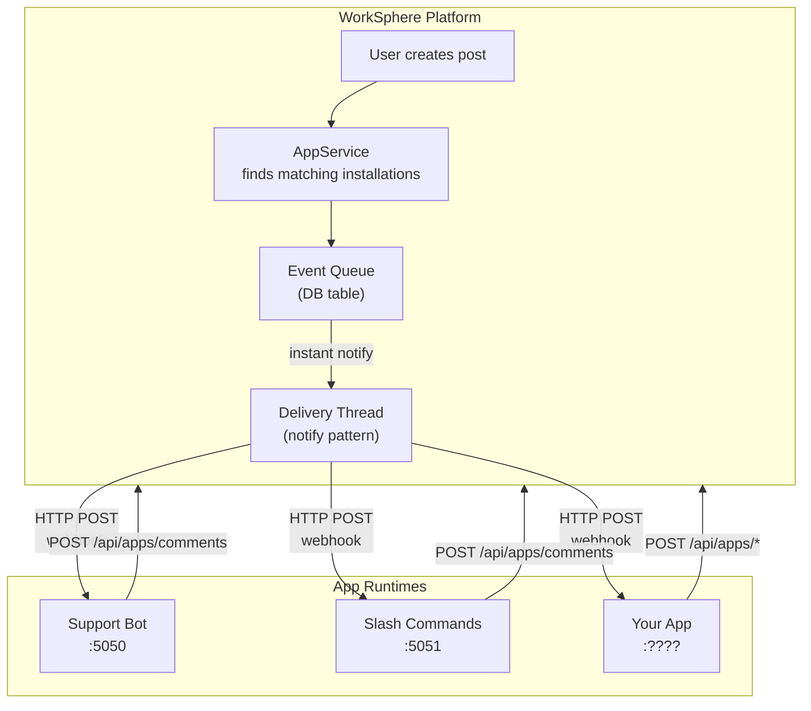
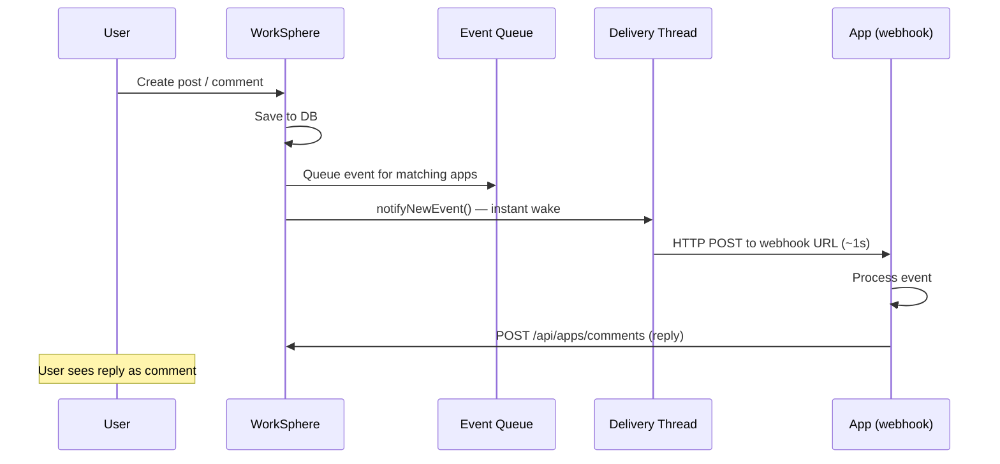
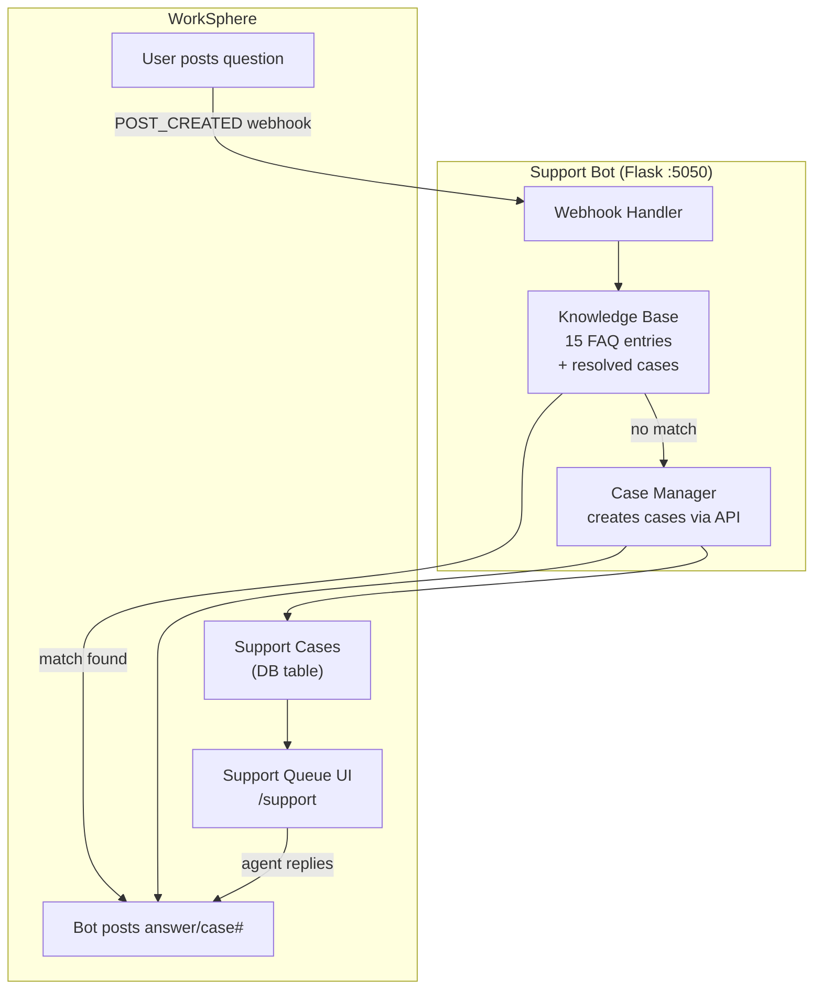
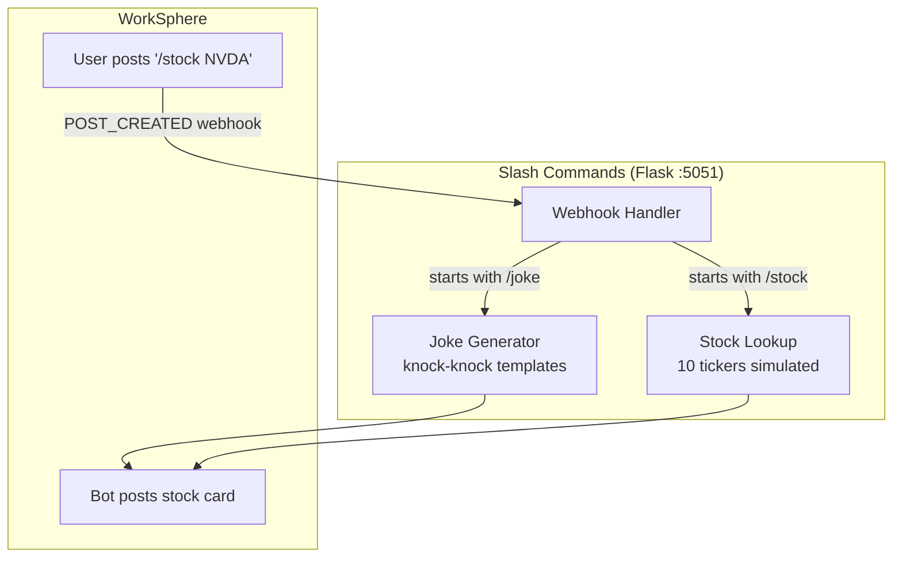
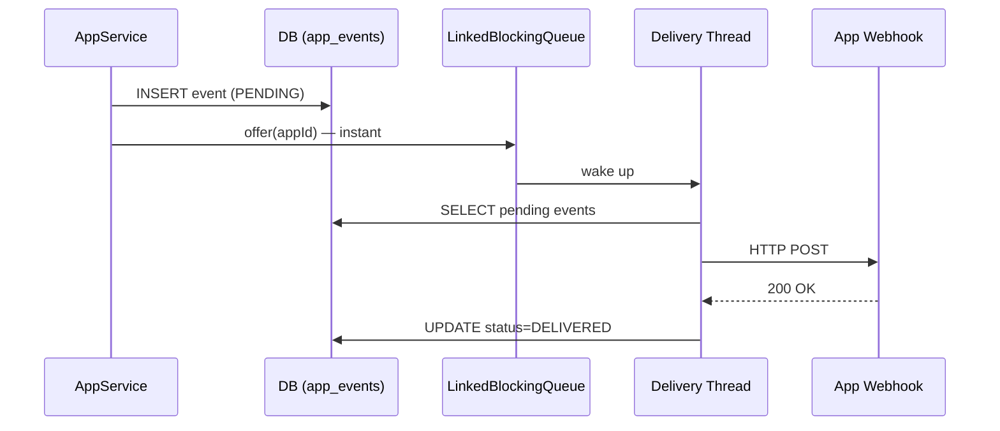
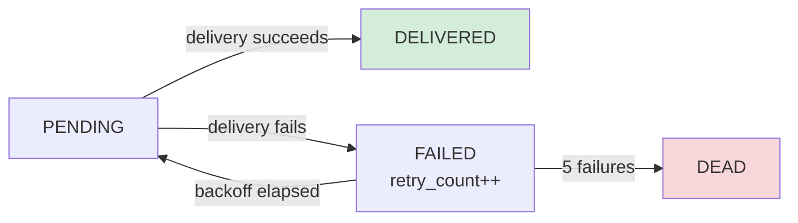

# WorkSphere Apps Guide

## Overview

WorkSphere's App Platform allows independent applications to integrate with the social platform via webhooks and APIs. Apps are separate runtimes that receive events and respond with content — similar to Slack apps or Facebook integrations.



## How It Works

### Event Flow



### Key Design Decisions

| Decision | Why |
|---|---|
| **Webhooks** (push) | Apps don't need to poll. Delivery is instant (<1 second). |
| **Notify pattern** | `LinkedBlockingQueue` wakes delivery thread immediately on new event. No 10-second polling delay. |
| **Per-app event queue** | One app's failures don't block others. Each app has independent retry. |
| **Exponential backoff** | Failed deliveries retry at 10s, 30s, 2m, 10m, 30m. Dead letter after 5 failures. |
| **API key auth** | Apps authenticate with `Authorization: Bearer app_xxx`. Simpler than OAuth for server-to-server. |
| **Separate runtimes** | Apps run in their own process/container. Can be any language. Only need HTTP. |

### Installation Types

| Type | Who Installs | Scope | Events Received |
|---|---|---|---|
| **PAGE** | Page admin | One page | Posts/comments on that page |
| **GROUP** | Group admin | One group | Posts/comments in that group |
| **USER** | Individual user | One user | That user's posts, messages |
| **ORG** | Platform admin | All users in tenant | ALL posts/comments in the tenant |

---

## Built-In Apps

### 1. Support Bot

**Purpose:** Automated FAQ answering and support case management. When users ask questions on a support page/group, the bot either answers from a knowledge base or creates a tracked support case.

**Architecture:**



**How it works:**

1. Listens for `POST_CREATED` events on installed pages/groups
2. Searches FAQ knowledge base using keyword overlap matching
3. **If match found** (>=30% confidence): Posts a formatted answer as a comment with the matched question and confidence score
4. **If no match**: Creates a support case with a tracking number (CS-XXXX) and posts the case number as a comment
5. Support agents view cases at `/support` and can reply, assign, and resolve

**FAQ Topics (15 entries):**
- Password reset, profile pictures, creating groups, inviting members
- Direct messages, polls, editing posts, search
- Pages vs groups, notifications, AI assistant, account deletion
- File uploads, @mentions, post visibility

**Knowledge Base Learning:** When a support agent resolves a case, the Q&A pair is added to the knowledge base at runtime, improving future matches.

**Files:**

```
apps/support-bot/
├── app.py              # Flask webhook server
├── knowledge_base.py   # FAQ search with keyword matching
├── case_manager.py     # Creates cases + posts comments via API
├── config.py           # Environment configuration
├── faq_data.json       # 15 FAQ entries (editable)
├── requirements.txt    # Flask, requests
├── Dockerfile          # Python 3.11 slim
└── README.md           # Setup instructions
```

**Setup:**

```bash
# 1. App is pre-registered (id=1297037792194330625)
# 2. Installed on Coffee Lovers group

# Start:
cd apps/support-bot
APP_ID=1297037792194330625 \
API_KEY=app_abbe0035430e8fd1ca7d0007d6037e57 \
python3 app.py

# Or via Docker:
docker compose -f docker-compose.apps.yml up -d support-bot
```

**Test:**
1. Login as `lamar.lehner` / `password`
2. Go to **Coffee Lovers** group
3. Post: **"How do I reset my password?"** → bot replies with FAQ answer (~1 second)
4. Post: **"The export button produces corrupted files"** → bot creates case #CS-XXXX

**Support Agent Workflow:**
1. Go to `/support` in the sidebar
2. See open cases with titles and priorities
3. Click a case → view details, assign to yourself
4. Type a reply → posts as a comment on the original question
5. Mark as resolved when done

---

### 2. Slash Commands

**Purpose:** Quick utility commands available to all users. Type `/joke` or `/stock` in any post and the app responds with content.

**Architecture:**



**Commands:**

| Command | Usage | Response |
|---|---|---|
| `/joke <topic>` | `/joke coffee` | Knock-knock joke themed to the topic |
| `/stock <TICKER>` | `/stock NVDA` | Stock price card with metrics table |

**Joke Topics:** The generator has themed punchlines for: coffee, code, work, meetings. Other topics get general-purpose punchlines.

**Available Stock Tickers:** AAPL, AMZN, GOOGL, JPM, META, MSFT, NFLX, NVDA, TSLA, V

**Stock Card Format (markdown):**

```markdown
## NVIDIA Corp. (NVDA) 📈

**$875.30**   +12.40 (+1.44%)

| | |
|---|---|
| **Day Range** | $860.00 — $880.00 |
| **Volume** | 42.8M |
| **P/E Ratio** | 65.4 |
| **Market Cap** | $2.16T |

---
_/stock • Data is simulated for demo_
```

**Files:**

```
apps/slash-commands/
├── app.py              # Flask webhook server with joke + stock handlers
├── config.py           # Environment configuration
├── requirements.txt    # Flask, requests
├── Dockerfile          # Python 3.11 slim
├── setup.sh            # Registration and org-wide install script
└── README.md           # Setup instructions
```

**Setup:**

```bash
# Register and install org-wide:
cd apps/slash-commands
bash setup.sh

# Or manually:
APP_ID=1297037792194330626 \
API_KEY=app_5904eb5c72199b27c56aaaa95ba99019 \
python3 app.py

# Or via Docker:
docker compose -f docker-compose.apps.yml up -d slash-commands
```

**Test:**
1. Login as any user
2. Go to any group
3. Post: **`/joke meetings`** → bot replies with a knock-knock joke
4. Post: **`/stock AAPL`** → bot replies with Apple's stock card

---

## Building Your Own App

### Step 1: Register

```bash
curl -X POST http://localhost:8080/api/app-registry/apps \
  -H "X-Debug-User-Id: 72057594037927937" \
  -H "X-Tenant-Id: 1" \
  -H "Content-Type: application/json" \
  -d '{
    "name": "My App",
    "slug": "my-app",
    "description": "Does something useful",
    "webhookUrl": "http://localhost:5052/webhook",
    "appType": "PAGE",
    "permissions": ["READ_POSTS", "WRITE_COMMENTS"]
  }'
# Returns: { "id": "...", "apiKey": "app_..." }
```

### Step 2: Install

```bash
# On a specific page/group:
curl -X POST http://localhost:8080/api/app-registry/install \
  -H "X-Debug-User-Id: 72057594037927937" \
  -H "X-Tenant-Id: 1" \
  -H "Content-Type: application/json" \
  -d '{"appId": APP_ID, "installType": "GROUP", "targetId": GROUP_ID}'

# Or org-wide:
curl -X POST http://localhost:8080/api/app-registry/install \
  -d '{"appId": APP_ID, "installType": "ORG", "targetId": 1}'
```

### Step 3: Handle Webhooks

```python
from flask import Flask, request, jsonify
import requests

app = Flask(__name__)

@app.route("/webhook", methods=["POST"])
def webhook():
    event = request.json
    if event["event"] == "POST_CREATED":
        post = event["data"]["post"]
        # Do something with the post
        # Reply:
        requests.post("http://localhost:8080/api/apps/comments", json={
            "postId": post["postId"],
            "content": "Hello from my app!"
        }, headers={
            "Authorization": "Bearer app_YOUR_KEY",
            "X-App-Id": "YOUR_APP_ID",
            "X-Tenant-Id": "1"
        })
    return jsonify({"status": "ok"})

app.run(port=5052)
```

### Step 4: Deploy

**Docker:**
```dockerfile
FROM python:3.11-slim
WORKDIR /app
COPY requirements.txt .
RUN pip install --no-cache-dir -r requirements.txt
COPY . .
CMD ["python", "-u", "app.py"]
```

**docker-compose.apps.yml:**
```yaml
my-app:
  build: ./apps/my-app
  environment:
    - APP_ID=xxx
    - API_KEY=xxx
    - WORKSPHERE_URL=http://host.docker.internal:8080
  ports:
    - "5052:5052"
```

### Available Events

| Event | When | Payload |
|---|---|---|
| `POST_CREATED` | New post in installed scope | `{postId, content, authorId, targetType, targetId}` |
| `COMMENT_CREATED` | New comment on a post in scope | `{commentId, postId, authorId, content}` |
| `MESSAGE_RECEIVED` | Message in installed conversation | `{messageId, conversationId, senderId, content}` |

### Available API Endpoints

All require `Authorization: Bearer app_xxx` and `X-App-Id: xxx` headers.

| Method | Path | Purpose |
|---|---|---|
| `POST /api/apps/comments` | Create a comment | `{postId, content}` |
| `POST /api/apps/cards` | Post a rich card | `{postId, card: {...}}` |
| `POST /api/apps/posts` | Create a post | `{content, targetType, targetId}` |
| `POST /api/apps/messages` | Send a message | `{conversationId, content}` |
| `POST /api/apps/cases` | Create support case | `{title, description, requesterId}` |
| `GET /api/apps/events` | Poll pending events | Fallback if webhook fails |
| `POST /api/apps/events/{id}/ack` | Acknowledge event | Mark as delivered |

---

## Event Delivery

### Instant Delivery (Notify Pattern)

Events are delivered in under 1 second:



### Retry & Dead Letter



Backoff schedule: 10s → 30s → 2min → 10min → 30min → DEAD

### Reliability

- **At-least-once delivery** — events may be delivered more than once if ack is lost
- **Per-app isolation** — one app's webhook failures don't affect others
- **Background sweep** — every 30 seconds catches any missed events or due retries
- **Dead letter** — after 5 failures, events are marked DEAD (admin can replay)
- **Pull fallback** — apps can also poll `GET /api/apps/events?status=PENDING`

---

## Deployment

### Docker Compose

```bash
# Start all apps:
docker compose -f docker-compose.apps.yml up -d

# With credentials:
SUPPORT_BOT_APP_ID=xxx SUPPORT_BOT_API_KEY=xxx \
SLASH_CMD_APP_ID=xxx SLASH_CMD_API_KEY=xxx \
docker compose -f docker-compose.apps.yml up -d
```

### Kubernetes

```bash
# Create secrets first:
kubectl create secret generic support-bot-secrets \
  --from-literal=app-id=xxx --from-literal=api-key=xxx -n worksphere

kubectl create secret generic slash-commands-secrets \
  --from-literal=app-id=xxx --from-literal=api-key=xxx -n worksphere

# Deploy:
kubectl apply -k k8s/
```

### AWS (ECS Fargate)

The Support Bot is defined in the CDK stack as a Fargate service. Additional apps can be added as new task definitions.

---

## Admin Operations

### List Apps

```bash
curl http://localhost:8080/api/app-registry/apps \
  -H "X-Debug-User-Id: 72057594037927937" -H "X-Tenant-Id: 1"
```

### View Installations

```bash
curl "http://localhost:8080/api/app-registry/installations?type=GROUP&targetId=360287970189639681" \
  -H "X-Debug-User-Id: 72057594037927937" -H "X-Tenant-Id: 1"
```

### Check Event Delivery Health

```bash
# As the app:
curl http://localhost:8080/api/apps/events?status=DEAD \
  -H "Authorization: Bearer app_xxx" -H "X-App-Id: xxx"

# Via DB:
SELECT status, count(*) FROM app_events GROUP BY status;
```

### Uninstall

```bash
curl -X DELETE http://localhost:8080/api/app-registry/installations/{installationId} \
  -H "X-Debug-User-Id: 72057594037927937" -H "X-Tenant-Id: 1"
```

---

## Ports Reference

| App | Port | Health Check |
|---|---|---|
| Support Bot | 5050 | http://localhost:5050/health |
| Slash Commands | 5051 | http://localhost:5051/health |
| (Your app) | 5052+ | http://localhost:5052/health |
