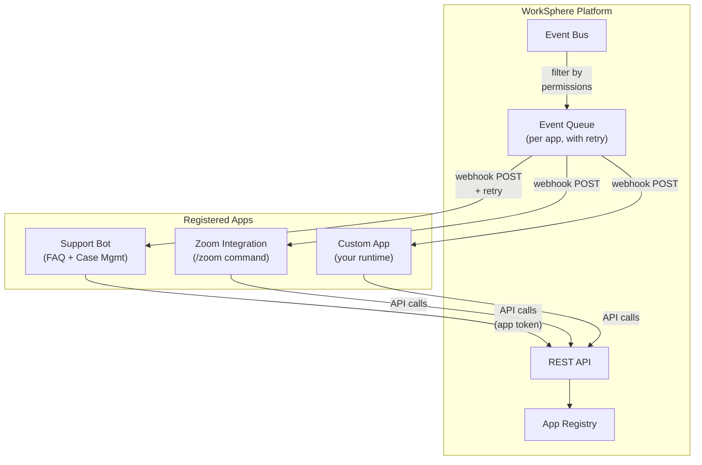
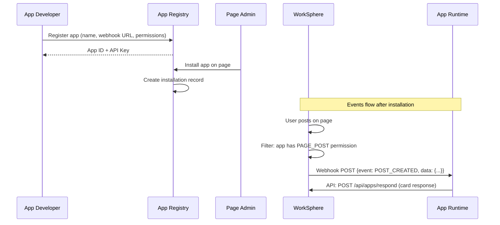
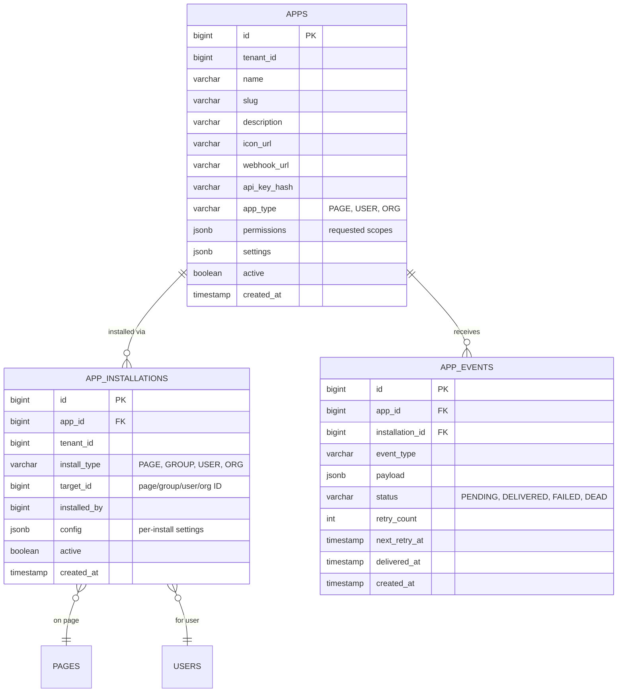
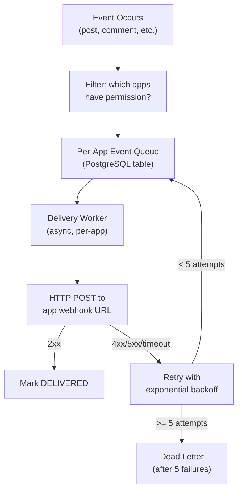

# App Platform

## Overview

WorkSphere's app platform allows third-party and internal applications to integrate with the social platform via webhooks and APIs. Apps are independent runtimes that receive events and interact with content through scoped API tokens.



## App Types

| Type | Installed By | Scope | Example |
|---|---|---|---|
| **Page/Group App** | Page/group admin | Receives events for that page/group | Support Bot, RSS Feed |
| **User App** | Individual user | Receives events for that user | /zoom, /giphy, Calendar |
| **Organization App** | Platform admin | Active for all users in org/tenant | SSO, Compliance, Analytics |

## App Lifecycle



## Data Model



## Permissions

Apps request permissions at registration. Installations grant the intersection of requested permissions and what the installer can authorize.

| Permission | Scope | Allows |
|---|---|---|
| `READ_POSTS` | Page/Group | Read posts and comments |
| `WRITE_POSTS` | Page/Group | Create posts |
| `WRITE_COMMENTS` | Page/Group | Create comments and replies |
| `READ_MESSAGES` | User/Page | Read messages in conversations |
| `WRITE_MESSAGES` | User/Page | Send messages |
| `READ_REACTIONS` | Page/Group | Read reaction data |
| `READ_MEMBERS` | Page/Group | Read member list |
| `READ_PROFILE` | User | Read user profile |
| `RECEIVE_MENTIONS` | Page/Group | Notified when @mentioned |
| `SLASH_COMMANDS` | User | Register /commands |

## Events

### Event Types

| Event | Trigger | Payload |
|---|---|---|
| `POST_CREATED` | New post on installed page/group | Post content, author, attachments |
| `COMMENT_CREATED` | New comment on a post | Comment content, post ID, author |
| `MESSAGE_RECEIVED` | DM to app or in installed conversation | Message content, sender, conversation |
| `REACTION_ADDED` | Reaction on a post in scope | Reaction type, post ID, user |
| `MEMBER_JOINED` | New member joins installed page/group | User info, group ID |
| `MENTION` | App or app-page @mentioned | Context, mentioner, content |
| `SLASH_COMMAND` | User invokes /command | Command, args, user, context |
| `INSTALLATION_CREATED` | App installed somewhere new | Installation details |
| `INSTALLATION_REMOVED` | App uninstalled | Installation ID |

### Event Delivery



**Delivery guarantees:**
- At-least-once delivery (retries on failure)
- Per-app queues — one app's failures don't block others
- Exponential backoff: 30s, 2min, 10min, 1hr, 6hr
- Dead letter after 5 failures (admin can replay)
- Apps can also poll: `GET /api/apps/{appId}/events?status=PENDING`

### Webhook Request Format

```json
POST https://your-app.com/webhook
Content-Type: application/json
X-WorkSphere-App-Id: 123
X-WorkSphere-Signature: sha256=...
X-WorkSphere-Event: POST_CREATED
X-WorkSphere-Delivery: evt_456

{
  "event": "POST_CREATED",
  "timestamp": "2026-03-31T12:00:00Z",
  "installation": {
    "id": 789,
    "type": "PAGE",
    "targetId": 101112
  },
  "data": {
    "post": {
      "id": 144115188075858000,
      "content": "How do I reset my password?",
      "author": {"id": 72057594037927937, "displayName": "Jane Doe"},
      "createdAt": "2026-03-31T12:00:00Z"
    }
  }
}
```

### Webhook Signature Verification

Apps should verify webhook authenticity:
```
signature = HMAC-SHA256(api_key, request_body)
compare with X-WorkSphere-Signature header
```

## App API

Apps interact with the platform using their API key:

```
Authorization: Bearer app_{api_key}
X-App-Id: {app_id}
```

### Endpoints Available to Apps

| Method | Path | Permission | Purpose |
|---|---|---|---|
| `POST` | `/api/apps/posts` | WRITE_POSTS | Create a post |
| `POST` | `/api/apps/comments` | WRITE_COMMENTS | Create a comment |
| `POST` | `/api/apps/messages` | WRITE_MESSAGES | Send a message |
| `POST` | `/api/apps/cards` | WRITE_POSTS | Post a rich card |
| `GET` | `/api/apps/events` | — | Poll pending events |
| `POST` | `/api/apps/events/{id}/ack` | — | Acknowledge event delivery |
| `GET` | `/api/apps/installations` | — | List installations |

### Rich Card Format

```json
{
  "type": "card",
  "targetType": "COMMENT",
  "targetId": 144115188075858000,
  "card": {
    "title": "Password Reset",
    "description": "Here's how to reset your password:",
    "color": "#10B981",
    "fields": [
      {"name": "Step 1", "value": "Go to Settings > Security"},
      {"name": "Step 2", "value": "Click 'Reset Password'"},
      {"name": "Step 3", "value": "Check your email for the reset link"}
    ],
    "actions": [
      {"label": "Open Help Center", "url": "https://help.example.com/password-reset"},
      {"label": "Create Support Case", "action": "create_case"}
    ],
    "footer": "Powered by Support Bot"
  }
}
```

## App Registry UI

### For Page/Group Admins

Admin panel of a page/group shows an "Apps" tab:
- Browse available apps from the registry
- Install apps with one click
- Configure per-installation settings
- View event delivery status
- Uninstall apps

### For Individual Users

User settings has an "Apps" section:
- Browse user-type apps
- Activate /commands
- Manage app permissions
- Revoke access

### For Platform Admins

Admin panel > Apps tab:
- Register new apps
- Manage app credentials
- View all installations across tenants
- Activate org-wide apps
- Monitor event delivery health

## Building an App

### 1. Register Your App

```bash
curl -X POST http://localhost:8080/api/super-admin/apps \
  -H "X-Debug-User-Id: 72057594037927937" \
  -H "Content-Type: application/json" \
  -d '{
    "name": "My Bot",
    "slug": "my-bot",
    "description": "Does cool things",
    "webhookUrl": "https://my-app.com/webhook",
    "appType": "PAGE",
    "permissions": ["READ_POSTS", "WRITE_COMMENTS"]
  }'
# Returns: { "id": 123, "apiKey": "app_xxxxxxxxxxxx" }
```

### 2. Handle Webhooks

Your app receives HTTP POST requests at the webhook URL:

```python
from flask import Flask, request, jsonify
import hmac
import hashlib

app = Flask(__name__)
API_KEY = "app_xxxxxxxxxxxx"
WORKSPHERE_URL = "http://localhost:8080"

@app.route("/webhook", methods=["POST"])
def webhook():
    # Verify signature
    sig = request.headers.get("X-WorkSphere-Signature", "")
    expected = "sha256=" + hmac.new(API_KEY.encode(), request.data, hashlib.sha256).hexdigest()
    if not hmac.compare_digest(sig, expected):
        return "Invalid signature", 401

    event = request.json
    event_type = event["event"]

    if event_type == "POST_CREATED":
        handle_post(event["data"]["post"])
    elif event_type == "COMMENT_CREATED":
        handle_comment(event["data"]["comment"])

    return "ok", 200

def handle_post(post):
    # Respond with a comment
    requests.post(f"{WORKSPHERE_URL}/api/apps/comments", json={
        "postId": post["id"],
        "content": f"Thanks for your post, {post['author']['displayName']}!"
    }, headers={
        "Authorization": f"Bearer {API_KEY}",
        "X-App-Id": "123"
    })
```

### 3. Install on a Page

A page admin installs your app:

```bash
curl -X POST http://localhost:8080/api/pages/{pageId}/apps \
  -H "X-Debug-User-Id: {adminUserId}" \
  -d '{"appId": 123}'
```

### 4. Test

Create a post on the page → your webhook receives `POST_CREATED` → your app replies with a comment.

## Support Bot Example

See the reference implementation in `apps/support-bot/`:

```
apps/support-bot/
├── app.py              # Flask webhook server
├── knowledge_base.py   # FAQ search (Ollama embeddings)
├── case_manager.py     # Case creation and queue
├── config.py           # App credentials
├── faq_data.json       # Seed FAQ entries
└── README.md           # Setup instructions
```

The support bot:
1. Listens for `POST_CREATED` on installed support pages
2. Searches FAQ knowledge base using Ollama semantic similarity
3. If match found → replies with a card containing the answer
4. If no match → creates a support case, replies with case ID
5. Support agents view cases in the Case Management UI
6. Agent replies → bot posts the reply as a comment on the original post
