# Social Enterprise Platform — Architecture Guide

## 1. Overview

Full-stack enterprise social networking platform built with:

- **Backend:** Spring Boot 3.4.3 (Java 21)
- **Frontend:** React 18 (TypeScript/Vite), iOS (SwiftUI), Android (Jetpack Compose)
- **Database:** PostgreSQL 16
- **Search:** OpenSearch 2.12 for full-text search
- **Cache:** Redis (L2) + Caffeine (L1) two-layer caching
- **Streaming:** Apache Kafka (event streaming + structured logging)
- **AI:** Ollama LLM (bot assistant "Roid", summarization)
- **Graph Cache:** AOEE — custom Rust gRPC service for in-memory social graph
- **Data Warehouse:** Spark → Apache Iceberg (MinIO/S3) → Trino
- **ML:** XGBoost feed ranking with GBDT kernel codegen

The project is organized as a **monorepo with a Maven multi-module build**.

---

## 2. System Architecture Diagram

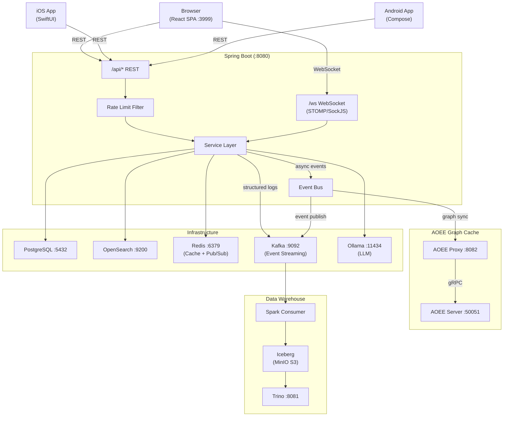

---

## 3. Module Structure

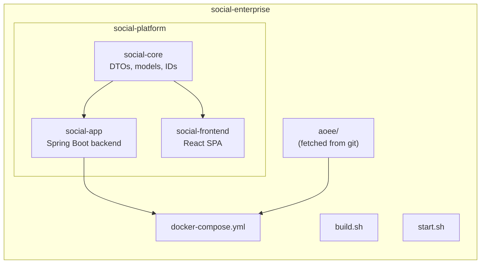

---

## 4. Backend Architecture

### 4.1 Layering

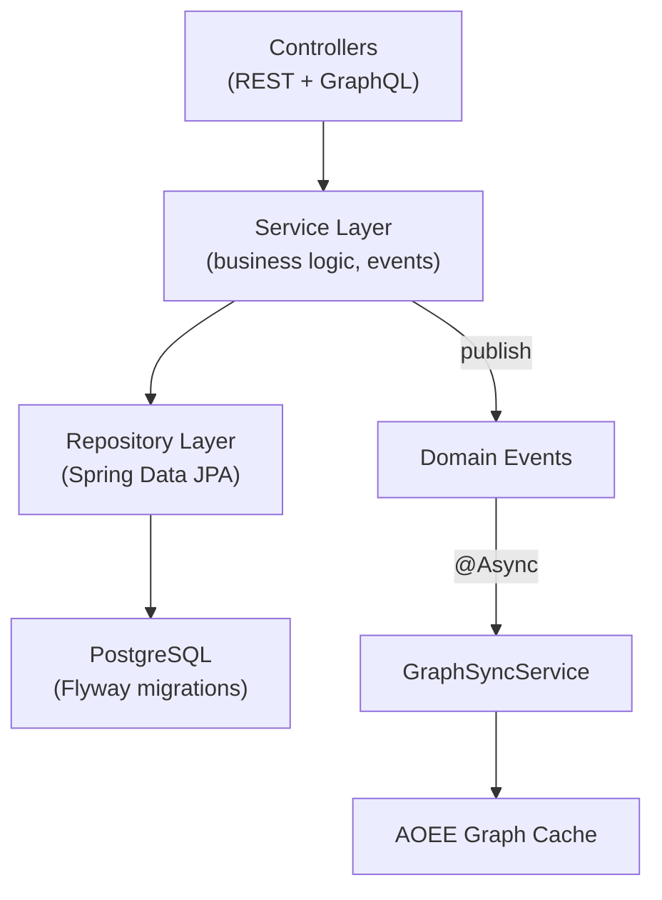

### 4.2 Authentication & Security

- **JWT tokens** — HMAC-SHA256, 24-hour expiry
- **JwtAuthFilter** extracts the Bearer token from the `Authorization` header
- **DebugAuthFilter** allows the `X-Debug-User-Id` header in dev mode (`social.auth.debug-bypass: true`)
- **SecurityConfig** public paths: `/api/auth/**`, `/api/v1/**`, `/graphql`, `/uploads/**`; all other `/api/**` routes require authentication
- Passwords hashed with **BCrypt**

### 4.3 ID System (GlobalId)

64-bit IDs with embedded type information:

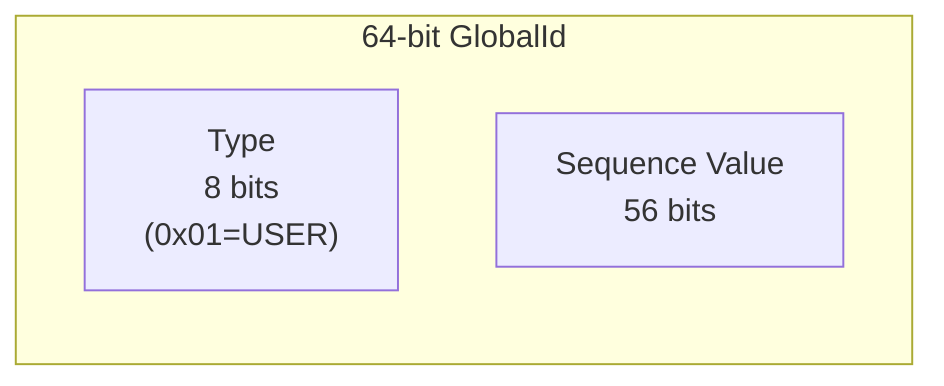

- **Upper 8 bits:** ObjectType code (`USER=0x01`, `POST=0x02`, `COMMENT=0x03`, etc.)
- **Lower 56 bits:** Sequence value
- Enables type detection from any ID: `GlobalId.typeOf(id) -> ObjectType`
- Generated by `GlobalIdGenerator` with per-type atomic counters
- On startup, loads max existing IDs from the database to avoid collisions

### 4.4 Event System

Spring `ApplicationEventPublisher` for domain events. All events are consumed **asynchronously** by `GraphSyncService`.

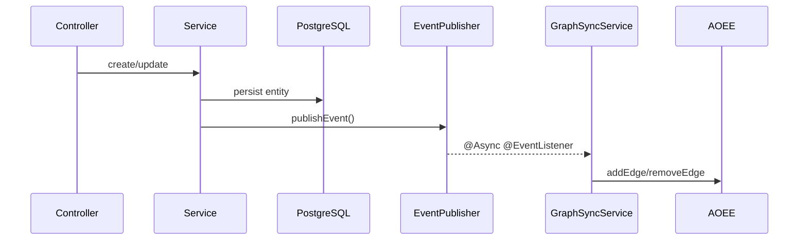

| Event | Published By | Fields | Graph Edge |
|---|---|---|---|
| `FollowEvent` | `FollowController`, `FriendRequestController` | `followerId`, `followedId`, `followed` | `FOLLOWS` |
| `PostCreatedEvent` | `PostService` | `postId`, `authorId`, `targetType`, `targetId` | `AUTHORED`, `CONTAINS` |
| `ReactionEvent` | `ReactionService` | `userId`, `targetId`, `reactionType`, `added` | `LIKES` |
| `MembershipEvent` | `GroupService` | `userId`, `groupId`, `role`, `joined` | `MEMBER_OF` |

### 4.5 Feed Algorithm

`FeedService.assembleFeed()`:

1. Collect followed user IDs + joined group/page IDs
2. Query posts from those sources (organic feed)
3. Generate recommendations via `RecommendationService` (20% of feed)
4. Interleave: every 5th post is a recommendation
5. Cursor-based pagination (ID descending)

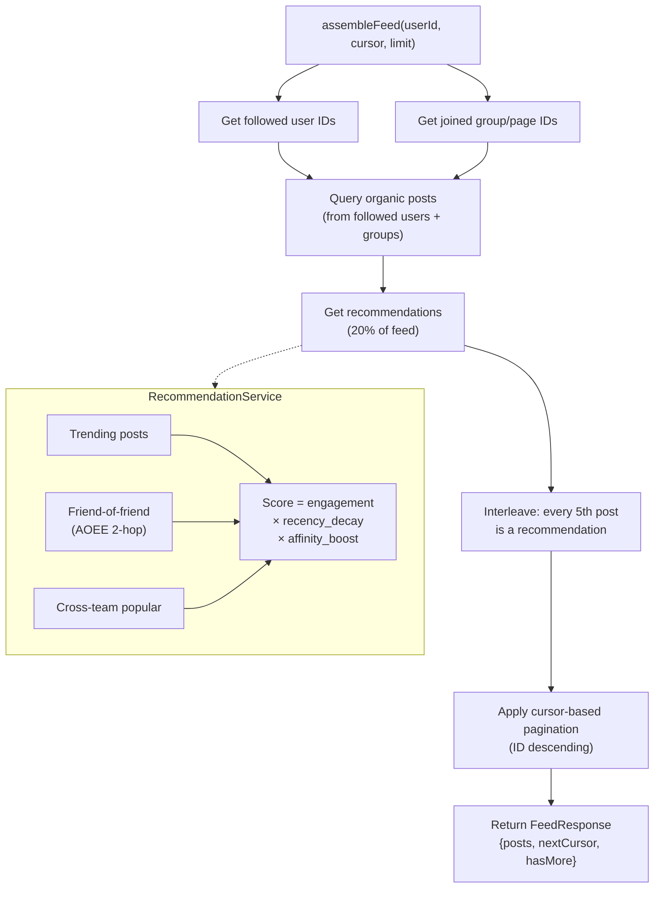

**RecommendationService scoring:**

- **Sources:** trending posts, friend-of-friend content (via AOEE 2-hop), cross-team popular content
- **Score** = `engagement_score * recency_decay * affinity_boost`
- Recency half-life: 24 hours

### 4.6 Search

`OpenSearchService` with graceful degradation:

- **Primary:** OpenSearch indices (`users`, `pages`) using multi-match queries
- **Fallback:** Database `LIKE` queries via repository methods
- Exception handling catches all errors and falls back to the database

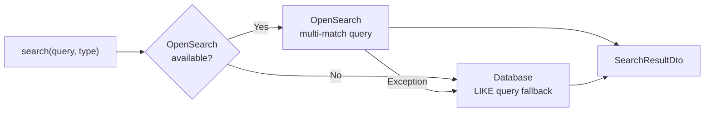

### 4.7 AOEE Graph Integration

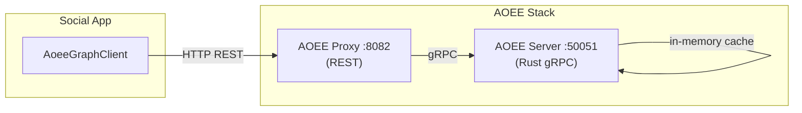

**AoeeGraphClient** (REST client to AOEE proxy at `:8082`):

- `addEdge` / `removeEdge` — write graph relationships
- `getNeighbors` — traverse graph (used for friend-of-friend recommendations)
- `contains` — check relationship existence
- `count` — edge count queries
- **Graceful degradation:** all methods catch exceptions and return empty/false

**GraphSyncService** (`@Async @EventListener`):

- Listens to domain events
- Syncs edges to AOEE asynchronously
- Never blocks the main request thread

---

## 5. Database Design

### 5.1 Partitioning

Posts and comments tables are **range-partitioned by `created_at`** (quarterly). Partitions cover Q1–Q4 for 2025, 2026, and 2027.

### 5.2 Key Relationships

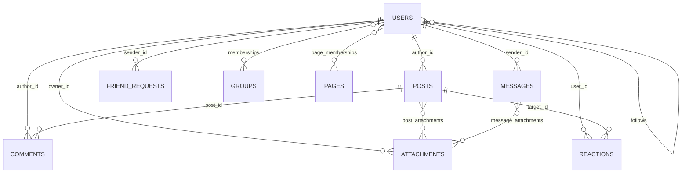

- `Users` -> `Posts` (`author_id`)
- `Users` -> `Comments` (`author_id`)
- `Users` -> `Follows` (`follower_id`, `followed_id`) — composite PK
- `Users` -> `Reactions` (`user_id` -> `target_id`)
- `Users` -> `Groups` via `Memberships` (composite PK: `user_id` + `group_id`)
- `Users` -> `Pages` via `PageMemberships` (composite PK: `user_id` + `page_id`)
- `Users` -> `Messages` (`sender_id`, `recipient_id`)
- `Posts` -> `Attachments` via `post_attachments` junction table
- `Posts` -> target (group/page/team feed via `target_type` + `target_id`)
- Graph edges stored in `graph_edges` for AOEE persistence

### 5.3 Visibility Model

Posts, groups, and pages support the following visibility levels:

- `PUBLIC`
- `PRIVATE`
- `TEAM_VISIBLE`
- `RESTRICTED`

### 5.4 Membership Roles

Groups and pages use role-based membership:

- **Roles:** `OWNER`, `ADMIN`, `MEMBER` / `FOLLOWER`
- **Status:** `APPROVED`, `PENDING`

---

## 6. Frontend Architecture

### 6.1 Stack

- React 18
- TypeScript
- Vite
- Tailwind CSS
- Zustand (auth state)
- TanStack React Query (server state)

### 6.2 Routing

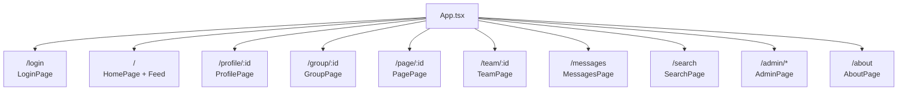

| Path | View |
|---|---|
| `/` | Home feed |
| `/login` | Authentication |
| `/profile/:id` | User profile |
| `/group/:id`, `/page/:id`, `/team/:id` | Entity pages |
| `/messages`, `/messages/:partnerId` | Direct messaging |
| `/search` | Full-text search |
| `/admin/*` | Admin dashboard |
| `/about` | Platform info |

### 6.3 API Client

Axios instance (`baseURL: /api`) with:

- JWT token injection from Zustand auth store
- `X-Debug-User-Id` header for dev mode
- Auto-redirect to `/login` on 401

### 6.4 Key Patterns

- **Optimistic updates** for reactions (ref-based prop tracking to avoid flash)
- **React Query invalidation** on mutations
- **Cursor-based infinite scroll** for feeds
- **Hover-based reaction picker** with CSS gap fix (`pb-2 -mb-2`)

---

## 7. Deployment

### 7.1 Docker Services

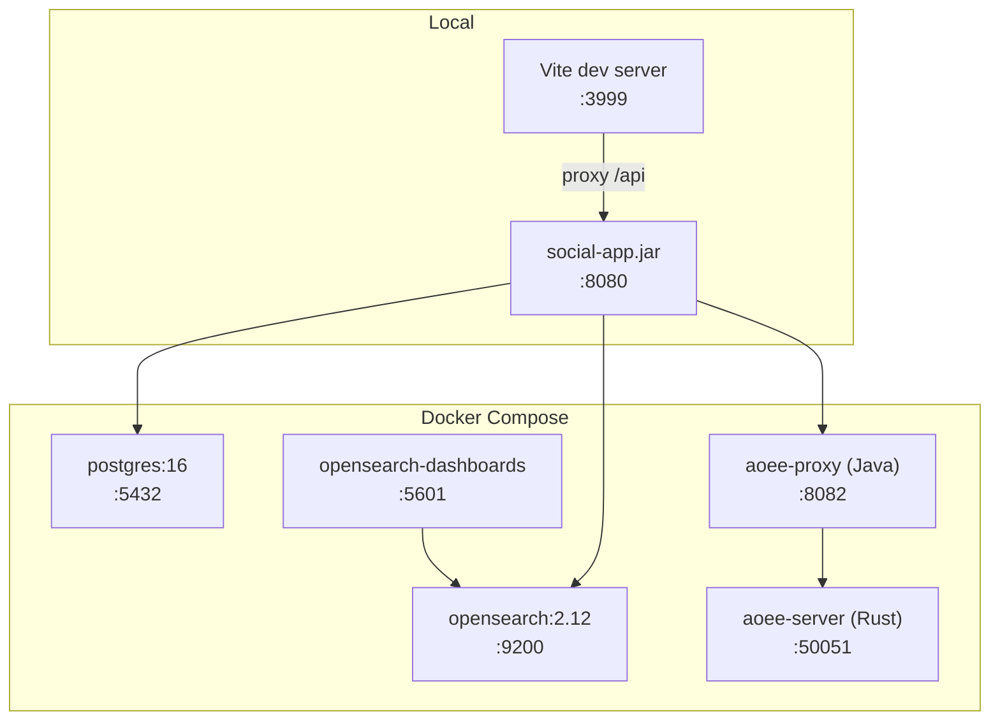

| Service | Image | Port | Purpose |
|---|---|---|---|
| `postgres` | `postgres:16` | 5432 | Primary database |
| `opensearch` | `opensearchproject/opensearch:2.12.0` | 9200 | Full-text search |
| `opensearch-dashboards` | `opensearchproject/opensearch-dashboards:2.12.0` | 5601 | Search UI |
| `aoee-server` | Custom Rust build | 50051 | Graph cache (gRPC) |
| `aoee-proxy` | Custom Spring Boot | 8082 | Graph cache REST proxy |

### 7.2 Build Pipeline

`build.sh`:

1. `setup-aoee.sh` — clone/pull AOEE from GitHub
2. `mvn clean package -DskipTests` — build Java backend
3. `npm install && npm run build` — build React frontend

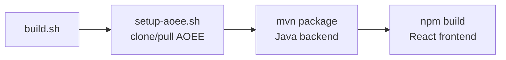

### 7.3 Startup

`start.sh`:

1. Ensure AOEE from git
2. `docker-compose up postgres opensearch`
3. Build backend if first run
4. `java -jar social-app.jar` (background)
5. `npx vite --host` (dev server)
6. Optional: `--with-aoee` for graph cache, `--generate` for test data

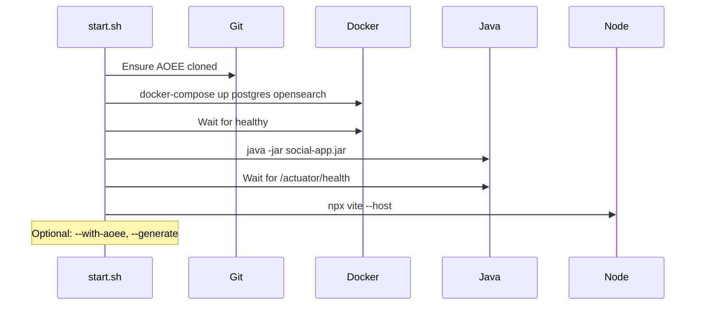

---

## 8. Design Decisions

| Decision | Rationale |
|---|---|
| GlobalId with embedded type | Enables O(1) type detection without DB lookup; deterministic sharding |
| Event-driven AOEE sync | Decouples graph cache from business logic; async avoids latency |
| OpenSearch + DB fallback | Graceful degradation; works without search infrastructure |
| Table partitioning | Efficient time-range queries; partition pruning for feeds |
| Cursor-based pagination | Consistent results under concurrent writes (vs offset-based) |
| JWT + debug header | Production-ready auth with frictionless development |
| AOEE as external dependency | Independent versioning; fetched from git at build time |
| Comment depth limit (1) | Prevents deeply nested threads; simpler UI |
| Content-hash deduplication | Saves storage for identical file uploads |
| 80/20 organic/recommended feed | Discovery without overwhelming organic content |
| Kafka for analytics events | Decoupled, durable event stream; replay for reprocessing |
| Iceberg on MinIO | Open table format with time travel; local S3-compatible storage |
| Heuristic scoring first, GBDT later | Ship fast, then replace with trained model when data exists |
| Structured log configs as JSON | Single source of truth for Kafka schemas, Iceberg tables, and code-generated loggers |

---

## 9. Scalability Infrastructure

### 9.1 Overview

```
┌─────────────────────────────────────────────────────────────┐
│                      Clients                                 │
│   React SPA  ·  iOS (SwiftUI)  ·  Android (Compose)        │
└──────┬───────────────┬──────────────────┬───────────────────┘
       │ REST          │ WebSocket        │ REST
       ▼               ▼                  ▼
┌──────────────────────────────────────────────────────────────┐
│                  Spring Boot (:8080)                          │
│  ┌──────────┐  ┌─────────────┐  ┌────────────┐              │
│  │ REST API │  │ STOMP/WS    │  │ Rate Limit │              │
│  │ Controllers│ │ Gateway     │  │ Filter     │              │
│  └────┬─────┘  └──────┬──────┘  └────────────┘              │
│       ▼               ▼                                      │
│  ┌────────────────────────────────┐                          │
│  │        Service Layer           │                          │
│  │  Feed · Message · Bot · Org   │                          │
│  └──┬────────┬────────┬──────────┘                          │
│     │        │        │                                      │
│     ▼        ▼        ▼                                      │
│  ┌──────┐ ┌──────┐ ┌───────┐                                │
│  │Redis │ │Kafka │ │Ollama │                                │
│  │Cache │ │Events│ │  LLM  │                                │
│  └──────┘ └──────┘ └───────┘                                │
└──────────────────────────────────────────────────────────────┘
       │               │
       ▼               ▼
┌──────────┐   ┌──────────────────────────────────────────────┐
│PostgreSQL│   │          Data Warehouse                       │
│ + AOEE   │   │  Kafka → Spark → Iceberg (MinIO) → Trino    │
└──────────┘   └──────────────────────────────────────────────┘
```

### 12.2 Redis (Two-Layer Cache + Pub/Sub)

**L1 Cache:** Caffeine (in-process, 1000 entries, 30s TTL)
**L2 Cache:** Redis (shared, configurable TTL per key type)

```
CacheService.getOrLoad(key, ttl, loader)
  → check L1 (Caffeine)
    → hit: return
    → miss: check L2 (Redis)
      → hit: populate L1, return
      → miss: call loader(), populate L2 + L1, return
```

Used for: conversation lists (10s), user profiles (60s), unread counts (30s), feed entries.

**Pub/Sub:** `MessageBroadcastService` publishes messages to Redis channels for cross-instance delivery when horizontal scaling.

### 12.3 Kafka (Event Streaming)

Five topics, each with 4 partitions:

| Topic | Producer | Purpose |
|---|---|---|
| `posts.created` | `EventPublisher` | Feed fan-out trigger |
| `messages.sent` | `EventPublisher` | Message delivery events |
| `reactions.added` | `EventPublisher` | Engagement events |
| `worksphere-feed-impressions` | `FeedImpressionLogger` | ML training data (structured) |
| `worksphere-user-interactions` | `UserInteractionLogger` | Analytics events (structured) |

`FeedFanoutConsumer` reads `posts.created` to pre-compute feed entries in Redis sorted sets.

### 12.4 WebSocket (STOMP over SockJS)

Real-time message delivery via Spring's STOMP broker:

- Endpoint: `/ws` (SockJS fallback)
- Destinations: `/topic/conversation/{id}`, `/user/{id}/queue/messages`
- `MessageBroadcastService` bridges REST message creation to WebSocket push

### 12.5 Rate Limiting

`RateLimitFilter` enforces per-user request limits using Redis:

- Default: 300 requests/minute
- `/api/ai/**`: 60 requests/minute
- `/api/messages/**`: 120 requests/minute

---

## 10. ML Feed Ranking Pipeline

### 10.1 End-to-End Architecture

```
┌─────────────────────────────────────────────────────────────────────┐
│ ONLINE (per request)                                                │
│                                                                     │
│  Feed Request                                                       │
│      │                                                              │
│      ▼                                                              │
│  FeedService.assembleFeed()                                         │
│      │                                                              │
│      ├─→ FeedFeatureExtractor.extractFeatures()  ← 10 features     │
│      │       per post × per viewer                                  │
│      │                                                              │
│      ├─→ FeedFeatureExtractor.computeScore()     ← heuristic       │
│      │   score = engagement × 0.5^(hours/24) × affinity             │
│      │                                                              │
│      ├─→ Sort posts by score                                        │
│      │                                                              │
│      └─→ AnalyticsService.logFeedImpression()    ← fire-and-forget │
│              │                                                      │
│              ▼                                                      │
│         FeedImpressionLogger → Kafka                                │
│         (worksphere-feed-impressions)                                │
│                                                                     │
│  User clicks/reacts/comments                                        │
│      │                                                              │
│      └─→ UserInteractionLogger → Kafka                              │
│          (worksphere-user-interactions)                              │
└──────────────────────────────┬──────────────────────────────────────┘
                               │
┌──────────────────────────────▼──────────────────────────────────────┐
│ OFFLINE (batch)                                                     │
│                                                                     │
│  Spark Consumer (Docker) — 30-second micro-batches                  │
│      │                                                              │
│      └─→ Iceberg Tables (MinIO S3)                                  │
│              │                                                      │
│              ▼                                                      │
│         Trino SQL                                                   │
│              │                                                      │
│              ├─→ JOIN impressions + interactions → training labels   │
│              │                                                      │
│              └─→ Export to Parquet                                   │
│                      │                                              │
│                      ▼                                              │
│               XGBoost Training (ml/feed-ranking/train.py)           │
│                      │                                              │
│                      ├─→ feed_ranker.ubj (XGBoost binary)           │
│                      │                                              │
│                      └─→ GBDT Kernel Codegen                        │
│                              │                                      │
│                              └─→ Optimized C scoring kernel         │
│                                      │                              │
│                                      └─→ gRPC inference server      │
│                                          (replaces heuristic)       │
└─────────────────────────────────────────────────────────────────────┘
```

### 10.2 Feature Extraction

`FeedFeatureExtractor` computes 10 features per (post, viewer) pair:

| # | Feature | Type | Source | Description |
|---|---|---|---|---|
| 0 | `engagement` | float | DB | `reactions + comments × 2` |
| 1 | `recency_hours` | float | computed | hours since post creation |
| 2 | `affinity` | float | DB | `1 + viewer_reactions_to_author × 0.3` |
| 3 | `reaction_count` | int | DB | total reactions on post |
| 4 | `comment_count` | int | DB | total comments on post |
| 5 | `author_follower_count` | int | DB | followers of post author |
| 6 | `is_recommended` | bool | logic | set by RecommendationService |
| 7 | `has_attachment` | bool | DB | post has image/file |
| 8 | `has_poll` | bool | DB | post has a poll |
| 9 | `social_distance` | int | follows | 1=direct, 2=FoF, 3=stranger |

Features 2 and 9 are **user-level** (vary per viewer); the rest are **item-level** (same for all viewers).

### 10.3 Current Scoring (Heuristic)

```java
double recencyDecay = Math.pow(0.5, recencyHours / 24.0);  // half-life: 24 hours
score = engagement * recencyDecay * affinity;
```

### 10.4 Model Training

```bash
cd ml/feed-ranking

# Synthetic data (development)
python3 train.py --samples 100000 --trees 200

# Real data (from Trino export)
python3 train.py --data real_training_data.parquet --trees 500 --depth 8
```

**XGBoost hyperparameters:** 200 trees, max depth 6, learning rate 0.1, `binary:logistic` objective.
**Validation gates:** AUC-ROC >= 0.65, AUC-PR >= 0.25, 5-fold cross-validation.

Outputs:
- `output/feed_ranker.ubj` — XGBoost binary (for GBDT kernel codegen)
- `output/feed_ranker.json` — human-readable model
- `output/feed_ranker_result.json` — metrics, feature importance, hyperparams
- `output/feature_config.json` — feature schema for ranker framework

### 10.5 Building Training Labels

The key join that creates labeled training data:

```sql
-- In Trino: join impressions with subsequent interactions
SELECT
    fi.user_id, fi.post_id,
    fi.feat_engagement, fi.feat_recency_hours, fi.feat_affinity,
    fi.feat_reaction_count, fi.feat_comment_count,
    fi.feat_author_follower_count, fi.feat_is_recommended,
    fi.feat_has_attachment, fi.feat_has_poll, fi.feat_social_distance,
    CASE WHEN ui.user_id IS NOT NULL THEN 1 ELSE 0 END AS engaged
FROM iceberg.worksphere.feedimpression fi
LEFT JOIN iceberg.worksphere.userinteraction ui
    ON fi.user_id = ui.user_id
    AND fi.post_id = ui.target_id
    AND ui.interaction_type IN ('reaction', 'comment', 'FEED_CLICK')
    AND ui.timestamp BETWEEN fi.timestamp AND fi.timestamp + INTERVAL '5' MINUTE
WHERE fi.event_date >= CURRENT_DATE - INTERVAL '30' DAY;
```

### 10.6 GBDT Kernel Generation

Uses `geekychris/gbdt_accelerated_ranker_framework` to convert the XGBoost model into optimized C scoring code:

```bash
python3 -m cuda_codegen generate \
  --model output/feed_ranker.ubj \
  --output output/generated \
  --user-features 2 \
  --library --cpu
```

The generated kernel eliminates XGBoost runtime overhead by converting the tree ensemble into a flat decision function. The `--user-features 2` flag tells the codegen that features at indices 2 (affinity) and 9 (social_distance) vary per-user and should be passed at inference time, while the remaining 8 item features can be pre-computed and cached.

### 10.7 Deployment Path

1. Deploy `scorched` gRPC server with the generated kernel
2. Add gRPC client to `FeedService`
3. Replace `FeedFeatureExtractor.computeScore()` with gRPC call
4. A/B test: 50% heuristic vs 50% GBDT, compare engagement rates

---

## 11. Structured Logging & Data Warehouse

### 11.1 Overview

The structured logging pipeline uses `geekychris/structured-logger` to generate type-safe Kafka loggers from JSON schema definitions. Events flow through Kafka into Apache Iceberg tables (stored on MinIO) and are queryable via Trino SQL.

```
┌─────────────┐     ┌──────────────────┐     ┌───────────────┐
│ JSON Schema │────▶│ Code Generator   │────▶│ Java Logger   │
│ log-configs/│     │ (structured-     │     │ Classes       │
│ *.json      │     │  logger)         │     │ (type-safe)   │
└─────────────┘     └──────────────────┘     └───────┬───────┘
                                                     │
                                                     ▼
┌─────────────────────────────────────────────────────────────┐
│                        Kafka                                 │
│  worksphere-feed-impressions (4 partitions, 30d retention)  │
│  worksphere-user-interactions (4 partitions, 30d retention) │
└────────────────────────┬────────────────────────────────────┘
                         │
                         ▼
┌─────────────────────────────────────────────────────────────┐
│  Spark Consumer (docker/spark-consumer/)                     │
│  - Reads JSON configs to auto-discover schemas               │
│  - Creates Iceberg tables via Hive Metastore                 │
│  - Streaming micro-batches every 30 seconds                  │
│  - Parses envelope: {_log_type, _log_class, _version, data} │
└────────────────────────┬────────────────────────────────────┘
                         │
                         ▼
┌─────────────────────────────────────────────────────────────┐
│  Apache Iceberg (on MinIO S3)                                │
│  Catalog: iceberg.worksphere                                 │
│  Tables: feedimpression, userinteraction                     │
│  Format: Parquet + Snappy, format-version 2                  │
│  Partitioned by: event_date (+ interaction_type for UI)      │
└────────────────────────┬────────────────────────────────────┘
                         │
                         ▼
┌─────────────────────────────────────────────────────────────┐
│  Trino (:8081)                                               │
│  - ANSI SQL over Iceberg                                     │
│  - Used for ad-hoc analytics & training data export          │
│  - iceberg.worksphere.feedimpression                         │
│  - iceberg.worksphere.userinteraction                        │
└─────────────────────────────────────────────────────────────┘
```

### 11.2 Log Schema Definitions

Schemas live in `log-configs/` as JSON files. Each defines:

- **Kafka config:** topic name, partitions, retention
- **Warehouse config:** table name, partition columns, sort order, retention days
- **Fields:** name, type, required flag, description

**`feed_impression.json`** — 20 fields including all 10 ML ranking features:

| Field | Type | Description |
|---|---|---|
| `timestamp` | timestamp | Event time |
| `event_date` | date | Partition key |
| `user_id` | long | Viewing user |
| `post_id` | long | Viewed post |
| `author_id` | long | Post author |
| `position` | int | Position in feed |
| `score` | double | Ranking score |
| `source` | string | `organic` or `recommended` |
| `feat_engagement` ... `feat_social_distance` | various | All 10 ranking features |

**`user_interaction.json`** — 18 fields covering all interaction types:

| Interaction Type | Tracked Fields |
|---|---|
| `FEED_CLICK` | target_id, target_type |
| `REACTION` | target_id, content_author_id, reaction_type |
| `COMMENT` | target_id, content_author_id |
| `MESSAGE_SENT` | target_id (conversation), message_has_attachment |
| `SEARCH` | search_query, search_result_count |
| `PROFILE_VIEW` | target_id (viewed user) |
| `BOT_INTERACTION` | bot_context, bot_tools_used, bot_response_time_ms |
| `POLL_VOTE` | target_id (poll) |

### 11.3 Code-Generated Loggers

The structured-logger code generator reads `log-configs/*.json` and produces Java classes:

- **`FeedImpressionLogger`** — wraps a Kafka producer; `log(timestamp, eventDate, userId, postId, ...)` with type-safe parameters matching the schema
- **`UserInteractionLogger`** — same pattern for user interactions

Each logger serializes events into a JSON envelope:
```json
{
  "_log_type": "feed_impression",
  "_log_class": "FeedImpression",
  "_version": "1.0.0",
  "data": { ... all fields ... }
}
```

`AnalyticsService` wraps both loggers with fire-and-forget semantics. Logging failures are caught and logged at DEBUG level — they never affect the user request.

### 11.4 Kafka Configuration

Kafka runs on the host (Homebrew) with two listeners:

| Listener | Port | Advertised As | Used By |
|---|---|---|---|
| `PLAINTEXT` | 9092 | `localhost:9092` | Social app, CLI tools |
| `DOCKER` | 29092 | `host.docker.internal:29092` | Spark consumer, other containers |

This dual-listener setup solves the Docker-to-host connectivity problem on macOS where containers cannot reach `localhost`.

### 11.5 Data Warehouse Services

All managed via `docker-compose.data-warehouse.yml`:

| Service | Container | Port | Purpose |
|---|---|---|---|
| MinIO | `ws-minio` | 9000/9001 | S3-compatible object storage for Iceberg |
| Hive Postgres | `ws-hive-postgres` | 5433 | Metadata store for Hive Metastore |
| Hive Metastore | `ws-hive-metastore` | 9083 | Iceberg catalog (Thrift) |
| Trino | `ws-trino` | 8081 | SQL query engine |
| Spark Consumer | `ws-spark-consumer` | — | Kafka → Iceberg streaming |

```bash
# Start the full warehouse
docker compose -f docker-compose.data-warehouse.yml up -d

# Verify
docker exec ws-trino trino --execute \
  "SELECT count(*) FROM iceberg.worksphere.feedimpression"
```

### 11.6 Spark Consumer

`docker/spark-consumer/consumer.py` reads all JSON configs from `log-configs/`, creates corresponding Iceberg tables, and starts Spark Structured Streaming queries.

Key configuration:
- **Warehouse location:** `s3a://warehouse/worksphere` (Iceberg namespace on MinIO)
- **Kafka bootstrap:** `host.docker.internal:29092` (Docker listener)
- **Micro-batch interval:** 30 seconds
- **Checkpoint:** persistent Docker volume for exactly-once delivery

The consumer dynamically adapts to schema changes — add a new JSON config file and restart the container.

---

## 12. AOEE Integration Deep Dive

AOEE (Attribute Object Enterprise Edition) is used as a **vanilla, unmodified dependency** — fetched from GitHub at build time with zero source code changes. The social platform integrates with it through two complementary patterns:

### 12.1 Integration Architecture

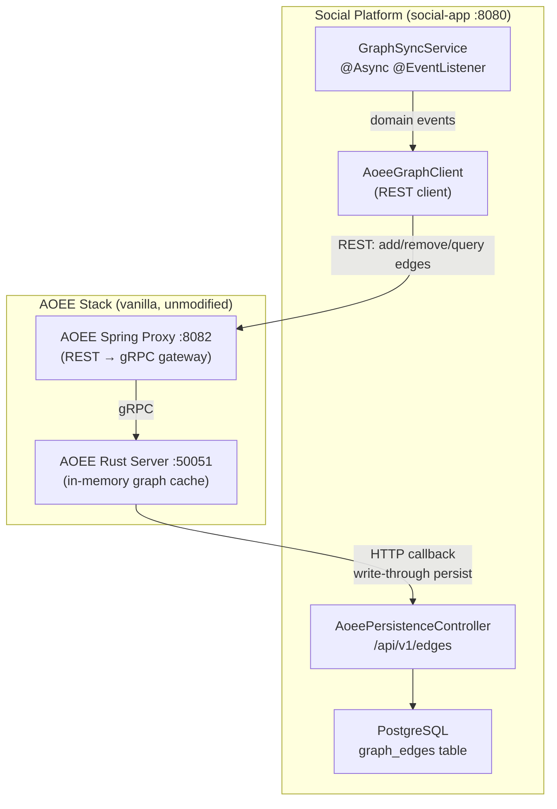

### 12.2 Pattern 1: Social Platform as AOEE Client

`AoeeGraphClient.java` is a Spring `RestClient` wrapper that calls AOEE's native REST proxy API. All methods include graceful degradation — they catch exceptions and return empty results so the platform works even when AOEE is unavailable.

**Edge mutations** (called by `GraphSyncService`):
| Method | AOEE Endpoint | Purpose |
|--------|--------------|---------|
| `addEdge(src, type, dst)` | `POST /api/edges` | Create a relationship |
| `addEdgeWithMetadata(src, type, dst, meta)` | `POST /api/edges` | Create with metadata (e.g., reaction type) |
| `removeEdge(src, type, dst)` | `DELETE /api/edges` | Remove a relationship |

**Edge queries** (called by services and controllers):
| Method | AOEE Endpoint | Purpose |
|--------|--------------|---------|
| `getNeighbors(src, type)` | `GET /api/edges/{src}/{type}` | List connected nodes |
| `contains(src, type, dst)` | `GET /api/edges/{src}/{type}/contains/{dst}` | Check if edge exists |
| `count(src, type)` | `GET /api/edges/{src}/{type}/count` | Count edges |

**Graph queries** (called by `GraphExplorerController` and `RecommendationService`):
| Method | AOEE Endpoint | Purpose |
|--------|--------------|---------|
| `friendOfFriend(src, type, max, minScore)` | `POST /api/query/fof` | FOF with scoring |
| `mutualFriends(id1, id2, type)` | `POST /api/query/mutual-friends` | Shared connections |
| `intersect(id1, id2, type)` | `POST /api/query/intersect` | Set intersection |
| `union(id1, id2, type)` | `POST /api/query/union` | Set union |
| `getStats()` | `GET /api/stats` | Cache statistics |

### 12.3 Pattern 2: Social Platform as AOEE Persistence Backend

When AOEE is configured with `AOEE_STORAGE_TYPE=http`, the Rust server calls back to the social platform to persist edges. `AoeePersistenceController.java` exposes the REST API that AOEE expects at `/api/v1/`:

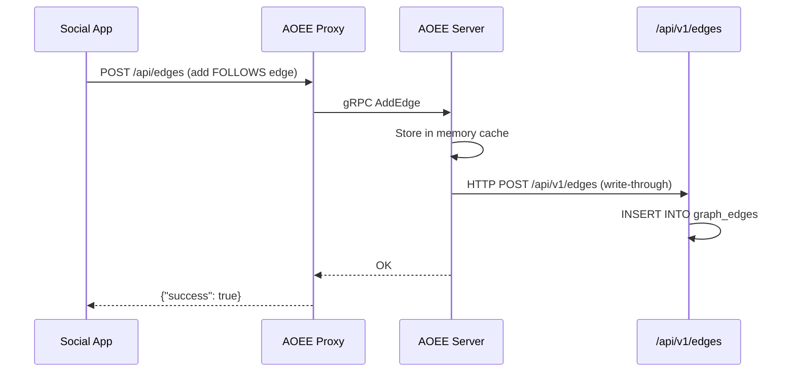

**Persistence endpoints** (no auth required — `/api/v1/**` is public):

| Endpoint | Purpose |
|----------|---------|
| `POST /api/v1/edges` | Persist a single edge |
| `POST /api/v1/edges/batch` | Persist multiple edges |
| `DELETE /api/v1/edges/{src}/{type}/{dst}` | Delete an edge |
| `GET /api/v1/edges?src=&type=` | Query persisted edges |
| `GET /api/v1/edges/count?src=&type=` | Count persisted edges |
| `POST /api/v1/entities` | Persist entity metadata |
| `POST /api/v1/entities/batch` | Batch persist entities |
| `GET /api/v1/export/stats` | Graph statistics |

### 12.4 Event-Driven Sync

`GraphSyncService` listens to Spring application events and syncs to AOEE asynchronously:

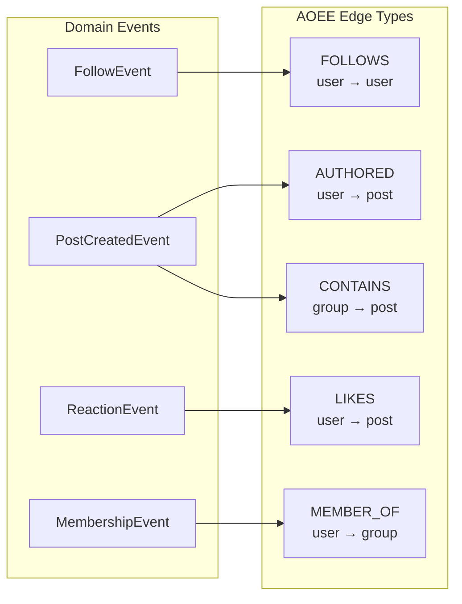

All sync operations are `@Async` to avoid blocking the main request thread. If AOEE is unavailable, errors are logged but the main operation succeeds.

### 12.5 Read-Through & Write-Through

AOEE uses the social app as its persistence backend via HTTP. On cache miss, it calls `GET /api/v1/edges?src=&type=` to load edges on demand. On write, it persists through to `POST /api/v1/edges`. This means AOEE doesn't need a manual backfill after restart — graph data is lazily loaded from PostgreSQL as users access it.

### 12.6 Configuration

```yaml
# application.yml
social:
  aoee:
    host: localhost        # AOEE proxy hostname
    port: 50051            # AOEE gRPC port (not used directly)
    proxy-port: 8082       # AOEE REST proxy port
```

```yaml
# docker-compose.yml - AOEE server
aoee-server:
  environment:
    AOEE_LISTEN_ADDR: "0.0.0.0:50051"
    AOEE_STORAGE_TYPE: http
    AOEE_HTTP_URL: "http://host.docker.internal:8080"
    AOEE_WRITE_THROUGH: "true"
```

With this configuration:
- **On read (cache miss):** AOEE calls `GET /api/v1/edges?src=&type=` to load edges from PostgreSQL on demand
- **On write:** AOEE writes to its in-memory cache AND calls `POST /api/v1/edges` to persist to PostgreSQL
- **On restart:** The cache starts empty but warms lazily — each user's graph is loaded from PostgreSQL on first access

The `/api/v1/edges` endpoints in `AoeePersistenceController` use `@JsonSerialize(using = RawLongSerializer.class)` to force numeric JSON output for long fields, since AOEE's Rust deserializer expects `i64` numbers (not the stringified longs that the global SafeLong serializer produces for JavaScript clients).

### 12.7 Backfill (Optional Pre-Warming)

The admin Graph Explorer includes a **"Load DB into AOEE"** button (`POST /api/admin/graph/backfill`) that reads all follows, reactions, posts, and memberships from PostgreSQL and pushes them to AOEE in bulk. This is optional — the read-through pattern handles lazy loading — but can eliminate cold-start latency after a fresh AOEE restart.

### 12.8 Graceful Degradation

Every `AoeeGraphClient` method wraps calls in try/catch and returns safe defaults:
- `getNeighbors()` → empty list
- `contains()` → false
- `count()` → 0
- `friendOfFriend()` → empty candidates
- `isAvailable()` → false

The platform is fully functional without AOEE — feed assembly, reactions, follows, and friend requests all work via PostgreSQL. AOEE adds performance for graph traversals and enables features like the admin Graph Explorer.
