# Social Enterprise Platform — Architecture Guide

## 1. Overview

Full-stack social networking platform built with:

- **Backend:** Spring Boot 3.4.3 (Java 21)
- **Frontend:** React 18 (TypeScript/Vite)
- **Database:** PostgreSQL 16
- **Search:** OpenSearch 2.12 for full-text search
- **Graph Cache:** AOEE — a custom Rust gRPC service for in-memory social graph caching

The project is organized as a **monorepo with a Maven multi-module build**.

---

## 2. System Architecture Diagram

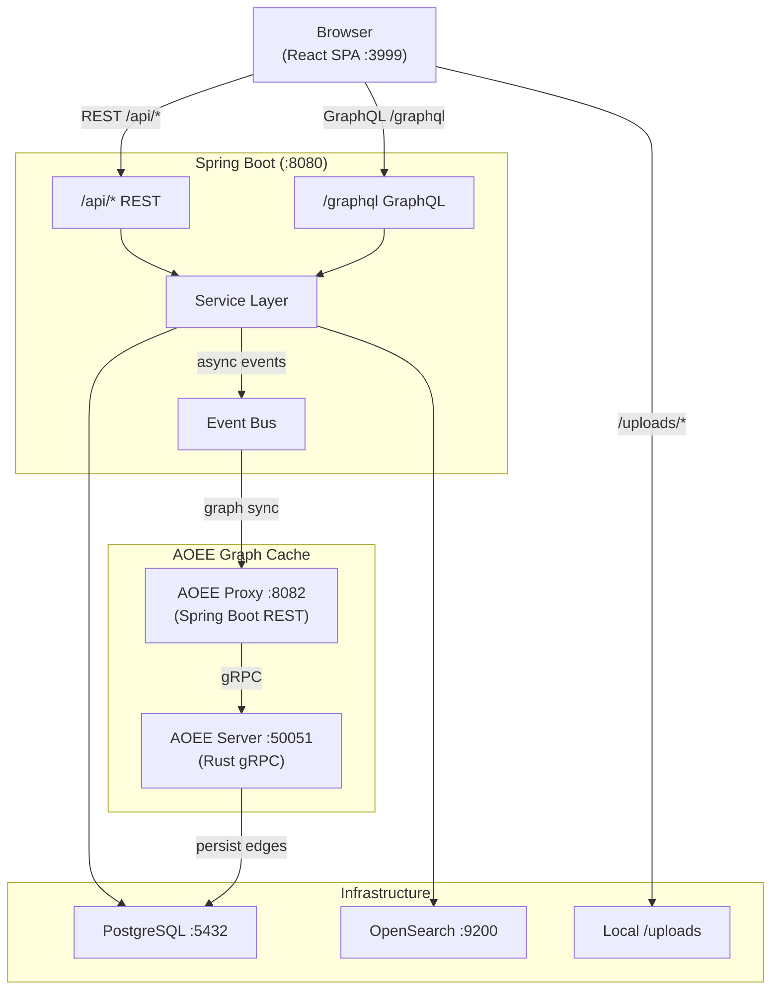

---

## 3. Module Structure

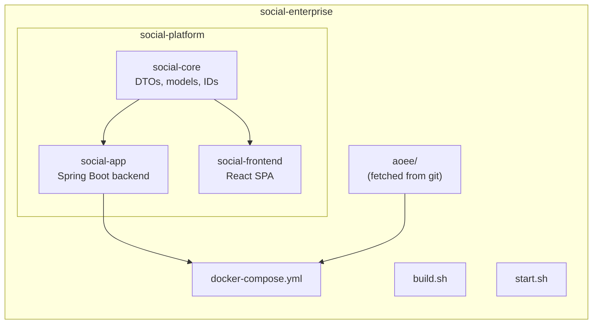

---

## 4. Backend Architecture

### 4.1 Layering

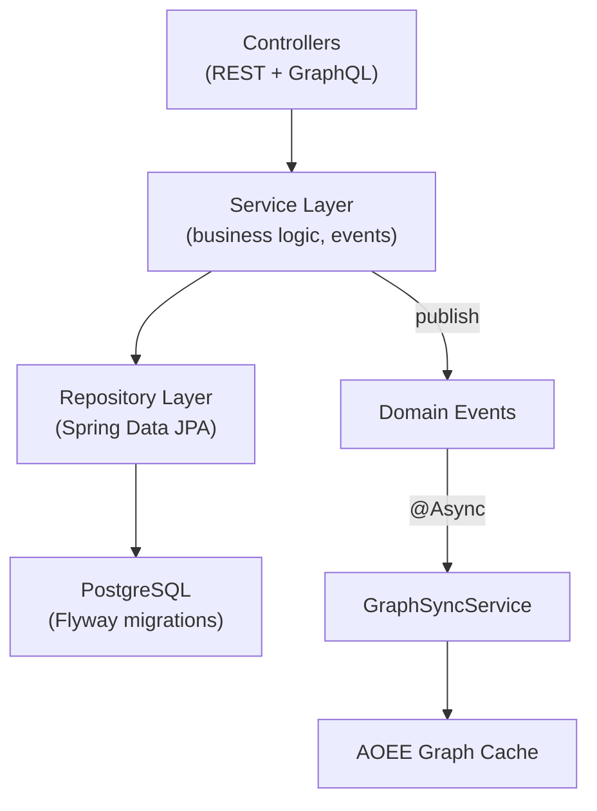

### 4.2 Authentication & Security

- **JWT tokens** — HMAC-SHA256, 24-hour expiry
- **JwtAuthFilter** extracts the Bearer token from the `Authorization` header
- **DebugAuthFilter** allows the `X-Debug-User-Id` header in dev mode (`social.auth.debug-bypass: true`)
- **SecurityConfig** public paths: `/api/auth/**`, `/api/v1/**`, `/graphql`, `/uploads/**`; all other `/api/**` routes require authentication
- Passwords hashed with **BCrypt**

### 4.3 ID System (GlobalId)

64-bit IDs with embedded type information:

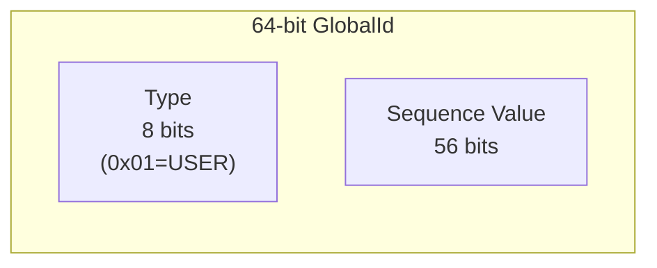

- **Upper 8 bits:** ObjectType code (`USER=0x01`, `POST=0x02`, `COMMENT=0x03`, etc.)
- **Lower 56 bits:** Sequence value
- Enables type detection from any ID: `GlobalId.typeOf(id) -> ObjectType`
- Generated by `GlobalIdGenerator` with per-type atomic counters
- On startup, loads max existing IDs from the database to avoid collisions

### 4.4 Event System

Spring `ApplicationEventPublisher` for domain events. All events are consumed **asynchronously** by `GraphSyncService`.

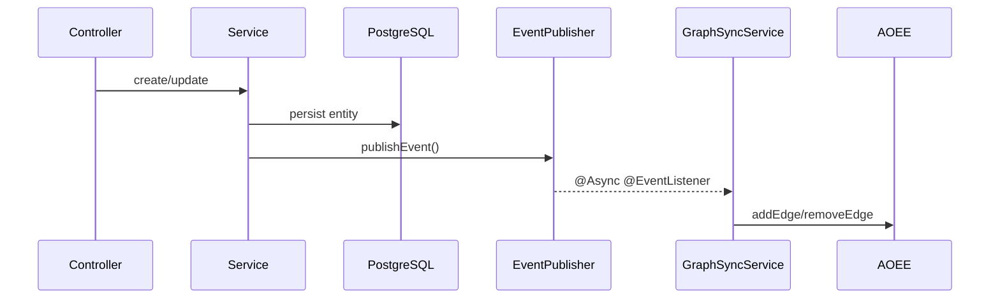

| Event | Published By | Fields | Graph Edge |
|---|---|---|---|
| `FollowEvent` | `FollowController`, `FriendRequestController` | `followerId`, `followedId`, `followed` | `FOLLOWS` |
| `PostCreatedEvent` | `PostService` | `postId`, `authorId`, `targetType`, `targetId` | `AUTHORED`, `CONTAINS` |
| `ReactionEvent` | `ReactionService` | `userId`, `targetId`, `reactionType`, `added` | `LIKES` |
| `MembershipEvent` | `GroupService` | `userId`, `groupId`, `role`, `joined` | `MEMBER_OF` |

### 4.5 Feed Algorithm

`FeedService.assembleFeed()`:

1. Collect followed user IDs + joined group/page IDs
2. Query posts from those sources (organic feed)
3. Generate recommendations via `RecommendationService` (20% of feed)
4. Interleave: every 5th post is a recommendation
5. Cursor-based pagination (ID descending)

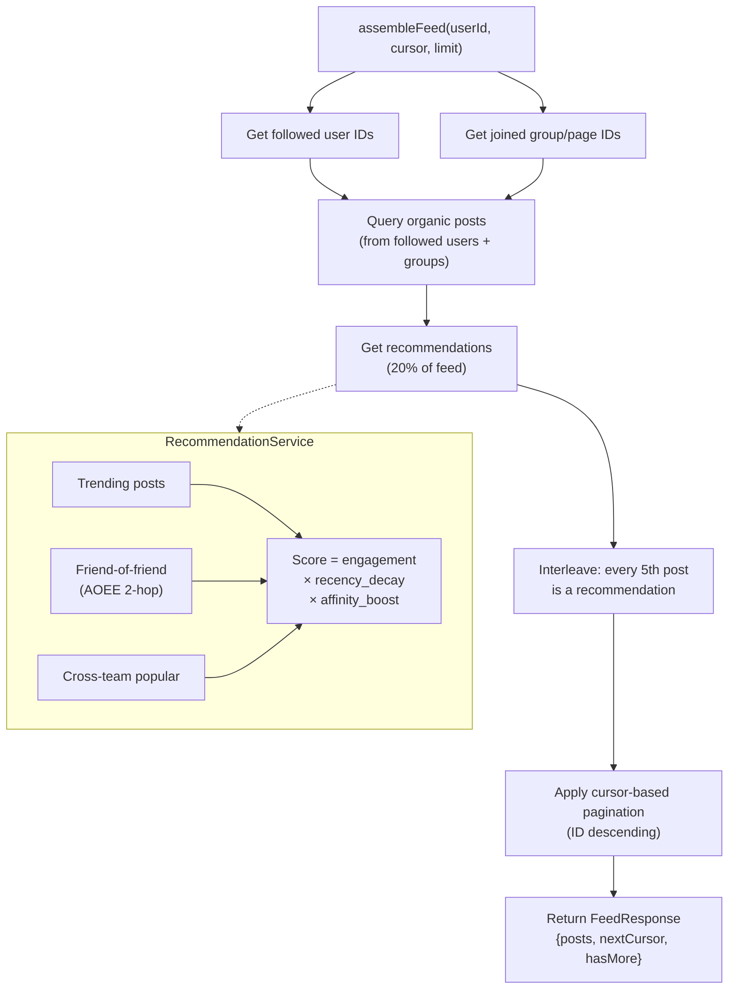

**RecommendationService scoring:**

- **Sources:** trending posts, friend-of-friend content (via AOEE 2-hop), cross-team popular content
- **Score** = `engagement_score * recency_decay * affinity_boost`
- Recency half-life: 24 hours

### 4.6 Search

`OpenSearchService` with graceful degradation:

- **Primary:** OpenSearch indices (`users`, `pages`) using multi-match queries
- **Fallback:** Database `LIKE` queries via repository methods
- Exception handling catches all errors and falls back to the database

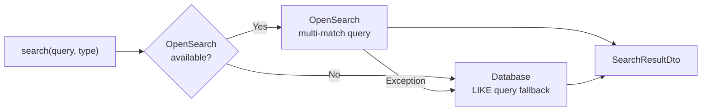

### 4.7 AOEE Graph Integration

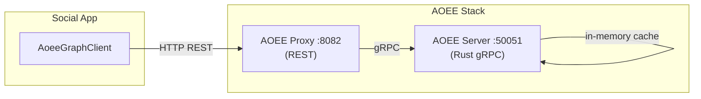

**AoeeGraphClient** (REST client to AOEE proxy at `:8082`):

- `addEdge` / `removeEdge` — write graph relationships
- `getNeighbors` — traverse graph (used for friend-of-friend recommendations)
- `contains` — check relationship existence
- `count` — edge count queries
- **Graceful degradation:** all methods catch exceptions and return empty/false

**GraphSyncService** (`@Async @EventListener`):

- Listens to domain events
- Syncs edges to AOEE asynchronously
- Never blocks the main request thread

---

## 5. Database Design

### 5.1 Partitioning

Posts and comments tables are **range-partitioned by `created_at`** (quarterly). Partitions cover Q1–Q4 for 2025, 2026, and 2027.

### 5.2 Key Relationships

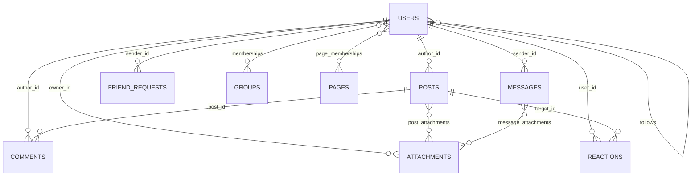

- `Users` -> `Posts` (`author_id`)
- `Users` -> `Comments` (`author_id`)
- `Users` -> `Follows` (`follower_id`, `followed_id`) — composite PK
- `Users` -> `Reactions` (`user_id` -> `target_id`)
- `Users` -> `Groups` via `Memberships` (composite PK: `user_id` + `group_id`)
- `Users` -> `Pages` via `PageMemberships` (composite PK: `user_id` + `page_id`)
- `Users` -> `Messages` (`sender_id`, `recipient_id`)
- `Posts` -> `Attachments` via `post_attachments` junction table
- `Posts` -> target (group/page/team feed via `target_type` + `target_id`)
- Graph edges stored in `graph_edges` for AOEE persistence

### 5.3 Visibility Model

Posts, groups, and pages support the following visibility levels:

- `PUBLIC`
- `PRIVATE`
- `TEAM_VISIBLE`
- `RESTRICTED`

### 5.4 Membership Roles

Groups and pages use role-based membership:

- **Roles:** `OWNER`, `ADMIN`, `MEMBER` / `FOLLOWER`
- **Status:** `APPROVED`, `PENDING`

---

## 6. Frontend Architecture

### 6.1 Stack

- React 18
- TypeScript
- Vite
- Tailwind CSS
- Zustand (auth state)
- TanStack React Query (server state)

### 6.2 Routing

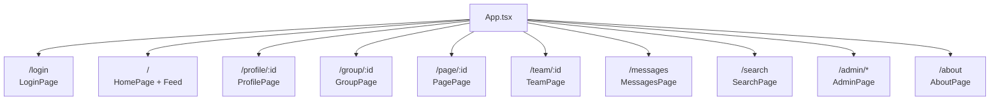

| Path | View |
|---|---|
| `/` | Home feed |
| `/login` | Authentication |
| `/profile/:id` | User profile |
| `/group/:id`, `/page/:id`, `/team/:id` | Entity pages |
| `/messages`, `/messages/:partnerId` | Direct messaging |
| `/search` | Full-text search |
| `/admin/*` | Admin dashboard |
| `/about` | Platform info |

### 6.3 API Client

Axios instance (`baseURL: /api`) with:

- JWT token injection from Zustand auth store
- `X-Debug-User-Id` header for dev mode
- Auto-redirect to `/login` on 401

### 6.4 Key Patterns

- **Optimistic updates** for reactions (ref-based prop tracking to avoid flash)
- **React Query invalidation** on mutations
- **Cursor-based infinite scroll** for feeds
- **Hover-based reaction picker** with CSS gap fix (`pb-2 -mb-2`)

---

## 7. Deployment

### 7.1 Docker Services

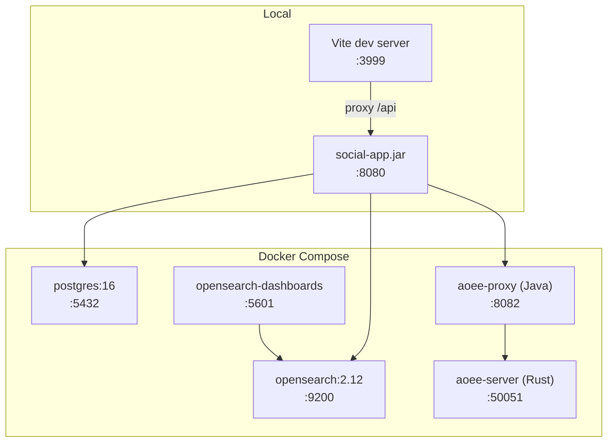

| Service | Image | Port | Purpose |
|---|---|---|---|
| `postgres` | `postgres:16` | 5432 | Primary database |
| `opensearch` | `opensearchproject/opensearch:2.12.0` | 9200 | Full-text search |
| `opensearch-dashboards` | `opensearchproject/opensearch-dashboards:2.12.0` | 5601 | Search UI |
| `aoee-server` | Custom Rust build | 50051 | Graph cache (gRPC) |
| `aoee-proxy` | Custom Spring Boot | 8082 | Graph cache REST proxy |

### 7.2 Build Pipeline

`build.sh`:

1. `setup-aoee.sh` — clone/pull AOEE from GitHub
2. `mvn clean package -DskipTests` — build Java backend
3. `npm install && npm run build` — build React frontend

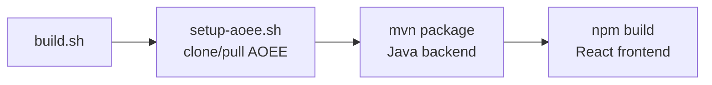

### 7.3 Startup

`start.sh`:

1. Ensure AOEE from git
2. `docker-compose up postgres opensearch`
3. Build backend if first run
4. `java -jar social-app.jar` (background)
5. `npx vite --host` (dev server)
6. Optional: `--with-aoee` for graph cache, `--generate` for test data

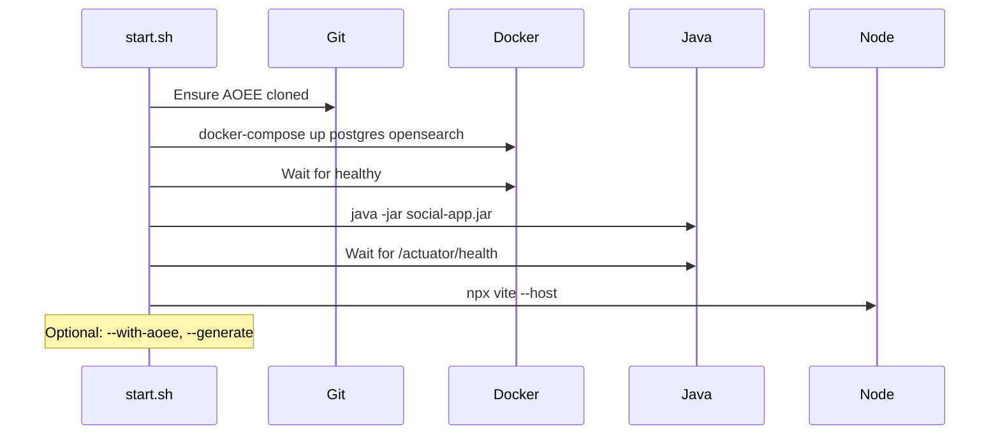

---

## 8. Design Decisions

| Decision | Rationale |
|---|---|
| GlobalId with embedded type | Enables O(1) type detection without DB lookup; deterministic sharding |
| Event-driven AOEE sync | Decouples graph cache from business logic; async avoids latency |
| OpenSearch + DB fallback | Graceful degradation; works without search infrastructure |
| Table partitioning | Efficient time-range queries; partition pruning for feeds |
| Cursor-based pagination | Consistent results under concurrent writes (vs offset-based) |
| JWT + debug header | Production-ready auth with frictionless development |
| AOEE as external dependency | Independent versioning; fetched from git at build time |
| Comment depth limit (1) | Prevents deeply nested threads; simpler UI |
| Content-hash deduplication | Saves storage for identical file uploads |
| 80/20 organic/recommended feed | Discovery without overwhelming organic content |

---

## 9. AOEE Integration Deep Dive

AOEE (Attribute Object Enterprise Edition) is used as a **vanilla, unmodified dependency** — fetched from GitHub at build time with zero source code changes. The social platform integrates with it through two complementary patterns:

### 9.1 Integration Architecture

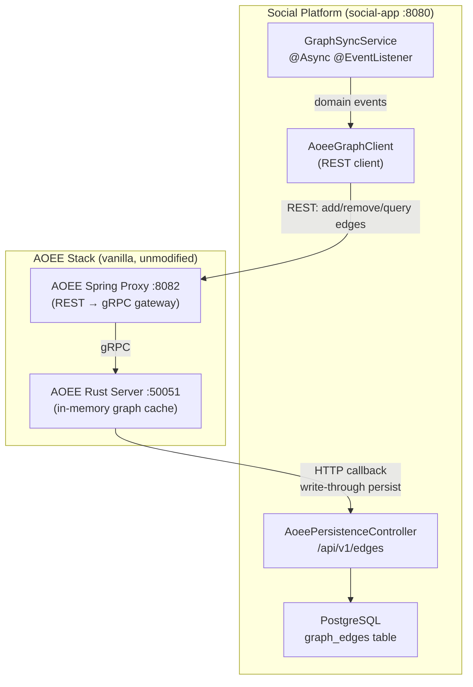

### 9.2 Pattern 1: Social Platform as AOEE Client

`AoeeGraphClient.java` is a Spring `RestClient` wrapper that calls AOEE's native REST proxy API. All methods include graceful degradation — they catch exceptions and return empty results so the platform works even when AOEE is unavailable.

**Edge mutations** (called by `GraphSyncService`):
| Method | AOEE Endpoint | Purpose |
|--------|--------------|---------|
| `addEdge(src, type, dst)` | `POST /api/edges` | Create a relationship |
| `addEdgeWithMetadata(src, type, dst, meta)` | `POST /api/edges` | Create with metadata (e.g., reaction type) |
| `removeEdge(src, type, dst)` | `DELETE /api/edges` | Remove a relationship |

**Edge queries** (called by services and controllers):
| Method | AOEE Endpoint | Purpose |
|--------|--------------|---------|
| `getNeighbors(src, type)` | `GET /api/edges/{src}/{type}` | List connected nodes |
| `contains(src, type, dst)` | `GET /api/edges/{src}/{type}/contains/{dst}` | Check if edge exists |
| `count(src, type)` | `GET /api/edges/{src}/{type}/count` | Count edges |

**Graph queries** (called by `GraphExplorerController` and `RecommendationService`):
| Method | AOEE Endpoint | Purpose |
|--------|--------------|---------|
| `friendOfFriend(src, type, max, minScore)` | `POST /api/query/fof` | FOF with scoring |
| `mutualFriends(id1, id2, type)` | `POST /api/query/mutual-friends` | Shared connections |
| `intersect(id1, id2, type)` | `POST /api/query/intersect` | Set intersection |
| `union(id1, id2, type)` | `POST /api/query/union` | Set union |
| `getStats()` | `GET /api/stats` | Cache statistics |

### 9.3 Pattern 2: Social Platform as AOEE Persistence Backend

When AOEE is configured with `AOEE_STORAGE_TYPE=http`, the Rust server calls back to the social platform to persist edges. `AoeePersistenceController.java` exposes the REST API that AOEE expects at `/api/v1/`:

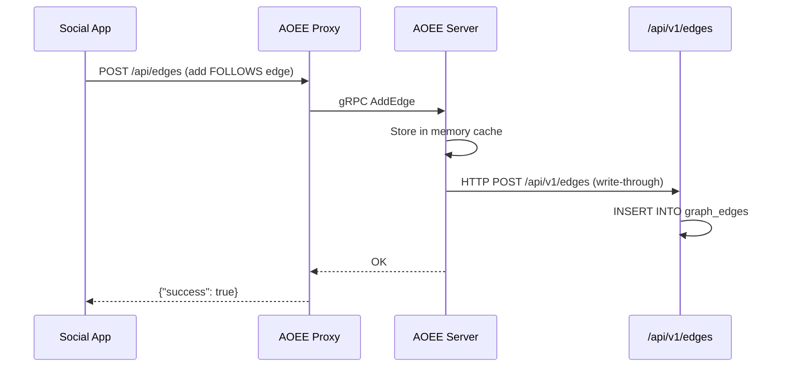

**Persistence endpoints** (no auth required — `/api/v1/**` is public):

| Endpoint | Purpose |
|----------|---------|
| `POST /api/v1/edges` | Persist a single edge |
| `POST /api/v1/edges/batch` | Persist multiple edges |
| `DELETE /api/v1/edges/{src}/{type}/{dst}` | Delete an edge |
| `GET /api/v1/edges?src=&type=` | Query persisted edges |
| `GET /api/v1/edges/count?src=&type=` | Count persisted edges |
| `POST /api/v1/entities` | Persist entity metadata |
| `POST /api/v1/entities/batch` | Batch persist entities |
| `GET /api/v1/export/stats` | Graph statistics |

### 9.4 Event-Driven Sync

`GraphSyncService` listens to Spring application events and syncs to AOEE asynchronously:

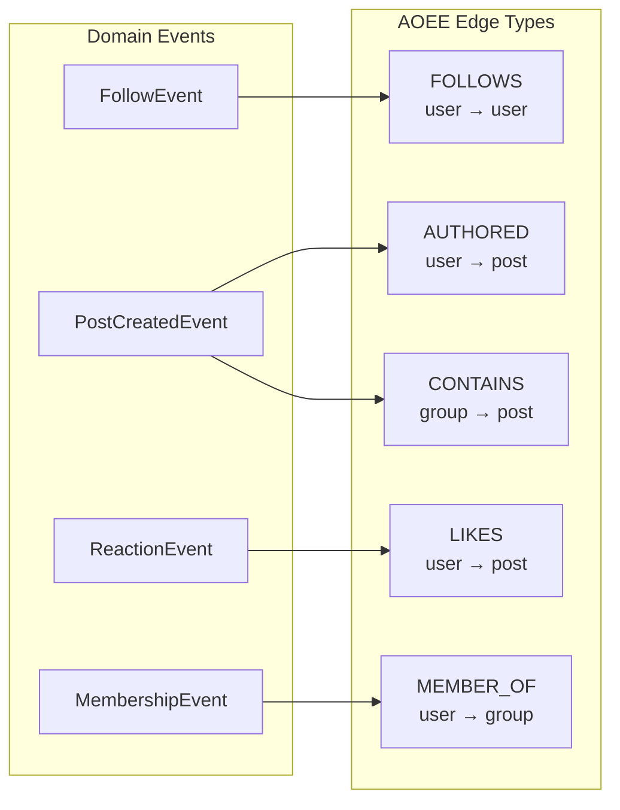

All sync operations are `@Async` to avoid blocking the main request thread. If AOEE is unavailable, errors are logged but the main operation succeeds.

### 9.5 Backfill

The admin Graph Explorer includes a **"Load DB into AOEE"** button (`POST /api/admin/graph/backfill`) that reads all follows, reactions, posts, and memberships from PostgreSQL and pushes them to AOEE. This is used when:
- AOEE is started fresh (in-memory cache is empty)
- Data was generated before AOEE was running
- AOEE was restarted and lost its cache

### 9.6 Configuration

```yaml
# application.yml
social:
  aoee:
    host: localhost        # AOEE proxy hostname
    port: 50051            # AOEE gRPC port (not used directly)
    proxy-port: 8082       # AOEE REST proxy port
```

```yaml
# docker-compose.yml - AOEE server
aoee-server:
  environment:
    AOEE_LISTEN_ADDR: "0.0.0.0:50051"
    AOEE_STORAGE_TYPE: memory        # or "http" for write-through
    AOEE_HTTP_URL: "http://host.docker.internal:8080"  # social-app callback
    AOEE_WRITE_THROUGH: "false"      # "true" to persist via HTTP
```

### 9.7 Graceful Degradation

Every `AoeeGraphClient` method wraps calls in try/catch and returns safe defaults:
- `getNeighbors()` → empty list
- `contains()` → false
- `count()` → 0
- `friendOfFriend()` → empty candidates
- `isAvailable()` → false

The platform is fully functional without AOEE — feed assembly, reactions, follows, and friend requests all work via PostgreSQL. AOEE adds performance for graph traversals and enables features like the admin Graph Explorer.
