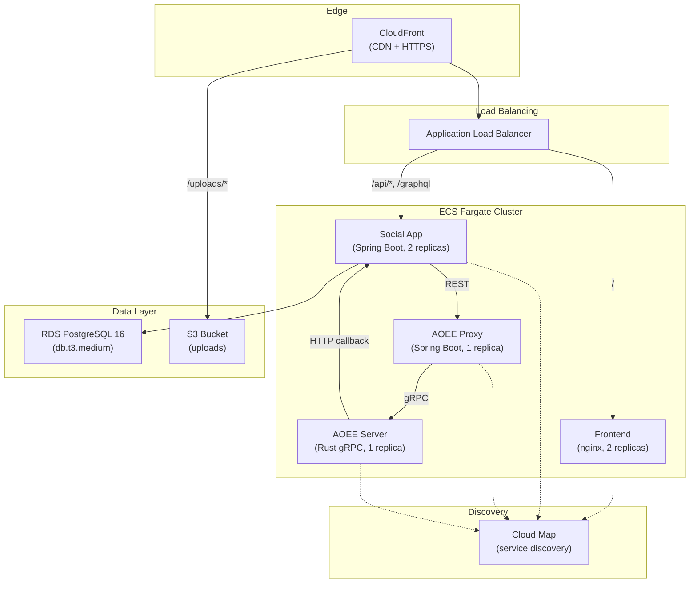
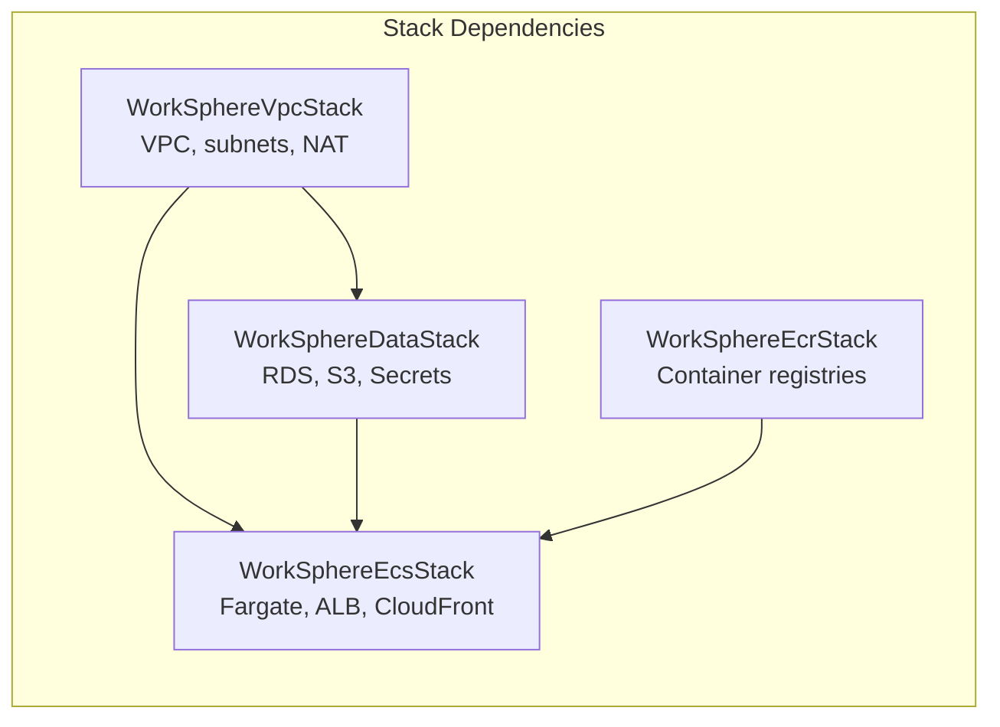
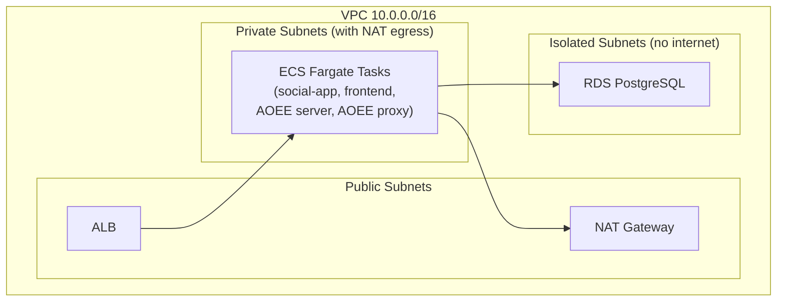
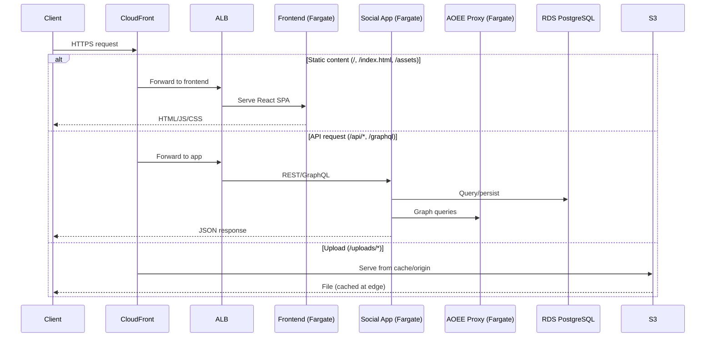
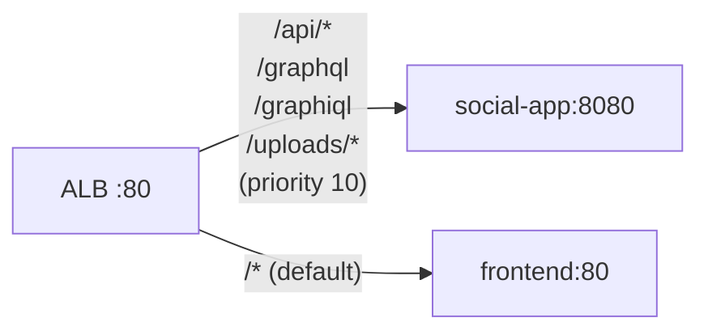
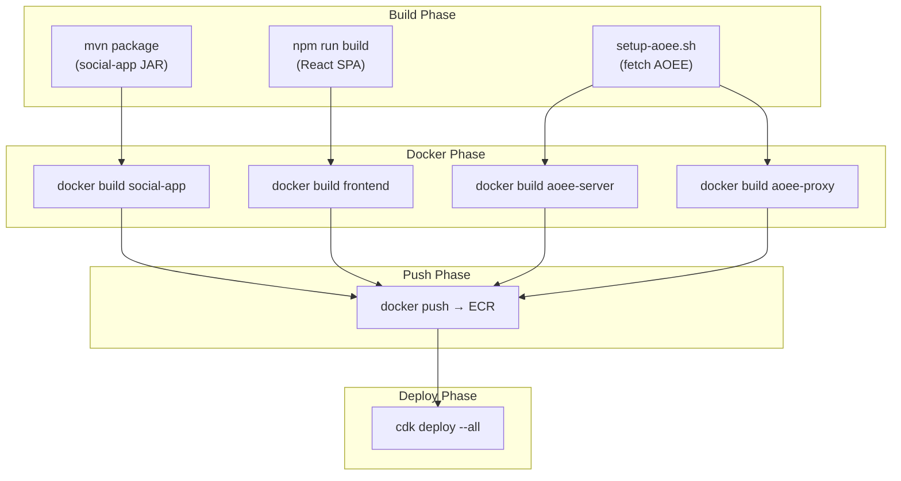

# WorkSphere — AWS Deployment Architecture

## Overview

WorkSphere deploys to AWS using managed services where possible, with all infrastructure defined as code using AWS CDK (TypeScript).



## CDK Stack Structure



| Stack | Resources | Depends On |
|-------|-----------|-----------|
| `WorkSphereVpcStack` | VPC (2 AZs), public/private/isolated subnets, NAT Gateway | — |
| `WorkSphereDataStack` | RDS PostgreSQL 16, S3 bucket, Secrets Manager (DB + JWT) | VPC |
| `WorkSphereEcrStack` | 4 ECR repositories | — |
| `WorkSphereEcsStack` | ECS cluster, 4 Fargate services, ALB, CloudFront | VPC, Data, ECR |

## Networking



- **Public subnets**: ALB, NAT Gateway
- **Private subnets**: All Fargate tasks (have internet via NAT for pulling images, calling external APIs)
- **Isolated subnets**: RDS (no internet access, only reachable from private subnets)

## Service Communication



### Service Discovery (Cloud Map)

ECS services register with AWS Cloud Map for internal DNS:

| Service | DNS Name | Port |
|---------|----------|------|
| social-app | `social-app.worksphere.local` | 8080 |
| aoee-proxy | `aoee-proxy.worksphere.local` | 8082 |
| aoee-server | `aoee-server.worksphere.local` | 50051 |

## Data Persistence

### RDS PostgreSQL

| Setting | Value |
|---------|-------|
| Engine | PostgreSQL 16.2 |
| Instance | db.t3.medium (configurable) |
| Storage | 20 GB (auto-scales to 100 GB) |
| Backup | 7-day retention |
| Multi-AZ | No (configurable) |
| Deletion Protection | Enabled |
| Subnet | Isolated (no internet) |

Flyway migrations run automatically on social-app startup.

### S3 (Uploads)

| Setting | Value |
|---------|-------|
| Bucket | `worksphere-uploads-{account-id}` |
| Encryption | S3-managed |
| Public Access | Blocked |
| Versioning | Disabled |
| Access | Via CloudFront (cached) + social-app IAM role |

### Secrets Manager

| Secret | Purpose |
|--------|---------|
| `worksphere/db-credentials` | RDS username + auto-generated password |
| `worksphere/jwt-secret` | JWT signing key (auto-generated) |

## ALB Routing



## Deployment Process



### Commands

```bash
# First-time setup
cd aws
npm install
cdk bootstrap

# Build and push images
./scripts/build-and-push.sh

# Deploy/update infrastructure
cdk deploy --all

# View outputs
aws cloudformation describe-stacks \
  --stack-name WorkSphereEcs \
  --query 'Stacks[0].Outputs'
```

## Scaling

| Service | Default | Scalable | Notes |
|---------|---------|----------|-------|
| social-app | 2 | Yes | Stateless, safe to scale horizontally |
| frontend | 2 | Yes | Stateless nginx |
| aoee-server | 1 | No | In-memory cache, single instance |
| aoee-proxy | 1 | Yes | Stateless proxy |
| RDS | 1 | Vertical | Change instance class; enable Multi-AZ for HA |

To scale:
```bash
# Update desired count in cdk.json context
# Or use AWS CLI:
aws ecs update-service \
  --cluster worksphere \
  --service social-app \
  --desired-count 4
```

## Estimated Costs

| Service | Monthly Cost |
|---------|-------------|
| RDS db.t3.medium | ~$30 |
| ECS Fargate (4 services) | ~$60 |
| ALB | ~$20 |
| NAT Gateway | ~$35 |
| S3 + CloudFront | ~$5 |
| Secrets Manager | ~$2 |
| CloudWatch Logs | ~$5 |
| **Total** | **~$157/month** |

*Based on us-west-2 pricing. Costs vary by region and usage.*

## Security

- All traffic HTTPS via CloudFront
- RDS in isolated subnets (no internet access)
- S3 bucket blocks all public access
- Secrets in AWS Secrets Manager (not environment variables)
- ECS tasks use IAM roles (not access keys)
- Security groups restrict traffic to required ports only
- `debug-bypass` disabled in production

## Differences from Local Development

| Aspect | Local (docker-compose) | AWS (CDK) |
|--------|----------------------|-----------|
| Database | PostgreSQL container | RDS PostgreSQL (managed) |
| Uploads | Local filesystem | S3 + CloudFront CDN |
| Search | OpenSearch container | Self-hosted on Fargate (or Amazon OpenSearch Service) |
| Networking | Docker bridge | VPC with public/private/isolated subnets |
| Secrets | Plaintext in env | AWS Secrets Manager |
| Load balancing | Vite proxy | ALB with health checks |
| HTTPS | None | CloudFront with auto-certs |
| Containers | Docker Compose | ECS Fargate (serverless) |
| Scaling | Manual | ECS desired count / auto-scaling |
| Auth debug | Enabled | Disabled |
