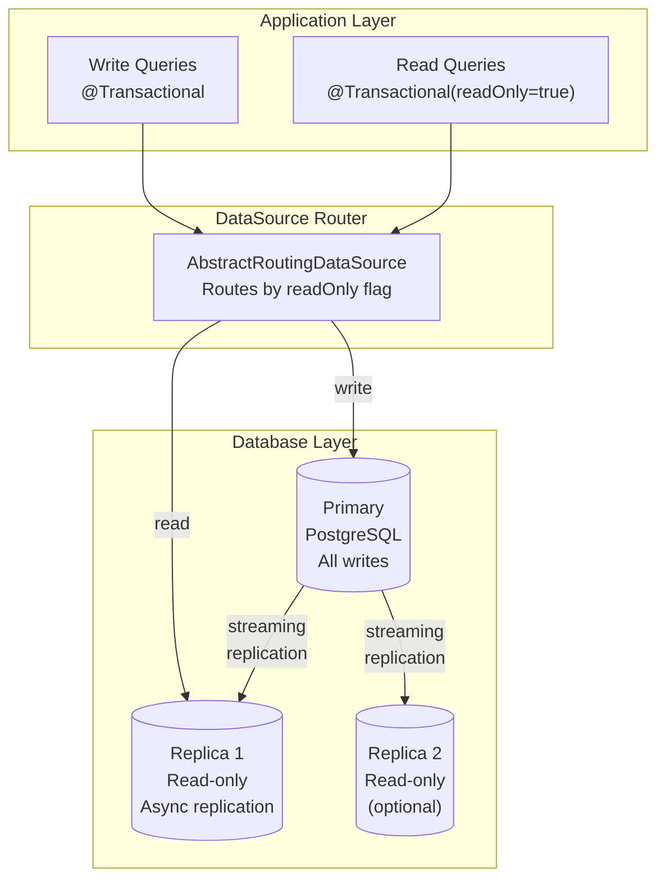
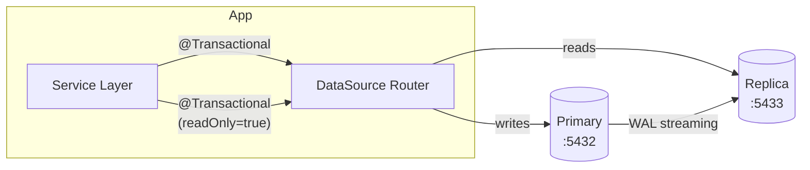

# Database Scaling Strategy

## Overview

WorkSphere uses a three-tier approach to scale the database for multi-tenant workloads:



## 1. Composite Indexes

Every high-traffic query now uses a **composite index** that starts with `tenant_id`. This enables PostgreSQL's index-only scans for multi-tenant queries.

### Index Strategy

| Table | Index | Covers Query |
|---|---|---|
| `users` | `(tenant_id, username)` | Login, user lookup |
| `users` | `(tenant_id, email)` | Registration check |
| `users` | `(tenant_id, created_at DESC)` | User listing |
| `posts` | `(tenant_id, author_id, created_at DESC)` | Feed assembly |
| `posts` | `(tenant_id, target_type, target_id, created_at DESC)` | Group/page feed |
| `comments` | `(tenant_id, post_id, created_at DESC)` | Comment threads |
| `reactions` | `(tenant_id, target_id, reaction_type)` | Reaction counts |
| `reactions` | `(tenant_id, user_id, target_id)` | Current user reaction |
| `messages` | `(tenant_id, conversation_id, created_at DESC)` | Message thread |
| `conversations` | `(tenant_id, type, created_at DESC)` | Conversation list |
| `conv_participants` | `(tenant_id, user_id)` | My conversations |
| `follows` | `(tenant_id, follower_id)` | Who I follow |
| `follows` | `(tenant_id, followed_id)` | My followers |
| `memberships` | `(tenant_id, user_id, status)` | My groups |
| `memberships` | `(tenant_id, group_id, status)` | Group members |
| `feed_entries` | `(tenant_id, user_id, score DESC)` | Pre-computed feed |
| `notifications` | `(tenant_id, user_id, read, created_at DESC)` | Notification list |

### Why Composite > Single Column

A single-column `idx_users_tenant(tenant_id)` requires:
1. Index scan on `tenant_id` → get row pointers
2. Heap fetch → read full rows
3. Sort by `created_at` in memory

A composite `idx_users_tenant_created(tenant_id, created_at DESC)` does:
1. Index scan → already sorted, already filtered
2. No heap fetch if covering index
3. No in-memory sort

For a tenant with 10K users in a 1M-row table: **10x faster**.

## 2. Table Partitioning

### Current Partitioning

| Table | Partition By | Partitions |
|---|---|---|
| `posts` | RANGE(created_at) | Quarterly: 2025 Q1-Q4, 2026 Q1-Q4, 2027 Q1-Q4 |
| `comments` | RANGE(created_at) | Same quarterly ranges |

### New: Messages Partitioned by Tenant

Messages is the highest-volume table after posts. It's now **list-partitioned by tenant_id**:

```sql
CREATE TABLE messages (
    id BIGINT NOT NULL,
    conversation_id BIGINT NOT NULL,
    sender_id BIGINT NOT NULL,
    content TEXT,
    read BOOLEAN DEFAULT false,
    created_at TIMESTAMP,
    tenant_id BIGINT NOT NULL DEFAULT 1,
    PRIMARY KEY (id, tenant_id)
) PARTITION BY LIST (tenant_id);

-- Default partition catches new tenants
CREATE TABLE messages_default PARTITION OF messages DEFAULT;

-- Explicit partition for tenant 1 (high-volume)
CREATE TABLE messages_tenant_1 PARTITION OF messages FOR VALUES IN (1);
```

**Benefits:**
- `WHERE tenant_id = 1 AND conversation_id = X` only scans `messages_tenant_1`
- Each partition can be vacuumed independently
- Large tenants can have their own partition; small tenants share the default

### Adding Partitions for New Tenants

When a large tenant is onboarded:

```sql
-- Create dedicated partition before it accumulates data
CREATE TABLE messages_tenant_42 PARTITION OF messages FOR VALUES IN (42);

-- Move data from default to dedicated partition (if any)
-- This requires detach/reattach of the default partition
BEGIN;
ALTER TABLE messages DETACH PARTITION messages_default;
CREATE TABLE messages_tenant_42 PARTITION OF messages FOR VALUES IN (42);
INSERT INTO messages_tenant_42 SELECT * FROM messages_default WHERE tenant_id = 42;
DELETE FROM messages_default WHERE tenant_id = 42;
ALTER TABLE messages ATTACH PARTITION messages_default DEFAULT;
COMMIT;
```

### Future: Sub-Partitioning

For very large tenants, sub-partition by time:

```sql
CREATE TABLE messages_tenant_1 PARTITION OF messages FOR VALUES IN (1)
    PARTITION BY RANGE (created_at);

CREATE TABLE messages_t1_2026_q1 PARTITION OF messages_tenant_1
    FOR VALUES FROM ('2026-01-01') TO ('2026-04-01');
```

## 3. Read Replicas

### Architecture



### How It Works

Spring's `@Transactional(readOnly = true)` annotation (already on most services) signals the routing datasource:

- **Read-only transactions** → routed to replica
- **Read-write transactions** → routed to primary
- **No transaction** → routed to primary (safe default)

```java
@Service
@Transactional(readOnly = true)  // ← reads go to replica
public class FeedService {

    public FeedResponse assembleFeed(...) { ... }  // reads from replica
}

@Service
public class MessageService {

    @Transactional  // ← writes go to primary
    public MessageEntity send(...) { ... }
}
```

### Configuration

```yaml
# application.yml
spring:
  replica:
    enabled: ${REPLICA_ENABLED:false}
    url: ${REPLICA_DATASOURCE_URL:}
    username: ${REPLICA_DATASOURCE_USERNAME:social}
    password: ${REPLICA_DATASOURCE_PASSWORD:}
```

**Enable with environment variables:**
```bash
REPLICA_ENABLED=true \
REPLICA_DATASOURCE_URL=jdbc:postgresql://replica:5432/social_enterprise \
java -jar social-app.jar
```

### Setting Up a Replica

**Local (Docker):**
```bash
# Primary is already running as social-postgres
# Add a replica container
docker run -d --name social-postgres-replica \
  -e POSTGRES_USER=social \
  -e POSTGRES_PASSWORD=social_dev_password \
  -e POSTGRES_DB=social_enterprise \
  -p 5433:5432 \
  postgres:16

# Configure streaming replication (primary postgresql.conf)
# wal_level = replica
# max_wal_senders = 3
```

**AWS (RDS):**
```bash
# RDS read replica is created from the CDK stack or console
# Just set the replica URL:
REPLICA_DATASOURCE_URL=jdbc:postgresql://social-replica.xxxxx.us-west-2.rds.amazonaws.com:5432/social_enterprise
```

### Replication Lag

Async streaming replication typically has <100ms lag. This means:
- A user sends a message → writes to primary → immediately reads from replica → **might not see their own message for ~100ms**
- Solution: After writes, the next read in the same transaction goes to primary (handled by `@Transactional` — write transactions never route to replica)

### What Goes Where

| Operation | Database | Annotation |
|---|---|---|
| Feed assembly | Replica | `@Transactional(readOnly = true)` |
| Post creation | Primary | `@Transactional` |
| Search | Replica | `@Transactional(readOnly = true)` |
| Message send | Primary | `@Transactional` |
| Message read | Replica | `@Transactional(readOnly = true)` |
| User login | Primary | `@Transactional` |
| User profile view | Replica | `@Transactional(readOnly = true)` |
| Reaction add/remove | Primary | `@Transactional` |
| Reaction counts | Replica | `@Transactional(readOnly = true)` |

## Capacity Planning

| Tenants | Users | Data Size | Recommended Setup |
|---|---|---|---|
| 1-10 | <10K | <10GB | Single primary, composite indexes |
| 10-50 | 10-100K | 10-100GB | Primary + 1 replica, message partitioning |
| 50-200 | 100K-1M | 100GB-1TB | Primary + 2 replicas, per-tenant message partitions |
| 200+ | 1M+ | >1TB | Consider database-per-tenant for large tenants |

## Monitoring

```sql
-- Check partition sizes
SELECT schemaname, tablename, pg_size_pretty(pg_total_relation_size(schemaname||'.'||tablename))
FROM pg_tables WHERE tablename LIKE 'messages%' ORDER BY pg_total_relation_size(schemaname||'.'||tablename) DESC;

-- Check index usage
SELECT indexrelname, idx_scan, idx_tup_read, idx_tup_fetch
FROM pg_stat_user_indexes
WHERE schemaname = 'public' AND indexrelname LIKE 'idx_%tenant%'
ORDER BY idx_scan DESC;

-- Check replication lag (on primary)
SELECT client_addr, state, sent_lsn, write_lsn, replay_lsn,
       (extract(epoch from now()) - extract(epoch from replay_lag))::int AS lag_seconds
FROM pg_stat_replication;
```
