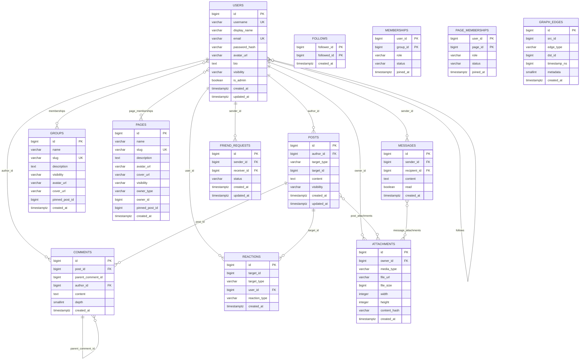
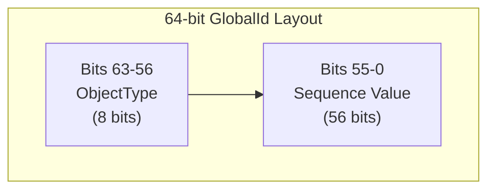
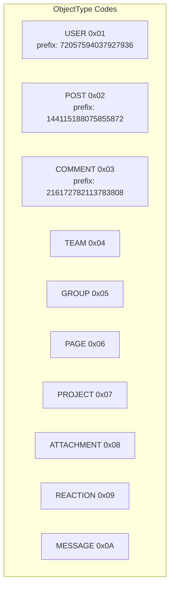
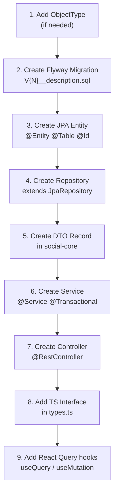
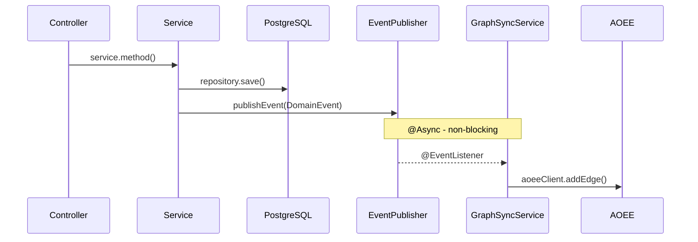
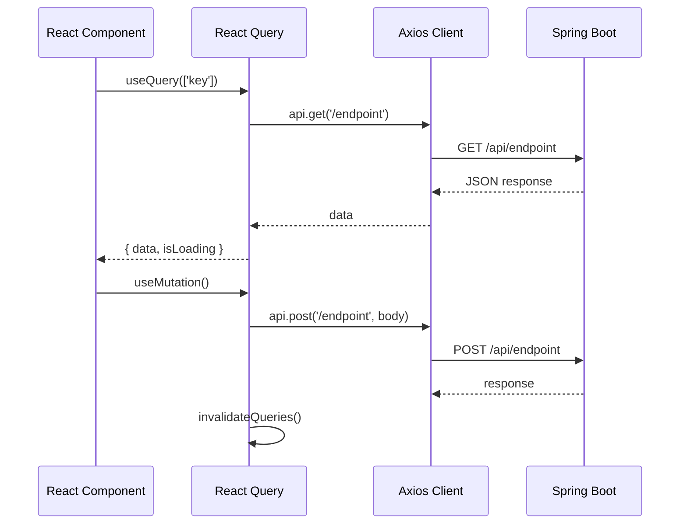
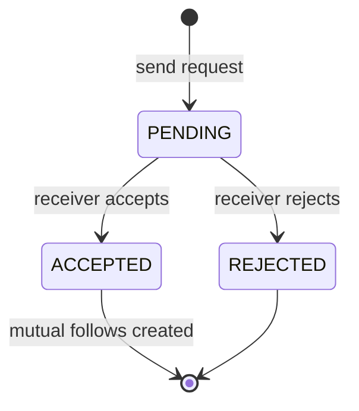
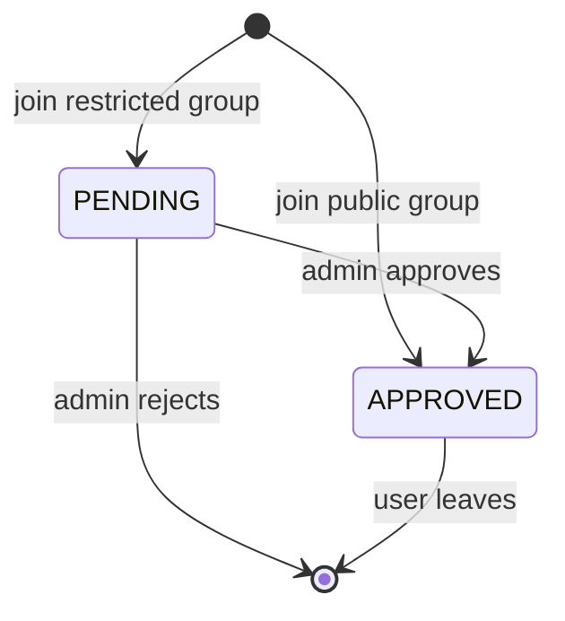
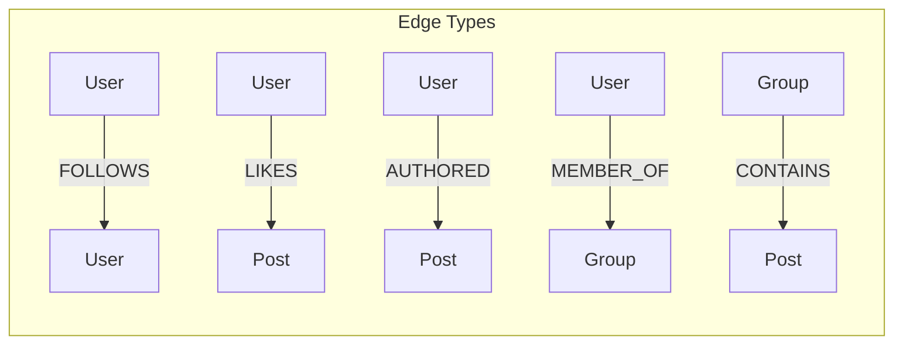

# Social Enterprise Platform -- Data Model & Programming Guide

This document is the authoritative reference for the database schema, the GlobalId system,
and the conventions used to add new features to the Social Enterprise Platform.

---

## 1. Database Schema

All tables live in a single PostgreSQL database (`social_enterprise`). Schema is managed by
Flyway migrations located at:

```
social-platform/social-app/src/main/resources/db/migration/
```

---

### users

| Column | Type | Constraints | Description |
|--------|------|-------------|-------------|
| id | BIGINT | PK | GlobalId (ObjectType.USER) |
| username | VARCHAR(64) | UNIQUE, NOT NULL | Login handle |
| display_name | VARCHAR(128) | | Human-readable name |
| email | VARCHAR(255) | UNIQUE, NOT NULL | Email address |
| password_hash | VARCHAR(255) | | BCrypt hash |
| avatar_url | VARCHAR(512) | | Profile picture URL |
| bio | TEXT | | User biography |
| visibility | VARCHAR(20) | NOT NULL, DEFAULT 'PUBLIC' | PUBLIC, PRIVATE |
| is_admin | BOOLEAN | NOT NULL, DEFAULT FALSE | Admin flag (added in V7) |
| created_at | TIMESTAMPTZ | NOT NULL, DEFAULT now() | |
| updated_at | TIMESTAMPTZ | NOT NULL, DEFAULT now() | |

**Indexes:** PK on `id`, UNIQUE on `username`, UNIQUE on `email`.

---

### posts (partitioned)

Partitioned by `RANGE (created_at)` into quarterly sub-tables (posts_2025_q1 through
posts_2026_q4). Because the table is partitioned, the primary key **must include the
partition column**: `PRIMARY KEY (id, created_at)`.

| Column | Type | Constraints | Description |
|--------|------|-------------|-------------|
| id | BIGINT | NOT NULL, part of composite PK | GlobalId (ObjectType.POST) |
| author_id | BIGINT | NOT NULL, FK -> users(id) | Post author |
| target_type | VARCHAR(20) | | TargetType enum value (TEAM_FEED, GROUP_FEED, PAGE_FEED, PROJECT_FEED, USER_FEED) |
| target_id | BIGINT | | ID of the target entity |
| content | TEXT | | Post body |
| visibility | VARCHAR(20) | NOT NULL, DEFAULT 'PUBLIC' | Visibility enum value |
| created_at | TIMESTAMPTZ | NOT NULL, DEFAULT now() | Partition column, part of composite PK |
| updated_at | TIMESTAMPTZ | NOT NULL, DEFAULT now() | |

**Indexes:** `idx_posts_author_id (author_id)`, `idx_posts_target_id (target_id)`.

**Partitions:**

| Partition | Range |
|-----------|-------|
| posts_2025_q1 | 2025-01-01 to 2025-04-01 |
| posts_2025_q2 | 2025-04-01 to 2025-07-01 |
| posts_2025_q3 | 2025-07-01 to 2025-10-01 |
| posts_2025_q4 | 2025-10-01 to 2026-01-01 |
| posts_2026_q1 | 2026-01-01 to 2026-04-01 |
| posts_2026_q2 | 2026-04-01 to 2026-07-01 |
| posts_2026_q3 | 2026-07-01 to 2026-10-01 |
| posts_2026_q4 | 2026-10-01 to 2027-01-01 |

When a new quarter is needed, add a new `CREATE TABLE ... PARTITION OF posts` statement
in a new migration.

---

### comments (partitioned)

Same partitioning strategy as `posts`. Supports single-level nesting
(depth 0 = top-level, depth 1 = reply). The `CHECK (depth <= 1)` constraint
enforces this.

| Column | Type | Constraints | Description |
|--------|------|-------------|-------------|
| id | BIGINT | NOT NULL, part of composite PK | GlobalId (ObjectType.COMMENT) |
| post_id | BIGINT | NOT NULL | Parent post ID |
| parent_comment_id | BIGINT | | NULL for top-level, set for replies |
| author_id | BIGINT | NOT NULL, FK -> users(id) | Comment author |
| content | TEXT | | Comment body |
| depth | SMALLINT | NOT NULL, DEFAULT 0, CHECK (depth <= 1) | 0 = top-level, 1 = reply |
| created_at | TIMESTAMPTZ | NOT NULL, DEFAULT now() | Partition column, part of composite PK |

**Indexes:** `idx_comments_post_id (post_id)`.

**Partitions:** Identical quarterly structure to posts (comments_2025_q1 through comments_2026_q4).

---

### reactions

| Column | Type | Constraints | Description |
|--------|------|-------------|-------------|
| id | BIGINT | PK | GlobalId (ObjectType.REACTION) |
| target_id | BIGINT | NOT NULL | Post or comment being reacted to |
| target_type | VARCHAR(10) | NOT NULL | "POST" or "COMMENT" (derived from GlobalId type) |
| user_id | BIGINT | NOT NULL, FK -> users(id) | User who reacted |
| reaction_type | VARCHAR(10) | NOT NULL | LIKE, LOVE, HAHA, WOW, SAD, ANGRY |
| created_at | TIMESTAMPTZ | NOT NULL, DEFAULT now() | |

**Indexes:** `idx_reactions_target_id (target_id)`.
**Unique constraint:** `UNIQUE (target_id, user_id)` -- one reaction per user per target.

---

### follows

| Column | Type | Constraints | Description |
|--------|------|-------------|-------------|
| follower_id | BIGINT | NOT NULL, FK -> users(id) | User who follows |
| followed_id | BIGINT | NOT NULL | User being followed |
| created_at | TIMESTAMPTZ | NOT NULL, DEFAULT now() | |

**Primary key:** `(follower_id, followed_id)`.
**Indexes:** `idx_follows_followed_id (followed_id)`.

---

### groups_

Table name uses trailing underscore to avoid the SQL reserved keyword `GROUP`.

| Column | Type | Constraints | Description |
|--------|------|-------------|-------------|
| id | BIGINT | PK | GlobalId (ObjectType.GROUP) |
| name | VARCHAR(128) | NOT NULL | Group name |
| slug | VARCHAR(128) | UNIQUE, NOT NULL | URL-safe identifier |
| description | TEXT | | |
| visibility | VARCHAR(20) | NOT NULL, DEFAULT 'PUBLIC' | |
| avatar_url | VARCHAR(512) | | Group avatar (added V5) |
| cover_url | VARCHAR(512) | | Cover image (added V5) |
| pinned_post_id | BIGINT | | Pinned post (added V4) |
| created_at | TIMESTAMPTZ | NOT NULL, DEFAULT now() | |

---

### pages

| Column | Type | Constraints | Description |
|--------|------|-------------|-------------|
| id | BIGINT | PK | GlobalId (ObjectType.PAGE) |
| name | VARCHAR(128) | NOT NULL | Page name |
| slug | VARCHAR(128) | UNIQUE, NOT NULL | URL-safe identifier |
| description | TEXT | | |
| avatar_url | VARCHAR(512) | | Page avatar |
| cover_url | VARCHAR(512) | | Cover image (added V5) |
| visibility | VARCHAR(20) | NOT NULL, DEFAULT 'PUBLIC' | |
| owner_type | VARCHAR(20) | | Type of owner (USER, TEAM, etc.) |
| owner_id | BIGINT | | Owner entity ID |
| pinned_post_id | BIGINT | | Pinned post (added V4) |
| created_at | TIMESTAMPTZ | NOT NULL, DEFAULT now() | |

---

### teams

| Column | Type | Constraints | Description |
|--------|------|-------------|-------------|
| id | BIGINT | PK | GlobalId (ObjectType.TEAM) |
| name | VARCHAR(128) | NOT NULL | Team name |
| slug | VARCHAR(128) | UNIQUE, NOT NULL | URL-safe identifier |
| description | TEXT | | |
| visibility | VARCHAR(20) | NOT NULL, DEFAULT 'PUBLIC' | |
| created_at | TIMESTAMPTZ | NOT NULL, DEFAULT now() | |

---

### projects

| Column | Type | Constraints | Description |
|--------|------|-------------|-------------|
| id | BIGINT | PK | GlobalId (ObjectType.PROJECT) |
| name | VARCHAR(128) | NOT NULL | Project name |
| slug | VARCHAR(128) | UNIQUE, NOT NULL | URL-safe identifier |
| description | TEXT | | |
| visibility | VARCHAR(20) | NOT NULL, DEFAULT 'PUBLIC' | |
| page_id | BIGINT | FK -> pages(id) | Optional associated page |
| created_at | TIMESTAMPTZ | NOT NULL, DEFAULT now() | |

---

### memberships

Join table between users and groups_.

| Column | Type | Constraints | Description |
|--------|------|-------------|-------------|
| user_id | BIGINT | NOT NULL, FK -> users(id) | Member |
| group_id | BIGINT | NOT NULL | Group or team ID |
| role | VARCHAR(20) | NOT NULL, DEFAULT 'MEMBER' | OWNER, ADMIN, MEMBER |
| status | VARCHAR(20) | NOT NULL, DEFAULT 'APPROVED' | APPROVED, PENDING, REJECTED (added V3) |
| joined_at | TIMESTAMPTZ | NOT NULL, DEFAULT now() | |

**Primary key:** `(user_id, group_id)`.
**Indexes:** `idx_memberships_group_id (group_id)`, `idx_memberships_status (status)`.

---

### page_memberships

Join table between users and pages (added in V3).

| Column | Type | Constraints | Description |
|--------|------|-------------|-------------|
| user_id | BIGINT | NOT NULL, FK -> users(id) | Follower/member |
| page_id | BIGINT | NOT NULL | Page ID |
| role | VARCHAR(20) | NOT NULL, DEFAULT 'FOLLOWER' | FOLLOWER, ADMIN, OWNER |
| status | VARCHAR(20) | NOT NULL, DEFAULT 'APPROVED' | APPROVED, PENDING |
| joined_at | TIMESTAMPTZ | NOT NULL, DEFAULT now() | |

**Primary key:** `(user_id, page_id)`.
**Indexes:** `idx_page_memberships_page_id (page_id)`, `idx_page_memberships_status (status)`.

---

### messages

Direct messaging between users (added in V3).

| Column | Type | Constraints | Description |
|--------|------|-------------|-------------|
| id | BIGINT | PK | GlobalId (ObjectType.MESSAGE) |
| sender_id | BIGINT | NOT NULL, FK -> users(id) | Message sender |
| recipient_id | BIGINT | NOT NULL, FK -> users(id) | Message recipient |
| content | TEXT | | Message body |
| read | BOOLEAN | NOT NULL, DEFAULT FALSE | Read receipt |
| created_at | TIMESTAMPTZ | NOT NULL, DEFAULT now() | |

**Indexes:**
- `idx_messages_sender (sender_id, created_at DESC)`
- `idx_messages_recipient (recipient_id, created_at DESC)`
- `idx_messages_conversation (LEAST(sender_id, recipient_id), GREATEST(sender_id, recipient_id), created_at DESC)` -- enables efficient conversation lookup regardless of sender/recipient order.

---

### message_attachments

Join table between messages and attachments (added in V3).

| Column | Type | Constraints | Description |
|--------|------|-------------|-------------|
| message_id | BIGINT | NOT NULL, FK -> messages(id) | |
| attachment_id | BIGINT | NOT NULL, FK -> attachments(id) | |

**Primary key:** `(message_id, attachment_id)`.

---

### attachments

| Column | Type | Constraints | Description |
|--------|------|-------------|-------------|
| id | BIGINT | PK | GlobalId (ObjectType.ATTACHMENT) |
| owner_id | BIGINT | NOT NULL | Uploading user ID |
| media_type | VARCHAR(64) | | MIME type (image/jpeg, etc.) |
| file_url | VARCHAR(512) | NOT NULL | Stored file URL/path |
| file_size | BIGINT | | Size in bytes |
| width | INT | | Image/video width in px |
| height | INT | | Image/video height in px |
| content_hash | VARCHAR(64) | | SHA-256 content hash for dedup (added V6) |
| created_at | TIMESTAMPTZ | NOT NULL, DEFAULT now() | |

**Indexes:** `idx_attachments_owner_id (owner_id)`.
**Unique index:** `idx_attachments_content_hash (content_hash) WHERE content_hash IS NOT NULL` -- partial unique index for deduplication.

---

### post_attachments

Join table between posts and attachments (added in V4).

| Column | Type | Constraints | Description |
|--------|------|-------------|-------------|
| post_id | BIGINT | NOT NULL | Post ID |
| attachment_id | BIGINT | NOT NULL, FK -> attachments(id) | |
| sort_order | INT | NOT NULL, DEFAULT 0 | Display order |

**Primary key:** `(post_id, attachment_id)`.
**Indexes:** `idx_post_attachments_post_id (post_id)`.

---

### comment_attachments

Join table between comments and attachments (added in V4).

| Column | Type | Constraints | Description |
|--------|------|-------------|-------------|
| comment_id | BIGINT | NOT NULL | Comment ID |
| attachment_id | BIGINT | NOT NULL, FK -> attachments(id) | |

**Primary key:** `(comment_id, attachment_id)`.

---

### friend_requests

Friend request workflow (added in V8). Accepting a request creates mutual follow relationships.

| Column | Type | Constraints | Description |
|--------|------|-------------|-------------|
| id | BIGINT | PK | Generated with ObjectType.USER counter |
| sender_id | BIGINT | NOT NULL, FK -> users(id) | User who sent the request |
| receiver_id | BIGINT | NOT NULL, FK -> users(id) | User who received the request |
| status | VARCHAR(20) | NOT NULL, DEFAULT 'PENDING' | PENDING, ACCEPTED, REJECTED |
| created_at | TIMESTAMPTZ | NOT NULL, DEFAULT now() | |
| updated_at | TIMESTAMPTZ | NOT NULL, DEFAULT now() | |

**Unique constraint:** `UNIQUE (sender_id, receiver_id)`.
**Indexes:** `idx_friend_requests_receiver_status (receiver_id, status)`, `idx_friend_requests_sender_status (sender_id, status)`.

---

### graph_edges

Local mirror of the AOEE social graph (added in V2). Used for persistence when the
in-memory graph cache restarts.

| Column | Type | Constraints | Description |
|--------|------|-------------|-------------|
| id | BIGSERIAL | PK | Auto-incrementing surrogate key |
| src_id | BIGINT | NOT NULL | Source entity GlobalId |
| edge_type | VARCHAR(50) | NOT NULL | FOLLOWS, LIKES, AUTHORED, CONTAINS, MEMBER_OF |
| dst_id | BIGINT | NOT NULL | Destination entity GlobalId |
| timestamp_ns | BIGINT | NOT NULL, DEFAULT 0 | Nanosecond timestamp for ordering |
| metadata | SMALLINT | DEFAULT 0 | Extra data (e.g., reaction subtype) |
| created_at | TIMESTAMPTZ | DEFAULT NOW() | |

**Unique constraint:** `UNIQUE (src_id, edge_type, dst_id)`.
**Indexes:** `idx_graph_edges_src_type (src_id, edge_type)`, `idx_graph_edges_dst_type (dst_id, edge_type)`.

---

### graph_entities

Registry of entities known to the graph layer (added in V2).

| Column | Type | Constraints | Description |
|--------|------|-------------|-------------|
| id | BIGINT | PK | GlobalId of the entity |
| entity_type | VARCHAR(50) | NOT NULL | USER, POST, GROUP, PAGE, etc. |
| name | VARCHAR(256) | | Human-readable label |
| created_at | TIMESTAMPTZ | DEFAULT NOW() | |

**Indexes:** `idx_graph_entities_type (entity_type)`.

---

## 2. Entity Relationship Diagram



**Key relationships:**
- `users 1:N posts` -- a user authors many posts
- `posts 1:N comments` -- a post has many comments
- `comments 1:N comments` -- single-level nesting via parent_comment_id (depth <= 1)
- `posts M:N attachments` -- via post_attachments junction table
- `comments M:N attachments` -- via comment_attachments junction table
- `users M:N users` -- via follows (follower_id, followed_id)
- `users M:N groups_` -- via memberships
- `users M:N pages` -- via page_memberships
- `users 1:N messages` -- sender_id and recipient_id
- `messages M:N attachments` -- via message_attachments
- `users 1:N friend_requests` -- sender_id and receiver_id
- `users 1:N attachments` -- owner_id

---

## 3. GlobalId System

Every entity in the system receives a 64-bit globally unique identifier that embeds the
object type. This allows the system to determine what kind of entity an ID refers to
without a database lookup.

### Bit Layout



```
  type     = ObjectType.code()  (upper 8 bits)
  sequence = per-type counter   (lower 56 bits, max 72,057,594,037,927,935)
```

### ObjectType Codes



| Enum | Hex Code | Decimal Prefix (code << 56) |
|------|----------|-----------------------------|
| USER | 0x01 | 72,057,594,037,927,936 |
| POST | 0x02 | 144,115,188,075,855,872 |
| COMMENT | 0x03 | 216,172,782,113,783,808 |
| TEAM | 0x04 | 288,230,376,151,711,744 |
| GROUP | 0x05 | 360,287,970,189,639,680 |
| PAGE | 0x06 | 432,345,564,227,567,616 |
| PROJECT | 0x07 | 504,403,158,265,495,552 |
| ATTACHMENT | 0x08 | 576,460,752,303,423,488 |
| REACTION | 0x09 | 648,518,346,341,351,424 |
| MESSAGE | 0x0A | 720,575,940,379,279,360 |

### Example

```
User #1:
  type     = 0x01
  sequence = 1
  encoded  = (0x01 << 56) | 1 = 72057594037927937

Post #42:
  type     = 0x02
  sequence = 42
  encoded  = (0x02 << 56) | 42 = 144115188075855914
```

### Extracting Type and Sequence

```java
// From a raw long ID
ObjectType type = GlobalId.typeOf(rawId);            // upper 8 bits
long sequence   = new GlobalId(rawId).sequence();    // lower 56 bits
```

### GlobalIdGenerator

Defined in `social-core`: `com.social.core.id.GlobalIdGenerator`

- Maintains one `AtomicLong` counter per `ObjectType`
- Thread-safe via `ConcurrentHashMap<ObjectType, AtomicLong>`
- On application startup, `GlobalIdConfig` (a `CommandLineRunner`) reads the max existing
  ID from each repository's `findMaxId()` query, extracts the sequence, and calls
  `generator.initCounter(type, sequence)` so the counter resumes after the highest
  existing value.

```java
// Usage in a service
GlobalId id = idGenerator.next(ObjectType.POST);
entity.setId(id.value());
```

### AOEE Interop

The GlobalId layout intentionally matches AOEE's `EntityId` format (8-bit type + 56-bit
value), so IDs pass through to the social graph cache with zero conversion. The
`ObjectType.aoeeTypeCode()` method returns the same byte code for compatibility.

---

## 4. Programming Model

### 4.1 Creating a New Entity Type

Follow these steps to add a completely new entity type to the platform:



**Step-by-step details:**

1. **Add ObjectType enum value** (if needed)
   - File: `social-core/src/main/java/com/social/core/id/ObjectType.java`
   - Add a new entry with the next available hex code

2. **Create Flyway migration**
   - File: `social-app/src/main/resources/db/migration/V{N}__description.sql`
   - Define the CREATE TABLE, indexes, and constraints
   - Naming convention: `V{N}__snake_case_description.sql`

3. **Create JPA Entity class**
   - Package: `com.social.app.persistence.entity`
   - Annotate with `@Entity`, `@Table(name = "...")`, `@Id`
   - All entities use `Long` for the ID field (no auto-generation -- GlobalIdGenerator handles it)

4. **Create Spring Data Repository**
   - Package: `com.social.app.persistence.repository`
   - Extend `JpaRepository<EntityClass, Long>`
   - Add a `findMaxId()` query for GlobalId counter initialization:
     ```java
     @Query("SELECT MAX(e.id) FROM ExampleEntity e")
     Long findMaxId();
     ```

5. **Register the counter in GlobalIdConfig**
   - File: `com.social.app.config.GlobalIdConfig`
   - Inject the new repository into `initializeGlobalIdCounters`
   - Add: `initCounter(generator, ObjectType.EXAMPLE, exampleRepository.findMaxId());`

6. **Create DTO record in social-core**
   - Package: `com.social.core.dto`
   - Use Java records for immutable DTOs:
     ```java
     public record ExampleDto(long id, String name, Instant createdAt) {}
     ```

7. **Create Service class**
   - Package: `com.social.app.service`
   - See Section 4.2 below

8. **Create REST Controller**
   - Package: `com.social.app.controller.rest`
   - See Section 4.3 below

9. **Add frontend TypeScript interface**
   - File: `social-frontend/src/api/types.ts`

10. **Add React Query hooks**
    - See Section 4.5 below

---

### 4.2 Service Pattern

Services are the main place for business logic. They follow these conventions:

```java
@Service
@Transactional(readOnly = true)     // Default: all public methods are read-only
public class ExampleService {

    private final ExampleRepository repository;
    private final GlobalIdGenerator idGenerator;
    private final ApplicationEventPublisher eventPublisher;

    public ExampleService(ExampleRepository repository,
                          GlobalIdGenerator idGenerator,
                          ApplicationEventPublisher eventPublisher) {
        this.repository = repository;
        this.idGenerator = idGenerator;
        this.eventPublisher = eventPublisher;
    }

    @Transactional                   // Write operations override to read-write
    public ExampleEntity create(long userId, CreateExampleRequest request) {
        var entity = new ExampleEntity();
        entity.setId(idGenerator.next(ObjectType.EXAMPLE).value());
        entity.setName(request.name());
        // ... set other fields

        ExampleEntity saved = repository.save(entity);

        // Publish domain event for async graph sync
        eventPublisher.publishEvent(new ExampleCreatedEvent(saved.getId(), userId));

        return saved;
    }

    public Optional<ExampleEntity> getById(long id) {
        return repository.findById(id);
    }

    public ExampleDto toDto(ExampleEntity entity) {
        return new ExampleDto(entity.getId(), entity.getName(), entity.getCreatedAt());
    }
}
```

**Key points:**
- Class-level `@Transactional(readOnly = true)` for safety; override with `@Transactional` on writes
- Constructor injection (no `@Autowired`)
- ID generation via `idGenerator.next(ObjectType.XXX).value()`
- Events published via Spring's `ApplicationEventPublisher`
- Entity-to-DTO conversion in `toDto()` methods

---

### 4.3 Controller Pattern

Controllers are thin -- they extract the authenticated user, parse the request, call the
service, and return the response.

```java
@RestController
@RequestMapping("/api/examples")
public class ExampleController {

    private final ExampleService exampleService;

    public ExampleController(ExampleService exampleService) {
        this.exampleService = exampleService;
    }

    @PostMapping
    public ResponseEntity<ExampleDto> create(@RequestBody CreateExampleRequest request,
                                              Authentication auth) {
        long userId = (Long) auth.getPrincipal();
        var entity = exampleService.create(userId, request);
        return ResponseEntity.ok(exampleService.toDto(entity));
    }

    @GetMapping("/{id}")
    public ResponseEntity<ExampleDto> getById(@PathVariable long id) {
        return exampleService.getById(id)
                .map(exampleService::toDto)
                .map(ResponseEntity::ok)
                .orElse(ResponseEntity.notFound().build());
    }
}
```

**Authentication:** The principal is always `(Long) auth.getPrincipal()`, which is the
user's GlobalId.

**When accepting IDs in a `Map<String, Object>` body** (e.g., for reactions), handle
both String and Number because large IDs may arrive as strings from JavaScript:

```java
Object raw = body.get("targetId");
long id = raw instanceof Number n ? n.longValue() : Long.parseLong(raw.toString());
```

---

### 4.4 Event Publishing Pattern

Domain events decouple write operations from async side effects (graph sync, notifications, etc.).



**1. Define the event as a record:**

```java
// In com.social.app.service
public record ExampleCreatedEvent(long entityId, long userId) {}
```

Existing events:
- `PostCreatedEvent(long postId, long authorId, String targetType, Long targetId)`
- `FollowEvent(long followerId, long followedId, boolean followed)`
- `ReactionEvent(long userId, long targetId, String reactionType, boolean added)`
- `MembershipEvent(long userId, long groupId, String role, boolean joined)`

**2. Publish in the service method:**

```java
eventPublisher.publishEvent(new ExampleCreatedEvent(saved.getId(), userId));
```

**3. Listen in GraphSyncService:**

```java
// In com.social.app.graph.GraphSyncService
@Async
@EventListener
public void onExampleCreated(ExampleCreatedEvent event) {
    aoeeClient.addEdge(event.userId(), "CREATED", event.entityId());
}
```

The `@Async` annotation ensures the graph sync does not block the HTTP response.
The `AoeeGraphClient` wraps all calls in try/catch for graceful degradation when
AOEE is unavailable.

---

### 4.5 Frontend Pattern

The frontend uses React, TypeScript, Axios, React Query, and Zustand.



**API client** (`social-frontend/src/api/client.ts`):

```typescript
import axios from 'axios';
import { useAuthStore } from '../stores/authStore';

const api = axios.create({
  baseURL: '/api',
  headers: { 'Content-Type': 'application/json' },
});

// Auth interceptor adds Bearer token or X-Debug-User-Id header
api.interceptors.request.use((config) => {
  const { token, debugUserId } = useAuthStore.getState();
  if (debugUserId) {
    config.headers['X-Debug-User-Id'] = debugUserId;
  } else if (token) {
    config.headers.Authorization = `Bearer ${token}`;
  }
  return config;
});
```

**Type definition** (`social-frontend/src/api/types.ts`):

```typescript
export interface ExampleDto {
  id: number;
  name: string;
  createdAt: string;
}
```

**React Query hook:**

```typescript
import { useQuery, useMutation, useQueryClient } from '@tanstack/react-query';
import api from '../api/client';
import type { ExampleDto } from '../api/types';

export function useExamples() {
  return useQuery<ExampleDto[]>({
    queryKey: ['examples'],
    queryFn: async () => {
      const { data } = await api.get('/examples');
      return data;
    },
  });
}

export function useCreateExample() {
  const queryClient = useQueryClient();
  return useMutation({
    mutationFn: (body: { name: string }) => api.post('/examples', body),
    onSuccess: () => {
      queryClient.invalidateQueries({ queryKey: ['examples'] });
    },
  });
}
```

**Infinite scroll (feed pattern):**

```typescript
import { useInfiniteQuery } from '@tanstack/react-query';

export function useFeed(limit = 20) {
  return useInfiniteQuery<FeedResponse>({
    queryKey: ['feed'],
    queryFn: async ({ pageParam }) => {
      const params: Record<string, string> = { limit: String(limit) };
      if (pageParam) params.cursor = pageParam as string;
      const { data } = await api.get('/feed', { params });
      return data;
    },
    initialPageParam: undefined as string | undefined,
    getNextPageParam: (lastPage) =>
      lastPage.hasMore ? lastPage.nextCursor : undefined,
  });
}
```

---

### 4.6 Handling Large IDs

GlobalIds exceed JavaScript's safe integer range (`Number.MAX_SAFE_INTEGER = 2^53 - 1`).
For example, User #1 = 72,057,594,037,927,937 which is larger than 9,007,199,254,740,991.

**Backend serialization:** The backend serializes IDs as JSON numbers. Jackson writes them
as full longs. When precision matters, the API may send them as strings.

**Frontend handling:** TypeScript interfaces declare IDs as `number`, but when the value
exceeds 2^53, precision is lost. For request bodies where the frontend passes an ID back
to the server, it should send IDs as-is (not parse/modify them).

**Backend controller safety:** When accepting IDs from JSON request bodies as
`Map<String, Object>`, always handle both `String` and `Number`:

```java
Object raw = body.get("targetId");
long id = raw instanceof Number n ? n.longValue() : Long.parseLong(raw.toString());
```

This pattern is used in `ReactionController` and any controller that accepts IDs in
a generic Map body.

---

## 5. Key Enums

### Visibility

```java
// com.social.core.model.Visibility
PUBLIC, TEAM_VISIBLE, RESTRICTED, PRIVATE
```

### TargetType

```java
// com.social.core.model.TargetType
USER_FEED, TEAM_FEED, GROUP_FEED, PAGE_FEED, PROJECT_FEED
```

Indicates where a post was published to. Stored in `posts.target_type`.

### ReactionType

```java
// com.social.core.model.ReactionType
LIKE(0), LOVE(1), HAHA(2), WOW(3), SAD(4), ANGRY(5)
```

Each value carries an `aoeeMetadata` byte for storage in AOEE edge metadata.

### MemberRole

```java
// com.social.core.model.MemberRole
MEMBER, ADMIN, OWNER
```

Used in `memberships.role` and `page_memberships.role`.

### FriendRequestStatus

Not a separate enum -- stored as VARCHAR strings in `friend_requests.status`:

```
PENDING, ACCEPTED, REJECTED
```

#### Friend Request State Machine



### Membership Status

```
APPROVED, PENDING, REJECTED
```

#### Membership State Machine



### AOEE Edge Types

String constants used as `edge_type` in `graph_edges` and in `AoeeGraphClient` calls:



| Edge Type | Meaning | Created By |
|-----------|---------|------------|
| FOLLOWS | User follows another user | FollowEvent |
| LIKES | User reacted to a post/comment | ReactionEvent |
| AUTHORED | User authored a post | PostCreatedEvent |
| CONTAINS | Target entity (group/page/team) contains a post | PostCreatedEvent |
| MEMBER_OF | User is a member of a group/team | MembershipEvent |

---

## 6. Database Migrations

All migrations are in `social-app/src/main/resources/db/migration/`.

```mermaid
gantt
    title Database Migrations
    dateFormat X
    axisFormat %s
    section Schema
    V1 Core tables (users, posts, comments, reactions, follows, groups, pages, teams) :v1, 0, 1
    V2 Graph edge tables (graph_edges, graph_entities) :v2, 1, 2
    V3 Messages and membership status :v3, 2, 3
    V4 Post attachments and edits :v4, 3, 4
    V5 Group/page enhancements (pins, covers) :v5, 4, 5
    V6 Attachment content hash :v6, 5, 6
    V7 Admin role :v7, 6, 7
    V8 Friend requests :v8, 7, 8
```



| Migration | Description |
|-----------|-------------|
| **V1__create_core_tables.sql** | Creates all foundational tables: users, teams, groups_, pages, projects, posts (partitioned 2025-Q1 through 2026-Q4), comments (partitioned same), reactions, attachments, memberships, follows. Creates indexes on foreign keys. |
| **V2__create_graph_edge_tables.sql** | Creates graph_edges (with unique constraint on src/edge_type/dst and indexes on src+type and dst+type) and graph_entities (with index on entity_type). |
| **V3__add_messages_and_membership_status.sql** | Adds `status` column to memberships table. Creates page_memberships table. Creates messages table with conversation index using LEAST/GREATEST. Creates message_attachments junction table. |
| **V4__post_attachments_and_edits.sql** | Creates post_attachments junction table with sort_order column. Creates comment_attachments junction table. Adds pinned_post_id column to groups_ and pages. |
| **V5__group_page_enhancements.sql** | Adds avatar_url and cover_url to groups_. Adds cover_url to pages. |
| **V6__attachment_content_hash.sql** | Adds content_hash column to attachments. Creates a partial unique index on content_hash (WHERE content_hash IS NOT NULL) for deduplication. |
| **V7__admin_role.sql** | Adds is_admin boolean column to users (default FALSE). Seeds the first 3 users as admins for development. |
| **V8__friend_requests.sql** | Creates friend_requests table with sender_id, receiver_id, status, and composite indexes for efficient lookup by receiver+status and sender+status. |

---

## 7. Configuration Reference

All configuration is in `social-app/src/main/resources/application.yml`.

### Server

| Property | Default | Description |
|----------|---------|-------------|
| `server.port` | `8080` | HTTP listen port |

### Spring Datasource

| Property | Default | Description |
|----------|---------|-------------|
| `spring.datasource.url` | `jdbc:postgresql://localhost:5432/social_enterprise` | PostgreSQL JDBC URL |
| `spring.datasource.username` | `social` | Database user |
| `spring.datasource.password` | *(empty)* | Database password |
| `spring.datasource.driver-class-name` | `org.postgresql.Driver` | JDBC driver |

### JPA / Hibernate

| Property | Default | Description |
|----------|---------|-------------|
| `spring.jpa.hibernate.ddl-auto` | `validate` | Validate schema against entities on startup (never auto-create -- Flyway handles DDL) |
| `spring.jpa.show-sql` | `false` | Log SQL statements |
| `spring.jpa.properties.hibernate.dialect` | `org.hibernate.dialect.PostgreSQLDialect` | Hibernate dialect |

### Flyway

| Property | Default | Description |
|----------|---------|-------------|
| `spring.flyway.enabled` | `true` | Run migrations on startup |

### GraphQL

| Property | Default | Description |
|----------|---------|-------------|
| `spring.graphql.graphiql.enabled` | `true` | Enable GraphiQL browser IDE |
| `spring.graphql.path` | `/graphql` | GraphQL endpoint path |

### Multipart Upload

| Property | Default | Description |
|----------|---------|-------------|
| `spring.servlet.multipart.max-file-size` | `50MB` | Max single file size |
| `spring.servlet.multipart.max-request-size` | `50MB` | Max total request size |

### JWT Authentication

| Property | Default | Description |
|----------|---------|-------------|
| `social.jwt.secret` | *(dev key)* | HMAC signing key. **Must be changed in production.** |
| `social.jwt.expiration-ms` | `86400000` | Token TTL (24 hours) |

### Auth Debug Mode

| Property | Default | Description |
|----------|---------|-------------|
| `social.auth.debug-bypass` | `true` | When true, the `X-Debug-User-Id` header bypasses JWT authentication. **Disable in production.** |

### AOEE Social Graph

| Property | Default | Description |
|----------|---------|-------------|
| `social.aoee.host` | `localhost` | AOEE server hostname |
| `social.aoee.port` | `50051` | AOEE gRPC port (used by native client) |
| `social.aoee.proxy-port` | `8082` | AOEE Spring Boot REST proxy port (used by AoeeGraphClient) |

### OpenSearch

| Property | Default | Description |
|----------|---------|-------------|
| `social.opensearch.host` | `localhost` | OpenSearch hostname |
| `social.opensearch.port` | `9200` | OpenSearch REST port |

### Media Storage

| Property | Default | Description |
|----------|---------|-------------|
| `social.media.upload-dir` | `./uploads` | Local directory for uploaded media files |

---

## 8. Quick Reference: REST API Endpoints

| Controller | Base Path | Key Operations |
|------------|-----------|----------------|
| AuthController | `/api/auth` | POST /login, POST /register |
| UserController | `/api/users` | GET /{id}, GET /me, PUT /me |
| PostController | `/api/posts` | POST /, GET /{id}, PUT /{id}, DELETE /{id}, GET /{id}/comments |
| CommentController | `/api/comments` | POST /, DELETE /{id} |
| ReactionController | `/api/reactions` | POST /, DELETE /{targetId}, GET /{targetId}/users |
| FollowController | `/api/follows` | POST /{id}, DELETE /{id} |
| GroupController | `/api/groups` | CRUD + membership management |
| PageController | `/api/pages` | CRUD + follower management |
| TeamController | `/api/teams` | CRUD + membership management |
| MessageController | `/api/messages` | POST /, GET /conversations, GET /with/{userId} |
| AttachmentController | `/api/attachments` | POST /upload (multipart) |
| FeedController | `/api/feed` | GET / (cursor-based pagination) |
| FriendRequestController | `/api/friend-requests` | POST /{targetId}, POST /{id}/accept, POST /{id}/reject, GET /received, GET /sent, GET /status/{targetUserId} |
| SearchController | `/api/search` | GET /?q=... |
| AdminController | `/api/admin` | Admin-only operations |
| LinkPreviewController | `/api/link-preview` | GET /?url=... |
| AoeePersistenceController | `/api/aoee-persistence` | Graph data persistence endpoints |
