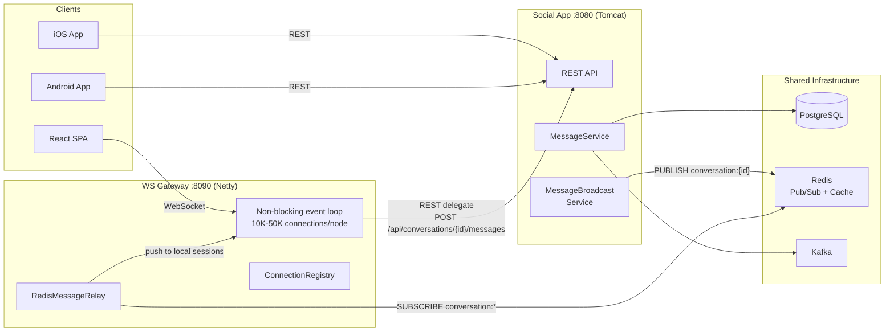
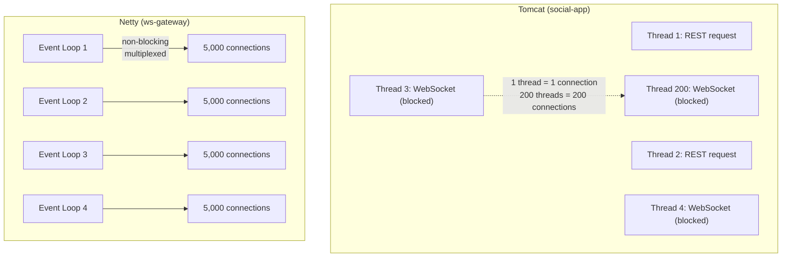
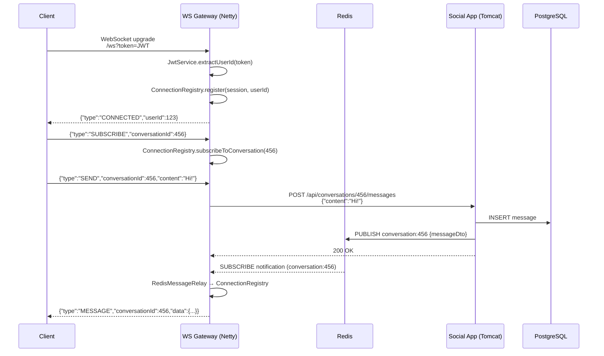
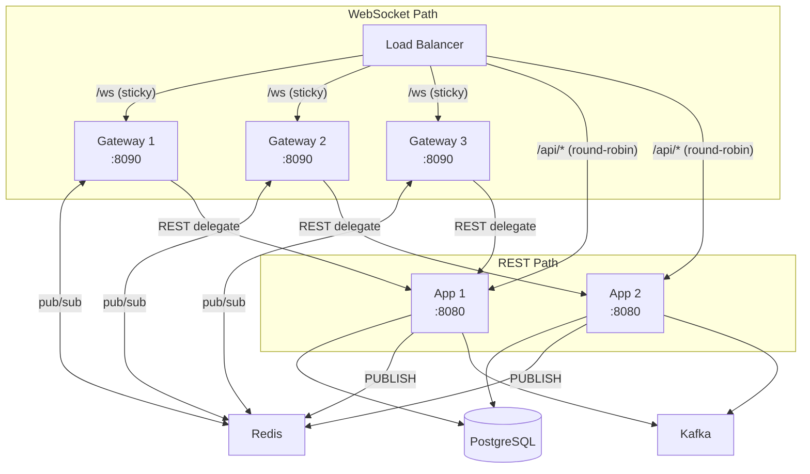
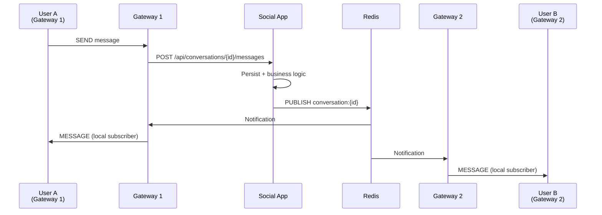
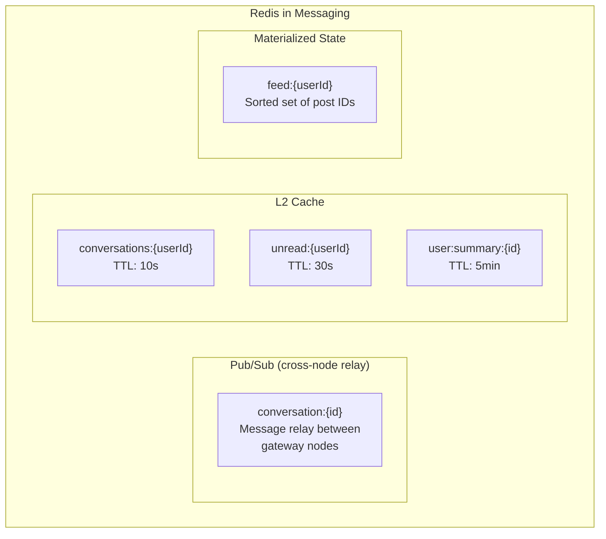
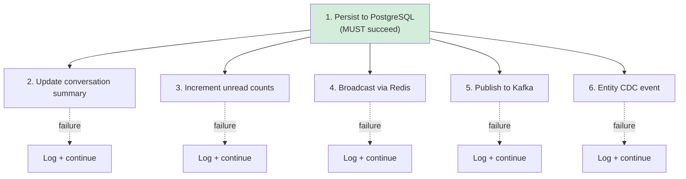
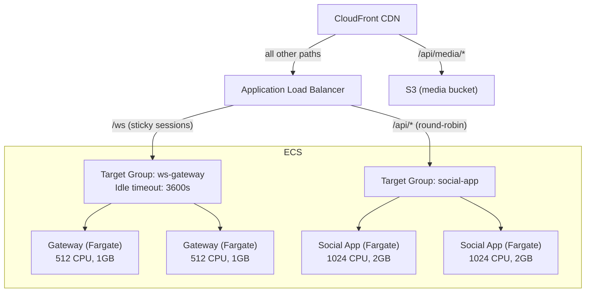

# Messaging Infrastructure

## Overview

WorkSphere's messaging system is designed for real-time delivery with horizontal scalability. The architecture separates concerns:

- **WebSocket Gateway** (Netty, non-blocking) — handles 10K-50K concurrent connections per node
- **Social App** (Tomcat, blocking) — handles business logic, persistence, REST API
- **Redis** — bridges WebSocket connections across gateway nodes via Pub/Sub
- **Kafka** — durable event stream for warehouse replication and downstream consumers



## WebSocket Gateway

### Why a Dedicated Gateway?

The social app runs on Tomcat with a thread-per-connection model. Each WebSocket connection holds a thread for its lifetime. At Tomcat's default 200 threads, that means **~200 concurrent WebSocket users per node** — and those threads are shared with REST API requests, so WebSocket connections starve the API under load.

The gateway runs on **Netty**, which uses non-blocking I/O with a small fixed thread pool (typically 2× CPU cores). A single gateway node with 4 CPU cores can handle **10,000-50,000 concurrent WebSocket connections** while using only 8 threads.



### Gateway Architecture

```
ws-gateway/
├── WsGatewayApplication.java     # Spring Boot WebFlux entry point
├── WebSocketConfig.java           # Registers /ws handler
├── GatewayWebSocketHandler.java   # Non-blocking message handler
├── ConnectionRegistry.java        # Tracks sessions by user + conversation
├── RedisMessageRelay.java         # Redis Pub/Sub bridge
├── JwtService.java                # JWT token validation
└── GatewayInfoController.java     # /info and /health endpoints
```

### Protocol

The gateway uses a JSON-over-WebSocket protocol (not STOMP):

**Client → Gateway:**
```json
{"type":"SUBSCRIBE","conversationId":123}
{"type":"SEND","conversationId":123,"content":"Hello!"}
{"type":"TYPING","conversationId":123}
```

**Gateway → Client:**
```json
{"type":"CONNECTED","userId":123,"connections":42}
{"type":"MESSAGE","conversationId":123,"data":{...messageDto...}}
{"type":"TYPING","conversationId":123,"userId":456}
{"type":"ERROR","message":"Authentication required"}
```

### Connection Flow



### Message Send Pipeline

When a message arrives at the gateway:

1. **Gateway** receives the WebSocket frame (non-blocking)
2. **Gateway** makes an async HTTP call to the social app's REST API
3. **Social app** persists the message (PostgreSQL), updates summaries, increments unread counts
4. **Social app's** `MessageBroadcastService` publishes to Redis `conversation:{id}`
5. **All gateway nodes** receive the Redis message via `RedisMessageRelay`
6. Each gateway pushes to locally-connected subscribers

This means the gateway is **stateless** for message persistence — it's purely a connection multiplexer and relay.

## Multi-Node Scaling



### How messages cross nodes



### Scaling dimensions

| Component | Scale Strategy | Bottleneck |
|---|---|---|
| Gateway nodes | Add more (stateless, ~50K conns each) | CPU for JSON parsing |
| App nodes | Add more (stateless, shared DB) | PostgreSQL write throughput |
| Redis | Single node handles ~100K pub/sub/sec | Upgrade to Redis Cluster if needed |
| PostgreSQL | Read replicas for queries, single writer | Shard by conversation_id at extreme scale |

### Session affinity

WebSocket connections are stateful — the STOMP session lives on one gateway node. The load balancer must route a client's WebSocket upgrade to the same node for the session lifetime:

- **ALB:** Cookie-based sticky sessions on the `/ws` target group
- **Nginx:** `ip_hash` or `sticky cookie`
- **REST calls** don't need stickiness — they're stateless (JWT auth)

## Redis Roles



## Denormalized Tables

To avoid expensive JOINs on every conversation list load:

### `conversation_summaries`

Updated by `ConversationSummaryService` on every message:

| Column | Type | Purpose |
|---|---|---|
| `conversation_id` | BIGINT PK | |
| `last_message_id` | BIGINT | Latest message |
| `last_timestamp` | TIMESTAMP | For sort order |
| `last_sender_id` | BIGINT | Sender info |
| `last_sender_name` | VARCHAR | Denormalized |
| `message_preview` | VARCHAR(100) | First 100 chars |

### `unread_counts`

Updated by `UnreadCountService`:

| Column | Type | Purpose |
|---|---|---|
| `user_id` | BIGINT | |
| `conversation_id` | BIGINT | |
| `unread_count` | INT | Badge number |
| `last_read_at` | TIMESTAMP | For filtering |

## Error Isolation

Every downstream operation after message persistence is independently guarded:



If Redis is down → message is saved, just not pushed in real-time.
If Kafka is down → message is saved and delivered, just not in the warehouse.
The message is **never lost** as long as PostgreSQL accepts the write.

## AWS Deployment

### ALB Configuration



### Key ALB settings

| Setting | Value | Why |
|---|---|---|
| Idle timeout | 3600s (for `/ws` TG) | WebSocket connections are long-lived |
| Sticky sessions | Enabled (cookie) for `/ws` TG | WebSocket session affinity |
| Health check | `GET /health` on gateway | Don't use WebSocket upgrade for health |
| Deregistration delay | 300s | Allow clients to reconnect during deploy |
| CloudFront | Exclude `/ws` | CloudFront does NOT support WebSocket |

### CloudFront Exclusion

CloudFront cannot proxy WebSocket connections. The ALB must be directly accessible for `/ws`:

```
https://app.worksphere.com/api/*     → CloudFront → ALB → social-app
https://app.worksphere.com/ws        → ALB (direct) → ws-gateway
https://app.worksphere.com/api/media → CloudFront → S3
```

## Capacity Planning

| Concurrent Users | Gateway Nodes | App Nodes | Redis | Estimated Cost (AWS) |
|---|---|---|---|---|
| 500 | 1 (256 CPU) | 2 (512 CPU) | cache.t3.micro | ~$150/mo |
| 5,000 | 2 (512 CPU) | 2 (1024 CPU) | cache.t3.small | ~$400/mo |
| 50,000 | 3 (1024 CPU) | 4 (1024 CPU) | cache.r6g.large | ~$1,500/mo |
| 500,000 | 10 (2048 CPU) | 8 (2048 CPU) | Redis Cluster | ~$8,000/mo |

## Running Locally

```bash
# Start the gateway (after social app is running)
java -jar social-platform/ws-gateway/target/ws-gateway-1.0.0-SNAPSHOT.jar

# Or with start-all.sh (starts on port 8090)
./scripts/start-all.sh

# Test connection
wscat -c "ws://localhost:8090/ws?userId=72057594037927937"
> {"type":"SUBSCRIBE","conversationId":864691128455135274}
> {"type":"SEND","conversationId":864691128455135274,"content":"Hello!"}
```

### Ports

| Service | Port | Protocol |
|---|---|---|
| Social App | 8080 | HTTP (REST + old STOMP WS) |
| WS Gateway | 8090 | HTTP (Netty WebSocket) |
| Redis | 6379 | RESP |
| Kafka | 9092 | Kafka protocol |

The old STOMP WebSocket endpoint (`/ws` on :8080) still works for backward compatibility. New clients should connect to the gateway on :8090.
