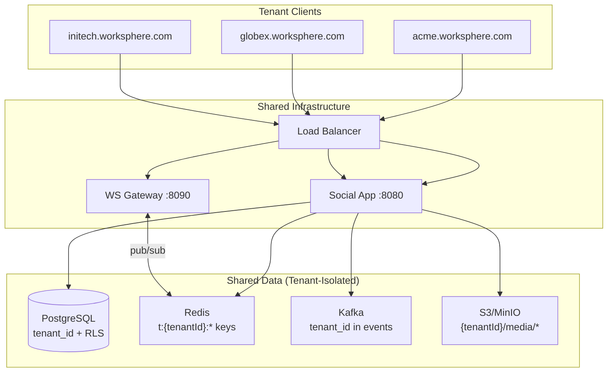
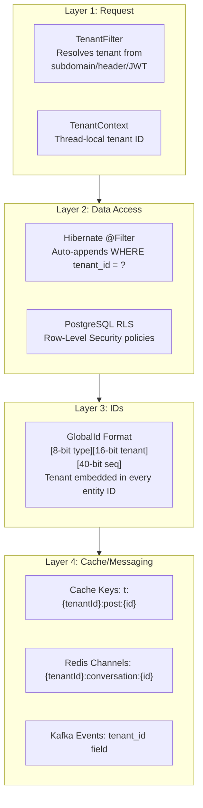

# Multi-Tenant Architecture

## Overview

WorkSphere supports multi-tenancy via a **shared schema with tenant_id** approach. All tenants share the same database, cache, and message infrastructure, with tenant isolation enforced at multiple layers.



## Tenant Isolation Layers



| Layer | Mechanism | What It Prevents |
|---|---|---|
| **Request** | TenantFilter + TenantContext | Tenant set before any business logic runs |
| **Hibernate** | @Filter on every entity | Queries automatically scoped to tenant |
| **PostgreSQL RLS** | Row-level security policies | Protection even if app logic has a bug |
| **ID Encoding** | Tenant embedded in GlobalId | IDs from different tenants can never collide |
| **Cache** | Tenant-prefixed keys | Cache reads can never return cross-tenant data |
| **Pub/Sub** | Tenant-prefixed channels | WebSocket messages scoped to tenant |
| **Warehouse** | tenant_id in all events | Analytics/rollups scoped to tenant |

## ID Format

```
Before:  [8-bit type][56-bit sequence]
After:   [8-bit type][16-bit tenant][40-bit sequence]

Example: User ID for tenant 1:
  type=0x01 (USER), tenant=0x0001, seq=0x0000000001
  = 0x01_0001_0000000001 = 72057598332895233

Extraction:
  GlobalId.typeOf(id)   → ObjectType (upper 8 bits)
  GlobalId.tenantOf(id) → tenant ID  (bits 40-55)
```

- **16-bit tenant** = 65,535 tenants max
- **40-bit sequence** = 1 trillion entities per type per tenant
- AOEE graph cache is automatically tenant-safe — edge src/dst IDs encode tenant

## Tenant Resolution

Order of precedence in `TenantFilter`:

1. `X-Tenant-Id` header (dev/testing)
2. Subdomain: `acme.worksphere.com` → lookup tenant by slug `acme`
3. JWT claim: `tenantId` in token payload
4. Default: tenant 1 (backward compatibility)

## Database

### Tenants Table

```sql
CREATE TABLE tenants (
    id          BIGINT PRIMARY KEY,
    name        VARCHAR(255) NOT NULL,
    slug        VARCHAR(100) NOT NULL UNIQUE,  -- subdomain
    plan        VARCHAR(50) DEFAULT 'free',     -- free, pro, enterprise
    max_users   INT DEFAULT 1000,
    max_storage_gb INT DEFAULT 10,
    settings    JSONB DEFAULT '{}',
    created_at  TIMESTAMP,
    updated_at  TIMESTAMP
);
```

### tenant_id Column

Every entity table has `tenant_id BIGINT NOT NULL REFERENCES tenants(id)` with an index. Hibernate's `@Filter` auto-appends `WHERE tenant_id = :tenantId` to all queries.

### Row-Level Security

PostgreSQL RLS is enabled on critical tables as a defense-in-depth layer:

```sql
ALTER TABLE users ENABLE ROW LEVEL SECURITY;
CREATE POLICY tenant_isolation_users ON users
    USING (tenant_id = current_setting('app.tenant_id', true)::bigint);
```

## Cache Keys

All Redis cache keys are prefixed with `t:{tenantId}:`:

| Before | After |
|---|---|
| `post:123:v:456` | `t:1:post:123:v:456` |
| `user:summary:789` | `t:1:user:summary:789` |
| `reactions:counts:123` | `t:1:reactions:counts:123` |
| `feed:456` | `t:1:feed:456` |
| `conversations:789` | `t:1:conversations:789` |

## Redis Pub/Sub

Message broadcast channels include tenant:

| Before | After |
|---|---|
| `conversation:123` | `1:conversation:123` |

The WebSocket gateway subscribes to `*:conversation:*` and extracts tenant from the channel name.

## Kafka Events

All entity CDC and analytics events include a `tenant_id` field:

```json
{
  "_log_type": "entity_user",
  "data": {
    "tenant_id": 1,
    "event_type": "CREATE",
    "id": 72057598332895233,
    ...
  }
}
```

## Warehouse

Iceberg tables include `tenant_id` for multi-tenant analytics:

```sql
-- DAU per tenant
SELECT tenant_id, COUNT(DISTINCT user_id) AS dau
FROM iceberg.worksphere.userinteraction
WHERE event_date = CURRENT_DATE
GROUP BY tenant_id;
```

## Tenant Provisioning

To create a new tenant:

```sql
INSERT INTO tenants (id, name, slug, plan) VALUES (2, 'Acme Corp', 'acme', 'pro');
```

Then create an admin user for that tenant:
```bash
curl -X POST http://localhost:8080/api/auth/register \
  -H "X-Tenant-Id: 2" \
  -H "Content-Type: application/json" \
  -d '{"username":"admin","password":"...",displayName":"Acme Admin","email":"admin@acme.com"}'
```

## WebSocket Gateway

The gateway extracts tenant from the JWT or query parameter:

```
ws://gateway:8090/ws?token=JWT          # tenant from JWT claims
ws://gateway:8090/ws?userId=ID&tenant=2 # explicit tenant (debug)
```

On connect, the gateway:
1. Extracts tenant ID
2. Auto-subscribes to the user's conversations (with tenant header)
3. Stores tenant in ConnectionRegistry

Redis relay matches pattern `*:conversation:*` and routes to sessions for the matching tenant.

## AOEE Graph Cache

AOEE requires **no changes** for multi-tenancy. Since entity IDs embed the tenant (bits 40-55), graph edges are naturally tenant-scoped:

- User 72057598332895233 (tenant 1) and User 72057602627862529 (tenant 2) have different IDs
- AOEE stores edges by ID — no cross-tenant edges can exist
- Queries by src_id only return that tenant's edges
- The persistence controller's `/api/v1/edges?src=&type=` returns only edges for that ID's tenant

## Adding a New Tenant

1. Insert into `tenants` table
2. Create admin user with `X-Tenant-Id` header
3. Invite users or enable self-registration
4. Configure tenant settings (branding, limits)
5. Data is automatically isolated at all layers

## Limitations

- **65,535 max tenants** (16-bit tenant in ID)
- **Shared compute** — all tenants share app/gateway instances (noisy neighbor risk)
- **Single database** — for >1000 tenants, consider sharding by tenant
- **No per-tenant Ollama** — AI features share the same LLM instance
