# WorkSphere System Design

## Overview

WorkSphere is an enterprise social platform comprising a Spring Boot backend, React web frontend, native iOS (SwiftUI) and Android (Jetpack Compose) apps, and an AI-powered bot assistant. The system supports real-time messaging, feed assembly with recommendations, organizational hierarchy, polls, and agent-based AI interactions.

## Architecture Diagram

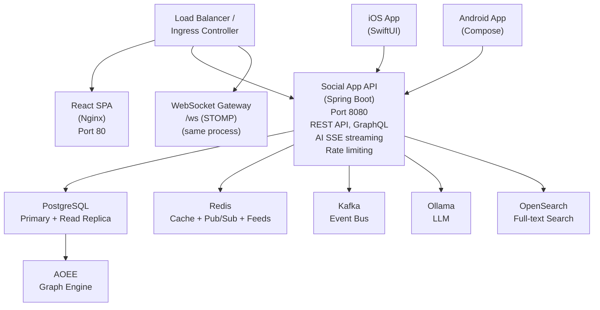

## Client Applications

### React Web (social-frontend)

Single-page application built with React 18, TypeScript, TanStack Query, and Tailwind CSS.

- **Feed**: Infinite scroll with cursor-based pagination, AI assistant
- **Messaging**: Conversation list with polling (10s), message thread with polling (3s), markdown rendering, file attachments, @mentions
- **Profiles**: Inline org tree, follow/friend system, edit with image upload
- **Groups/Pages**: Member avatars, polls, AI summarization, posts
- **Org**: Searchable hierarchy viewer, admin editor
- **Bot**: Chat with Roid via sidebar shortcut, @roid mentions in conversations
- **Admin**: Dashboard, user management, org editor, graph explorer

**API Communication**: All API calls go through Axios client with interceptor for JWT/debug auth headers. SSE used for AI streaming. Markdown rendered via `react-markdown` + `remark-gfm` + `@tailwindcss/typography`.

### iOS App (WorkSphere)

SwiftUI app targeting iOS 17+, universal iPhone/iPad.

- **Architecture**: `@Observable` services, `NavigationStack`/`NavigationSplitView`
- **Adaptive Layout**: iPhone uses `TabView` (5 tabs), iPad uses `NavigationSplitView` with sidebar
- **API Client**: Generic async/await methods, `FlexibleDecoder` handles string-encoded Int64 IDs
- **Special Features**: Camera/photo library for profile images, speech-to-text for message composition
- **Auth**: JWT token or X-Debug-User-Id stored in UserDefaults

### Android App (WorkSphere)

Kotlin + Jetpack Compose app targeting API 26+, phone and tablet.

- **Architecture**: Singleton `ApiClient` + `AuthService`, Compose navigation with `NavHost`
- **Adaptive Layout**: Phone uses `NavigationBar` (5 tabs), tablet uses `NavigationRail`
- **API Client**: OkHttp with auth interceptor, custom Gson `SafeLongAdapter` for string-encoded IDs
- **Data Layer**: SharedPreferences for auth persistence, Caffeine-style in-memory caching

### Client-Server Contract

All three clients communicate with the same REST API. No client-specific endpoints exist. The API returns JSON with string-encoded Int64 IDs (to avoid JavaScript precision loss). Each client handles this:

| Client | ID Handling | Auth Header |
|--------|-------------|-------------|
| React | `FlexibleDecoder` in iOS-style pre-processing isn't needed; IDs treated as numbers in TypeScript | `Authorization: Bearer {token}` or `X-Debug-User-Id` |
| iOS | `FlexibleDecoder` converts JSON string numbers to `Int64` before decoding | Same |
| Android | `SafeLongAdapter` Gson TypeAdapter handles both `123` and `"123"` | Same via OkHttp interceptor |

**WebSocket Opportunity**: The `/ws` STOMP endpoint is available for real-time messaging. Currently only the React app could use it (via SockJS). Adding WebSocket support to iOS/Android would replace the 3-second polling with instant delivery but is not required — polling still works.

## Backend Services

### Spring Boot Application (social-app)

The monolithic backend handles all API requests, WebSocket connections, event publishing, and scheduled tasks.

#### Request Flow

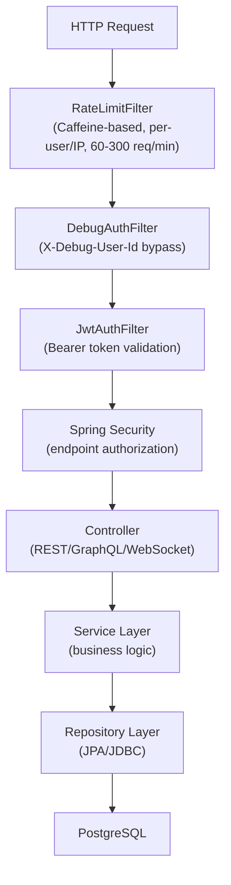

#### Service Layer

| Service | Purpose | Dependencies |
|---------|---------|-------------|
| `MessageService` | Send messages, convert DTOs | ConversationSummaryService, UnreadCountService, MessageBroadcastService, EventPublisher |
| `ConversationService` | Conversation CRUD, participant management | UnreadCountService, CacheService |
| `FeedService` | Feed assembly with organic + recommended posts | PostRepository, RecommendationService |
| `RecommendationService` | Trending, FOF, cross-team post recommendations | AOEE graph client, ReactionRepository |
| `BotService` | AI bot orchestration, action parsing, memory | OllamaService, BotToolService, BotActionService, BotMemoryService |
| `BotToolService` | Read-only tools (search, group posts, org queries) | PostRepository, UserRepository, OrgService |
| `BotActionService` | Write actions (create post, send message, create poll) | PostRepository, PollService, ConversationService |
| `OrgService` | Organizational hierarchy CRUD | OrgUnitRepository, OrgAssignmentRepository |
| `PostService` | Post CRUD with poll attachment | PostRepository, PollRepository, PollService |
| `PollService` | Poll creation, voting, results | PollRepository, PollOptionRepository, PollVoteRepository |
| `DailyDigestService` | Scheduled morning digest DMs | @Scheduled cron, OllamaService |

### Scalability Infrastructure

#### Redis (Cache + Pub/Sub + Feed Storage)

```
Redis Roles:
  1. L2 Cache (CacheService)
     - User profiles: TTL 5min
     - Conversation lists: TTL 10s
     - Unread counts: TTL varies

  2. Pub/Sub (MessageBroadcastService)
     - Channel: conversation:{id}
     - Publishes message JSON on send
     - All app instances subscribe for WebSocket broadcast

  3. Feed Sorted Sets (FeedFanoutConsumer)
     - Key: feed:{userId}
     - Score: timestamp
     - Members: postId
     - Max 500 entries per user
```

#### Kafka (Event Streaming)

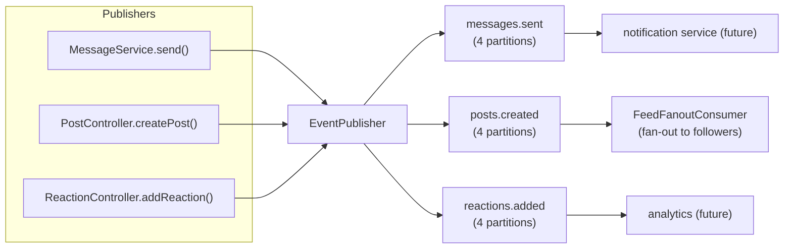

#### WebSocket (Real-Time Messaging)

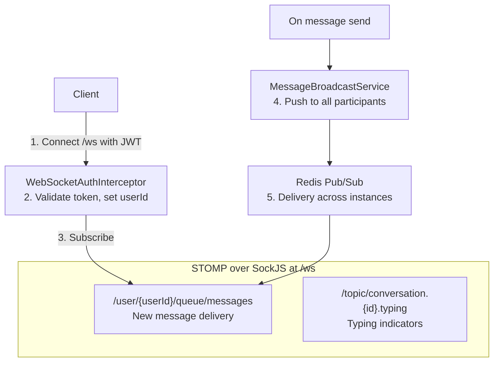

#### Rate Limiting

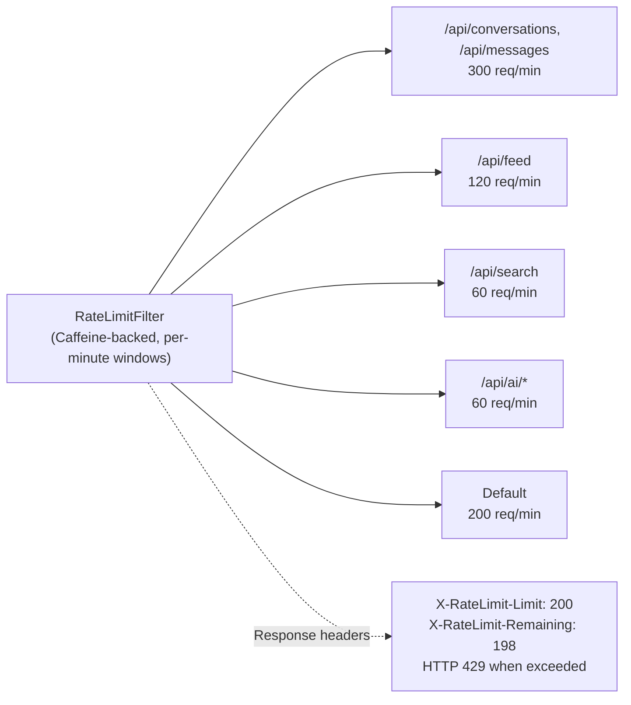

#### Caching (Two-Layer)

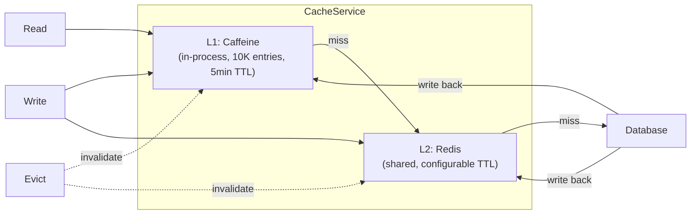

#### Materialized Views

```
conversation_summaries:
  - Last message preview per conversation
  - Updated by ConversationSummaryService on every message send
  - Eliminates N+1 query for conversation list

unread_counts:
  - Per-user per-conversation unread count
  - Incremented on message send (for all participants except sender)
  - Reset to 0 on mark-read
  - Total = SUM(unread_count) WHERE user_id = ?
  - O(conversations) not O(messages)
```

### AI Integration (Roid Bot)

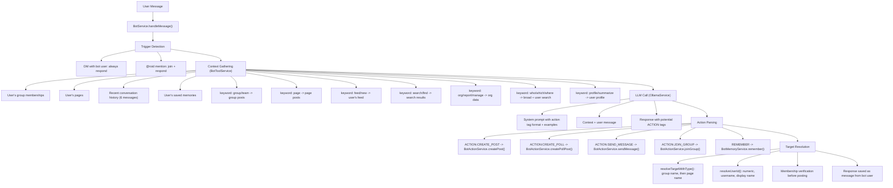

### Database Schema

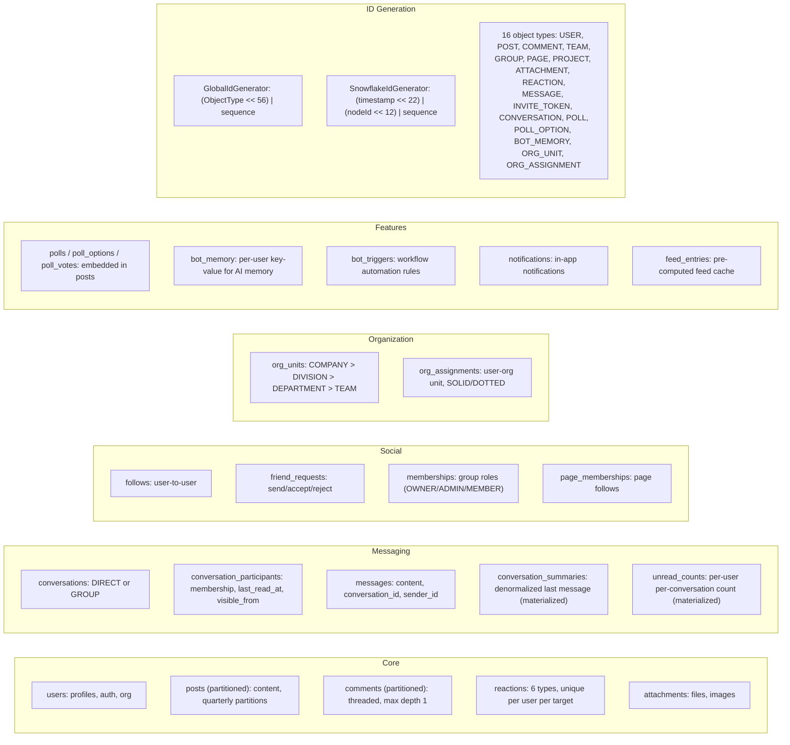

### Kubernetes Deployment

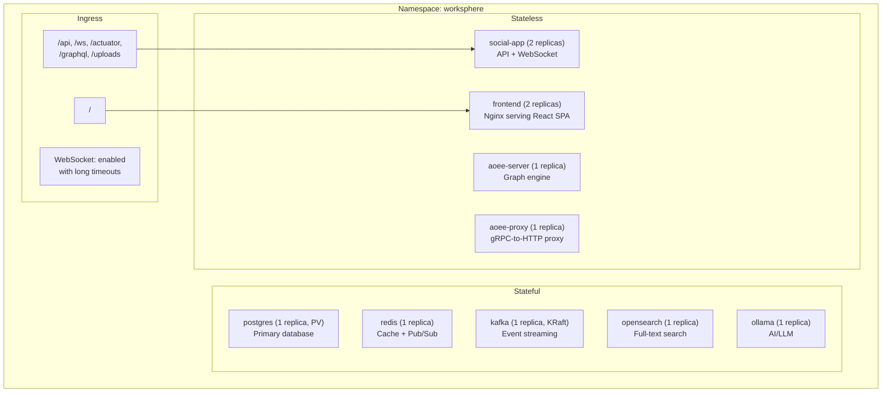

### Data Flow Examples

#### Sending a Message

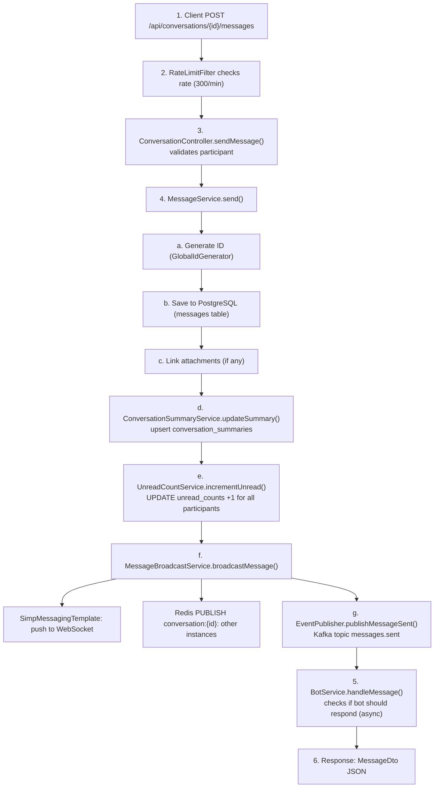

#### Loading the Feed

```
1. Client GET /api/feed?limit=20&cursor={lastPostId}
2. FeedService.assembleFeed():
   a. Get followed user IDs + own ID
   b. Get group/page membership IDs
   c. Query organic posts (author IN followers OR target IN groups)
   d. Apply visibility filter (PUBLIC, TEAM_VISIBLE, RESTRICTED)
   e. Apply cursor pagination
   f. Get recommendations (trending + FOF + cross-team)
   g. Score: engagement × recency_decay × affinity_boost
   h. Interleave: 1 recommended per 5 organic
3. Return FeedResponse {posts, nextCursor, hasMore}
```

#### Bot Creating a Poll

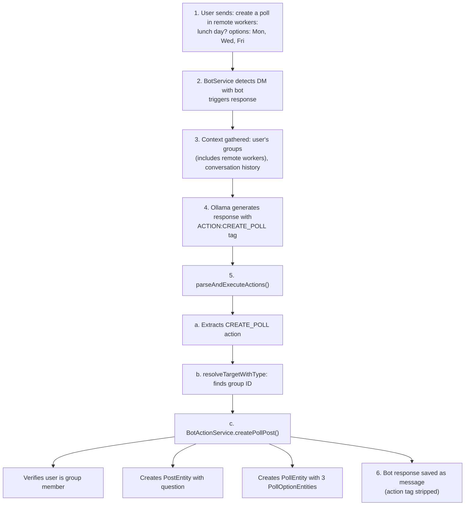

### Mobile App Integration

Both iOS and Android apps use the **same REST API** as the React web app. No client-specific endpoints exist.

| Feature | API Used | Mobile Notes |
|---------|----------|-------------|
| Auth | POST /api/auth/login, /register | Token stored locally |
| Feed | GET /api/feed?limit=20&cursor= | Infinite scroll via pagination |
| Messages | GET/POST /api/conversations/* | Polling (3s thread, 10s list) |
| Bot chat | POST /api/conversations/direct/{botId}, POST .../messages | Same as human chat |
| Polls | POST /api/polls/{id}/vote | Vote returns updated PollDto |
| Org | GET /api/org/units, /assignments/* | Tree + chain + reports |
| Search | GET /api/search?q=&type= | Type filters |
| AI | POST /api/ai/ask (SSE) | Token-based streaming |
| Catch-up | POST /api/catchup | Batch sync for offline devices |

**Future mobile optimization**: Replace polling with WebSocket connection to `/ws` using STOMP. The backend already supports this — clients just need to add SockJS/STOMP client libraries and subscribe to `/user/{self}/queue/messages`.

### Testing

```
Test Suites:
  SnowflakeIdGeneratorTest (5 tests)
    - Uniqueness, ordering, multi-node, validation, throughput

  ApiIntegrationTest (26 tests)
    - Full API integration against real PostgreSQL + Redis + Kafka
    - Feed, Posts, Reactions, Comments, Messaging, Search,
      Groups, Org, Notifications, User Profiles, AI/Bot, Polls, WebSocket

Run: mvn test -pl social-app
```
