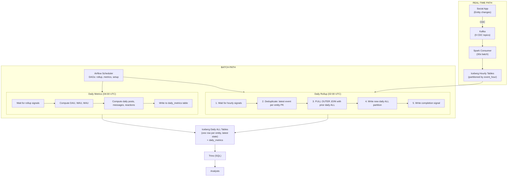
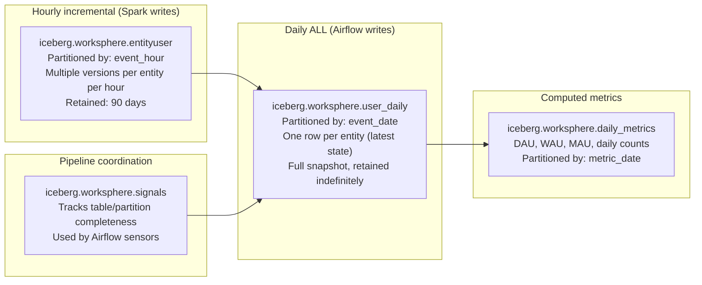
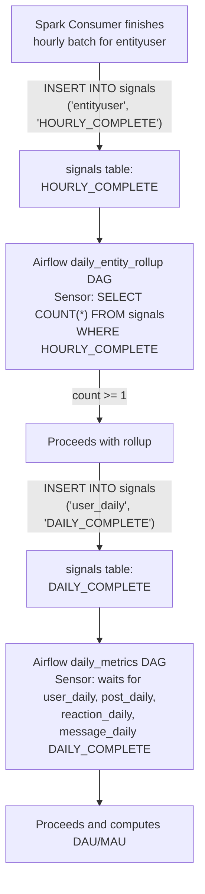
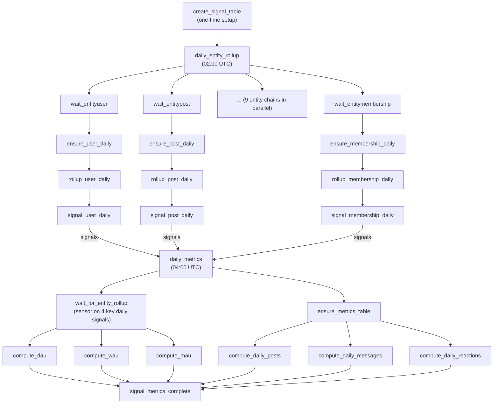

# Data Warehouse Batch Processing

## Architecture Overview



## Table Hierarchy

For each entity (users, posts, comments, etc.):



## Entity CDC (Change Data Capture)

### How entity events flow

When a user, post, or any entity is created/updated/deleted in the social app, `EntityEventService` publishes the full entity state to a Kafka topic:

```java
// In UserService.save():
entityEventService.publishUserEvent("UPDATE", user.getId(), user.getUsername(), ...);
```

The message follows the structured logging envelope format:
```json
{
  "_log_type": "entity_user",
  "_log_class": "EntityUser",
  "_version": "1.0.0",
  "data": {
    "event_type": "UPDATE",
    "event_timestamp": "2026-03-29T14:30:00Z",
    "event_hour": "2026-03-29-14",
    "event_date": "2026-03-29",
    "id": 72057594037927937,
    "username": "jdoe",
    "display_name": "Jane Doe",
    "job_title": "Senior Engineer",
    ...all entity fields...
  }
}
```

### Kafka topics (9 entity topics)

| Topic | Entity | Key |
|---|---|---|
| `worksphere-entity-users` | User | user ID |
| `worksphere-entity-posts` | Post | post ID |
| `worksphere-entity-comments` | Comment | comment ID |
| `worksphere-entity-reactions` | Reaction | reaction ID |
| `worksphere-entity-messages` | Message | message ID |
| `worksphere-entity-groups` | Group | group ID |
| `worksphere-entity-pages` | Page | page ID |
| `worksphere-entity-follows` | Follow | followerID-followedID |
| `worksphere-entity-memberships` | Membership | userID-groupID |

### Config files

Each entity has a JSON schema in `log-configs/entity_*.json`. The Spark consumer auto-discovers these and creates the corresponding Iceberg tables.

## Signal Tables

Signals track pipeline completeness. Each stage writes a signal when it finishes.

```sql
CREATE TABLE iceberg.worksphere.signals (
    table_name  VARCHAR,    -- e.g., 'entityuser', 'user_daily'
    signal_date DATE,       -- the date the signal is for
    signal_type VARCHAR,    -- 'HOURLY_COMPLETE' or 'DAILY_COMPLETE'
    completed_at TIMESTAMP  -- when the signal was written
);
```

### Signal flow



## Daily Rollup Logic

The rollup produces a **Type-1 SCD** (Slowly Changing Dimension) — one row per entity, latest state wins.

```sql
-- Pseudocode for the daily user rollup (simplified)

-- 1. Get all hourly changes for today, deduplicated (latest wins)
WITH hourly_changes AS (
    SELECT *, ROW_NUMBER() OVER (
        PARTITION BY id ORDER BY event_timestamp DESC
    ) AS rn
    FROM iceberg.worksphere.entityuser
    WHERE event_date = DATE '2026-03-29'
),
latest_changes AS (
    SELECT * FROM hourly_changes WHERE rn = 1
),

-- 2. Get yesterday's daily ALL
prior_daily AS (
    SELECT * FROM iceberg.worksphere.user_daily
    WHERE event_date = (SELECT MAX(event_date) FROM user_daily WHERE event_date < DATE '2026-03-29')
)

-- 3. Merge: new changes overwrite old rows, deletions remove rows
SELECT ...
FROM latest_changes c
FULL OUTER JOIN prior_daily d ON c.id = d.id
WHERE COALESCE(c.event_type, '') != 'DELETE'
```

## Airflow

### Access

| | |
|---|---|
| **URL** | http://localhost:8083 |
| **Username** | `admin` |
| **Password** | `worksphere` |

### DAGs

| DAG | Schedule | Purpose |
|---|---|---|
| `create_signal_table` | `@once` | Creates the signals table (run first) |
| `daily_entity_rollup` | `0 2 * * *` (02:00 UTC) | Rolls up hourly entity tables into daily ALL |
| `daily_metrics` | `0 4 * * *` (04:00 UTC) | Computes DAU, WAU, MAU from daily tables |

### DAG Dependencies



### Docker Services

| Container | Port | Purpose |
|---|---|---|
| `ws-airflow-postgres` | (internal) | Airflow metadata database |
| `ws-airflow-webserver` | 8083 | Airflow web UI |
| `ws-airflow-scheduler` | (internal) | Executes DAG tasks |

### Starting Airflow

Airflow is part of the data warehouse docker-compose:

```bash
docker compose -f docker-compose.data-warehouse.yml up -d
```

Or start just Airflow:
```bash
docker compose -f docker-compose.data-warehouse.yml up -d airflow-postgres airflow-init airflow-webserver airflow-scheduler
```

### Trino Connection

Airflow connects to Trino via the `trino_default` connection (created automatically during init):
- Host: `ws-trino`
- Port: `8080`
- Catalog: `iceberg`
- Schema: `worksphere`
- Login: `admin`

## Adding a New Entity to the Warehouse

### 1. Create the log config

```bash
# Create log-configs/entity_newentity.json following the pattern of existing entity configs
```

### 2. Publish events from the app

```java
// In the service that manages the entity:
entityEventService.publishXxxEvent("CREATE", entity.getId(), ...);
```

### 3. Create the Kafka topic

```bash
kafka-topics --create --topic worksphere-entity-newentity \
  --bootstrap-server localhost:9092 --partitions 4 --replication-factor 1
```

### 4. Restart Spark consumer

```bash
docker compose -f docker-compose.data-warehouse.yml restart spark-consumer
```

### 5. Add to the rollup DAG

Edit `airflow/dags/daily_entity_rollup.py`:

```python
ENTITY_TABLES = [
    ...existing tables...,
    'entitynewentity',  # ← add
]

ENTITY_KEYS = {
    ...existing keys...,
    'entitynewentity': 'id',  # ← add (primary key column)
}
```

### 6. Restart Airflow scheduler

```bash
docker compose -f docker-compose.data-warehouse.yml restart airflow-scheduler
```

## Adding a New Airflow Job

### 1. Create a DAG file

Create `airflow/dags/my_new_dag.py`:

```python
from datetime import datetime, timedelta
from airflow import DAG
from airflow.providers.trino.operators.trino import TrinoOperator
from airflow.sensors.python import PythonSensor

default_args = {
    'owner': 'worksphere',
    'depends_on_past': False,
    'retries': 2,
    'retry_delay': timedelta(minutes=5),
}

with DAG(
    'my_new_dag',
    default_args=default_args,
    description='Description of what this DAG does',
    schedule_interval='0 6 * * *',  # 06:00 UTC daily
    start_date=datetime(2026, 3, 29),
    catchup=False,
    tags=['warehouse', 'custom'],
) as dag:

    # Wait for upstream dependency
    wait = PythonSensor(
        task_id='wait_for_dependency',
        python_callable=lambda ds, **kwargs: check_signal('daily_metrics', ds),
        timeout=3600,
        poke_interval=300,
    )

    # Run Trino SQL
    compute = TrinoOperator(
        task_id='compute_something',
        trino_conn_id='trino_default',
        sql="""
            SELECT ... FROM iceberg.worksphere.user_daily
            WHERE event_date = DATE '{{ ds }}'
        """,
    )

    wait >> compute
```

### 2. Place the file

DAG files are auto-discovered from `airflow/dags/` (mounted into the Airflow containers).

### 3. Verify

```bash
# Check DAG appears in Airflow
curl -s http://localhost:8083/api/v1/dags -u admin:worksphere | python3 -m json.tool
```

Or check the Airflow web UI at http://localhost:8083.

### Tips for writing DAGs

- Use `{{ ds }}` for the logical execution date (YYYY-MM-DD)
- Use `PythonSensor` to wait for signal table entries
- Use `TrinoOperator` for SQL operations against Iceberg tables
- Set `catchup=False` unless you want backfill
- Tag DAGs with `['warehouse', ...]` for organization
- Write a signal at the end of your DAG so downstream DAGs can depend on it

## Querying the Warehouse

### Daily ALL tables (latest entity state per day)

```sql
-- All active users as of yesterday
SELECT id, username, display_name, department, job_title
FROM iceberg.worksphere.user_daily
WHERE event_date = CURRENT_DATE - INTERVAL '1' DAY
ORDER BY username;

-- User count by department
SELECT department, COUNT(*) AS headcount
FROM iceberg.worksphere.user_daily
WHERE event_date = CURRENT_DATE - INTERVAL '1' DAY
  AND department IS NOT NULL
GROUP BY department
ORDER BY headcount DESC;
```

### Hourly tables (raw change events)

```sql
-- All user changes in the last 24 hours
SELECT event_type, event_timestamp, id, username, display_name
FROM iceberg.worksphere.entityuser
WHERE event_date = CURRENT_DATE
ORDER BY event_timestamp DESC;

-- Posts created per hour today
SELECT event_hour, COUNT(*) AS posts_created
FROM iceberg.worksphere.entitypost
WHERE event_date = CURRENT_DATE AND event_type = 'CREATE'
GROUP BY event_hour
ORDER BY event_hour;
```

### Metrics

```sql
-- DAU trend over the last 30 days
SELECT metric_date, metric_value AS dau
FROM iceberg.worksphere.daily_metrics
WHERE metric_name = 'DAU'
  AND metric_date >= CURRENT_DATE - INTERVAL '30' DAY
ORDER BY metric_date;

-- All metrics for yesterday
SELECT metric_name, metric_value
FROM iceberg.worksphere.daily_metrics
WHERE metric_date = CURRENT_DATE - INTERVAL '1' DAY;
```

## Monitoring

### Check pipeline health

```sql
-- Latest signals per table
SELECT table_name, signal_type, MAX(signal_date) AS latest_date, MAX(completed_at) AS latest_time
FROM iceberg.worksphere.signals
GROUP BY table_name, signal_type
ORDER BY table_name;
```

### Check Airflow task status

```bash
# Via CLI
curl -s "http://localhost:8083/api/v1/dags/daily_entity_rollup/dagRuns" \
  -u admin:worksphere | python3 -m json.tool

# Or use the web UI at http://localhost:8083
```

### Check hourly data freshness

```sql
-- Most recent event per entity table
SELECT 'users' AS entity, MAX(event_timestamp) AS latest FROM iceberg.worksphere.entityuser
UNION ALL
SELECT 'posts', MAX(event_timestamp) FROM iceberg.worksphere.entitypost
UNION ALL
SELECT 'comments', MAX(event_timestamp) FROM iceberg.worksphere.entitycomment
UNION ALL
SELECT 'reactions', MAX(event_timestamp) FROM iceberg.worksphere.entityreaction
UNION ALL
SELECT 'messages', MAX(event_timestamp) FROM iceberg.worksphere.entitymessage;
```

## Kubernetes

Airflow is deployed via `k8s/airflow.yaml` with:
- `airflow-postgres` StatefulSet
- `airflow-webserver` Deployment (port 8080, exposed via Ingress)
- `airflow-scheduler` Deployment
- DAGs mounted via ConfigMap or persistent volume

```bash
# Port-forward to access Airflow UI
kubectl -n worksphere port-forward svc/airflow-webserver 8083:8080
```
