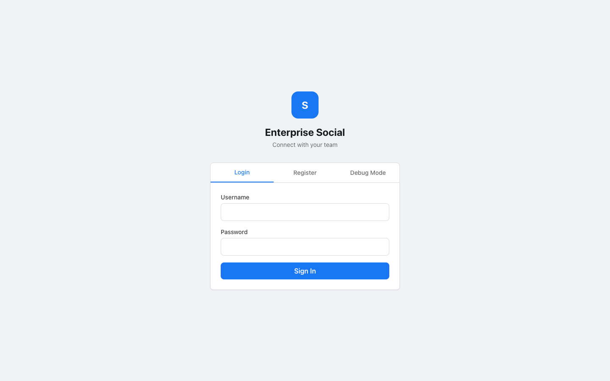
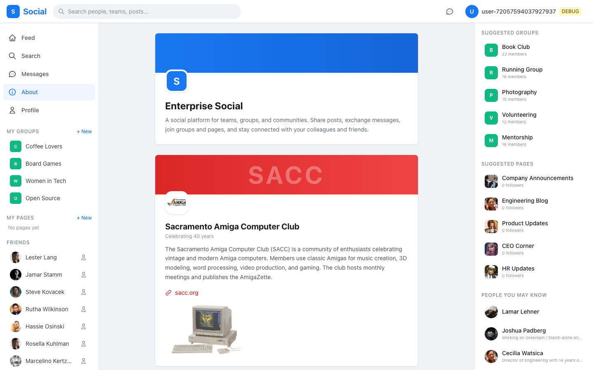

# Enterprise Social Platform - User Guide

## Getting Started

### Running the Application

**Backend** (Spring Boot on port 8080):
```bash
cd social-platform
mvn install -N -q && mvn install -pl social-core -q
mvn spring-boot:run -pl social-app
```

**Frontend** (Vite dev server on port 3999):
```bash
cd social-platform/social-frontend
npm run dev
```

Open **http://localhost:3999** in your browser.

### Authentication

There are three ways to log in:

1. **Username + Password** - Use any generated username with password `password123`
2. **Register** - Create a new account with username, email, and password
3. **Debug Mode** - Toggle debug mode on the login page and enter a raw user ID (no password needed)



#### Debug Mode

Debug mode bypasses authentication by sending an `X-Debug-User-Id` header with every request. This is useful for testing - you can quickly switch between users by logging out and entering a different user ID.

**Sample User IDs for Debug Login:**

| User # | User ID | Notes |
|--------|---------|-------|
| 1 | `72057594037927937` | Owns "Coffee Lovers" group |
| 4 | `72057594037927940` | Owns "Book Club" group |
| 5 | `72057594037927941` | Regular member |
| 7 | `72057594037927943` | Owns "Running Group" |
| 10 | `72057594037927946` | Owns "Photography" group |

All test users have password `password123`. To find usernames:
```sql
SELECT id, username, display_name FROM users ORDER BY id LIMIT 20;
```

---

## Home Feed

The home feed shows posts from people you follow, groups you belong to, and pages you follow. Recommended posts are interleaved (~20% of feed) and marked as "Suggested for you."


### Layout

- **Left Sidebar** - Navigation links, your groups, your pages, and friends list
- **Center** - Post composer and feed
- **Right Panel** (xl screens) - Suggested groups, pages, and people you may know

### Creating Posts

Type in the post composer and click **Post**. You can:

- **Attach media** - Click "Media" to attach images or videos (.jpg, .png, .gif, .mp4, .mov, .webm, .avi, .mkv)
- **Paste images** - Paste screenshots directly from clipboard (Ctrl+V / Cmd+V)
- **Drag & drop** - Drag files onto the composer
- **Multiple attachments** - Add several images/videos to a single post
- **Share links** - Paste a URL and a preview card appears with the site's title, description, and image
- **YouTube** - Paste a YouTube link and it embeds as a playable video

### Post Features

- **Reactions** - Hover over the reaction button to pick from: Like, Love, Haha, Wow, Sad, Angry
- **Who reacted** - Hover over the reaction count to see who reacted (friends shown first)
- **Comments** - Click the comment count to expand the comment thread
- **Nested replies** - Reply to comments (1 level of nesting)
- **Edit your posts** - Hover over your own post, click "..." menu, select "Edit"
- **Edit your comments** - Hover over your comment to see a pencil icon
- **Posted to** - Posts targeted at groups/pages show "Author > Group Name" with a clickable link

### Rich Text

Post content supports lightweight markup:
- `**bold text**` or `*bold*` renders as **bold**
- `_italic text_` renders as _italic_
- URLs auto-link and render as clickable links
- When posting to a group/page, a formatting toolbar (Bold, Italic, Link) appears

### Content Deduplication

Uploaded files are hashed (SHA-256). If the same file is uploaded again by any user, the existing copy is reused, saving disk space.

---

## Search

Search for users, teams, groups, pages, and posts. Filter by type using the buttons at the top.


Results link directly to the relevant profile, group, page, or team.

---

## Profiles

View any user's profile with their avatar, bio, follower/following counts, and posts.


### Profile Actions

- **Follow** - Follow a user to see their posts in your feed
- **Message** - Click "Message" to start a direct conversation
- **Followers/Following** - Click the counts to see the full lists

---

## Messages

Direct messaging between users with support for text, images, and file attachments.


### Features

- **Conversation list** - Left panel shows all conversations sorted by most recent, with unread badges
- **Chat thread** - Right panel shows the message history with the selected person
- **Chat bubbles** - Sent messages appear blue (right), received messages gray (left)
- **Attachments** - Click the paperclip icon to attach files to messages
- **Read receipts** - Sent messages show "Read" status
- **Auto-refresh** - Conversations refresh every 3 seconds, conversation list every 10 seconds
- **Unread badge** - Header and sidebar show unread message count
- **Start from profile** - Click "Message" on any user's profile to start chatting
- **Start from sidebar** - Click a friend's name in the sidebar to open a chat

### Starting a Conversation

There are several ways to start messaging someone:
1. Click a friend's name in the left sidebar (Friends section)
2. Click "Message" on a user's profile page
3. Navigate to `/messages/{userId}` directly

---

## Groups

Groups are communities that members can join, post to, and discuss in.


### Creating a Group

1. In the left sidebar under "My Groups", click **+ New**
2. Enter a group name and optional description
3. Optionally upload an avatar image
4. Click **Create** - you'll be taken to the new group page

### Group Features

- **Join/Leave** - Click "Join Group" on any group. For restricted groups, your request must be approved by an owner/admin
- **Pending Approval** - Restricted groups show "Pending Approval" until the owner approves
- **Post to group** - Members can create posts within the group
- **Group feed** - See all posts targeted at the group
- **Pin posts** - Owners/admins can pin a post to the top of the group (via "..." menu on any post)
- **Edit group** - Owners/admins can click "Edit" to update the name, description (with rich text), avatar, and cover image
- **Member management** - Owners can approve/reject pending members

### Group Visibility

- **PUBLIC** - Anyone can join instantly
- **RESTRICTED** - Users must request to join; owner/admin must approve

### Group Roles

- **OWNER** - Full control, created the group
- **ADMIN** - Can approve members, pin posts, edit group
- **MEMBER** - Can view and post

---

## Pages

Pages are like public profiles for topics, announcements, or projects. Users follow pages to see their content.

### Creating a Page

1. In the left sidebar under "My Pages", click **+ New**
2. Enter a name, optional description, and optional avatar
3. Click **Create**

### Page Features

- **Follow/Unfollow** - Follow a page to see its posts in your feed
- **Page feed** - The page owner can post content
- **Edit page** - Owners can update name, description (rich text), avatar, and cover image
- **Pin posts** - Owners can pin important posts to the top
- **Follower count** - Shows how many users follow the page

---

## About

The About page includes information about the platform and featured communities.



### Sacramento Amiga Computer Club (SACC)

The About page features the **Sacramento Amiga Computer Club**, a community celebrating 40 years of vintage and modern Amiga computers. Members use classic Amigas for music creation, 3D modeling, word processing, video production, and gaming. The club hosts monthly meetings and publishes the AmigaZette.

Visit: [sacc.org](https://sacc.org/)

---

## Link Previews

When you paste a URL in a post, the platform fetches Open Graph metadata and displays a preview card with:
- Site title
- Description
- Preview image
- Domain name

The raw URL is hidden from the post text when a preview is shown. Click the preview card to open the link in a new tab.

### YouTube Embeds

YouTube links are automatically embedded as playable video iframes. Supported URL formats:
- `youtube.com/watch?v=VIDEO_ID`
- `youtu.be/VIDEO_ID`
- `youtube.com/embed/VIDEO_ID`

---

## Admin Dashboard

Users with admin privileges see an "Admin" link (shield icon) in the sidebar. The first 3 generated users are admins by default.

### Admin Users

| Username | Display Name | User ID | Email |
|----------|-------------|---------|-------|
| lamar.lehner | Lamar Lehner | `72057594037927937` | lamar.lehner@enterprise.com |
| joshua.padberg | Joshua Padberg | `72057594037927938` | joshua.padberg@enterprise.com |
| cecilia.watsica | Cecilia Watsica | `72057594037927939` | cecilia.watsica@enterprise.com |

All admin users have password `password123`. Login with any of them (or use debug mode with their ID) to access the admin dashboard.

### Dashboard Tab


**Stats Cards** - Total users, posts, groups, and messages at a glance with trend badges.

**DAU / WAU / MAU Metrics:**
- **DAU (Daily Active Users)** - Distinct users who posted, commented, reacted, or messaged today
- **WAU (Weekly Active Users)** - Same metric over the last 7 days
- **MAU (Monthly Active Users)** - Same metric over the last 30 days
- **Stickiness** - DAU/MAU ratio (higher = users come back more often)
- **DAU Trend** - Bar chart showing daily active users over the last 14 days

**Activity Chart** - Post, comment, and reaction counts per day for the last 30 days.

**Top Users / Groups / Pages** - Ranked tables of the most active entities, with clickable links to their profiles/pages.

**User Growth** - Weekly signup chart for the last 12 weeks.

**System Health** - Upload directory size, file count, database size, duplicate attachments.

### Engagement Tab

Drill into activity for any specific group, page, or user over a configurable time period (7/14/30/60/90 days).

**Features:**
- Select entity type (Group / Page / User) from dropdown
- Pick a specific group, page, or user from the populated list
- Choose time range
- View daily activity chart (posts, comments, reactions)
- For groups: see unique posters per day and member growth over time
- For users: see breakdown of posts, comments, and reactions
- Entity info card with total stats and link to view the actual group/page/profile

**Quick links** at the top let you jump to any group's engagement with one click.

### Users Tab

Searchable, paginated user management:
- Search by username, display name, or email
- View user details (post count, group count, followers)
- Toggle admin status on/off
- Link to user profiles

### Content Tab

Post moderation:
- Paginated list of all posts (most recent first)
- View author, content preview, target, reactions, and comments
- Delete any post (with confirmation)

### Groups & Pages Tab

**Groups section:**
- All groups with member count, post count, visibility
- Link to view group page
- Delete groups

**Pages section:**
- All pages with follower count, post count, owner
- Link to view page
- Delete pages

---

## Technical Details

### ID System

All entities use 64-bit GlobalIds with an 8-bit type code in the upper bits:

| Entity | Type Code | Example ID |
|--------|-----------|------------|
| User | 0x01 | 72057594037927937 |
| Post | 0x02 | 144115188075855873 |
| Team | 0x04 | 288230376151711745 |
| Group | 0x05 | 360287970189639681 |
| Page | 0x06 | 432345564227567617 |
| Message | 0x0A | 720575940379279361 |

IDs exceed JavaScript's `Number.MAX_SAFE_INTEGER` (2^53-1), so they are serialized as JSON strings in API responses to prevent precision loss.

### API Endpoints

| Area | Endpoints |
|------|-----------|
| Auth | `POST /api/auth/login`, `POST /api/auth/register` |
| Users | `GET /api/users/{id}`, `GET /api/users/search`, `GET /api/users/{id}/followers`, `GET /api/users/{id}/following` |
| Posts | `POST /api/posts`, `GET /api/posts/{id}`, `PUT /api/posts/{id}`, `DELETE /api/posts/{id}` |
| Comments | `POST /api/comments`, `PUT /api/comments/{id}`, `DELETE /api/comments/{id}` |
| Reactions | `POST /api/reactions`, `DELETE /api/reactions/{targetId}`, `GET /api/reactions/{targetId}/users` |
| Feed | `GET /api/feed`, `GET /api/feed/recommended` |
| Follow | `POST /api/follow/{id}`, `DELETE /api/follow/{id}` |
| Groups | `POST /api/groups`, `GET /api/groups/{id}`, `PUT /api/groups/{id}`, `GET /api/groups/mine`, `GET /api/groups/search`, `POST /api/groups/{id}/join`, `DELETE /api/groups/{id}/leave` |
| Pages | `POST /api/pages`, `GET /api/pages/{id}`, `PUT /api/pages/{id}`, `GET /api/pages/mine`, `GET /api/pages/search`, `POST /api/pages/{id}/follow`, `DELETE /api/pages/{id}/unfollow` |
| Messages | `POST /api/messages`, `GET /api/messages/conversations`, `GET /api/messages/conversation/{partnerId}`, `POST /api/messages/conversation/{partnerId}/read`, `GET /api/messages/unread-count` |
| Attachments | `POST /api/attachments/upload`, `GET /api/attachments/{id}` |
| Link Preview | `GET /api/link-preview?url=...` |
| Search | `GET /api/search?q=...&type=...` |

### Tech Stack

**Backend:** Spring Boot 3.4.3, Java 21, PostgreSQL, Spring Data JPA, Spring Security + JWT, Flyway migrations, OpenSearch (with DB fallback)

**Frontend:** React 18, TypeScript, Vite, TanStack React Query, Zustand, Tailwind CSS, React Router v6
